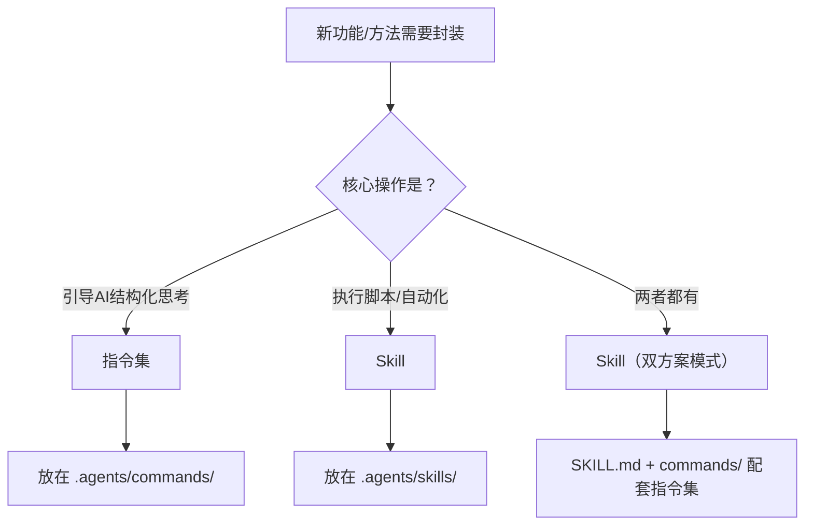

# 指令集与Skill边界判断（Command vs Skill Boundary）

## 模式类型
方法论模式（治理策略/分类决策）

## 成熟度
L1 实验级（1次验证：对抗性审查指令集创建任务；5个已验证案例）

## 问题陈述

"指令集还是Skill"是AI工作流封装中的常见决策点，但判断标准常被混淆：
- **误判方向1**："这个功能很重要，应该做成Skill"——混淆了"重要性"和"核心操作类型"
- **误判方向2**："这个功能很简单，不需要独立指令集"——混淆了"复杂度"和"是否需要结构化"

## 解决方案

基于"核心操作类型"而非"重要性"或"复杂度"来判断边界。

### 判断公式

```
如果核心操作是"引导AI进行结构化思考" → 指令集（.agents/commands/）
如果核心操作是"执行Python脚本/自动化流程" → Skill（.agents/skills/）
如果两者都有（如forum-posting既有脚本又有决策树）→ Skill（双方案模式）
```

### 边界判断矩阵

| 特征 | 指令集 | Skill |
|------|--------|-------|
| 核心操作 | 引导AI进行结构化思考 | 执行脚本/自动化流程 |
| 执行方式 | 纯文本指令，AI按步骤推理 | 调用Python/Shell脚本 |
| 典型场景 | 对抗性审查、第一性原理、复盘、洞察 | forum-posting、link-check、ci-check |
| 是否需要脚本 | 否 | 通常需要 |
| 抽象层次 | 认知方法层 | 工具执行层 |
| 可独立使用 | 是（AI可直接按指令执行） | 是（但通常需要脚本支撑） |

### 判断流程


```mermaid
flowchart TD
    A["新功能/方法需要封装"] --> B{"核心操作是？"}
    B -->|"引导AI结构化思考"| C["指令集"]
    B -->|"执行脚本/自动化"| D["Skill"]
    B -->|"两者都有"| E["Skill（双方案模式）"]
    C --> F["放在 .agents/commands/"]
    D --> G["放在 .agents/skills/"]
    E --> H["SKILL.md + commands/ 配套指令集"]
```

## 常见误判类型

| 误判 | 为什么错 | 正确判断 |
|------|---------|---------|
| "X很重要，应该做成Skill" | 重要性≠需要脚本。认知方法不需要脚本执行 | 以核心操作类型为准 |
| "X很简单，不需要独立指令集" | 简单≠不需要结构化。认知方法需要防止直觉跳跃 | 以是否需要结构化引导为准 |
| "有决策树，应该做成指令集" | 有决策树但核心操作是脚本驱动→仍应归为Skill | 以核心操作为准，决策树是辅助 |

## 已验证案例

| 案例 | 判断 | 验证结果 |
|------|------|---------|
| 对抗性审查 | 指令集 | 283行指令集，无需脚本，AI可直接按步骤执行 |
| 第一性原理分析 | 指令集 | 6步分析流程，纯推理，无需脚本 |
| forum-posting | Skill | 双方案模式：Playwright脚本 + 决策树 |
| link-check | Skill | Python脚本驱动，自动化检测 |
| insight-cmd | Skill | Skill门面 + 指令集L2文档 |

## 失败案例

**Skill 门面边界误配事故（本仓真实，2026-08-29）**：`wsl-ops-cmd` Skill 创建时，frontmatter `description` 误用 YAML 折叠块标量（`>-`），质量检查器将其解析为 2 字符 → 质量分 69/100 FAIL（description.length -15 + mandatory_phrase/trigger_context 双 WARN）。修正为单行单引号标量后即 100/100。教训：Skill 门面（L1 索引层）的触发元数据是机器消费的"接口"，其格式约束比指令集（纯文本）更严——这正是边界公式中"执行脚本/自动化→Skill"一侧必须配套结构化质量门的原因。

**注册漂移事故**：脚本命令门面 Skill 注册曾只更新一处索引（`.agents/skills/README.md`），漏同步 `.agents/capability-registry/02-skills.md`（表格行+分类计数），导致两处触发词措辞漂移、能力索引失真。已固化为"注册必须同步两处索引"的硬约定。

## 反目标用户/场景

以下情况**不适用**本模式的判断公式：

1. **核心操作是引导 AI 结构化思考，却做成 Skill**：产出只有空壳脚本调用+纯文本步骤，脚本无实质逻辑——应归指令集（误判方向1的真实形态）；
2. **核心操作是脚本驱动，却做成纯指令集**：AI 被迫在会话内手写并执行一次性代码，不可复现、不可测试——应归 Skill；
3. **不推荐**在"两者都有"时强行二选一：双方案模式（SKILL.md+commands/）才是正确解，硬拆会造成触发词与文档分裂；
4. **不适用**于尚未稳定的一次性探索——探索期直接在会话内执行，稳定后再按公式归类。

## 早期预警信号

出现以下任一早期预警信号时，应重新评估封装边界：

| 预警信号 | 处置 |
|---------|------|
| Skill 的 SKILL.md 90% 篇幅是思考步骤，脚本只是摆设 | 重新评估是否应为指令集 |
| 指令集内出现"请运行 xxx.py 并解析输出"的步骤 | 考虑升级为 Skill |
| 同一能力在 commands/ 与 skills/ 各有一份且措辞开始漂移 | 立即裁决归属，废弃一份 |
| Skill 门面超过 500 行（L1 门面纪律） | 拆 L2 详细文档 |
| 新 Skill 注册未同步双索引 | 补同步后再提交 |

## 适用边界

- **适用前提**：封装对象是可复用的稳定能力；判断依据是"核心操作类型"而非"重要性/复杂度"；
- **边界条件**：双方案模式的成本是双份维护，仅在脚本与认知引导确实并存时使用；
- 本模式本身是认知方法（指令集形态的判断规则），不附带脚本——按公式自反验证成立。

## 验证来源

- **对抗性审查指令集创建任务**（2026-07-10）：Skill vs 指令集是3个关键决策之一，通过第一性原理分析得出"指令集"结论，283行指令集运行验证通过

## 关联资源

- 洞察来源：[command-vs-skill-boundary.md](../../../reports/insight-extraction/meta-methodology/retrospective-adversarial-review-cmd-20260710/insights/command-vs-skill-boundary.md)
- 关联模式：[knowledge-to-command-pipeline.md](knowledge-to-command-pipeline.md)（知识库→指令集转化）