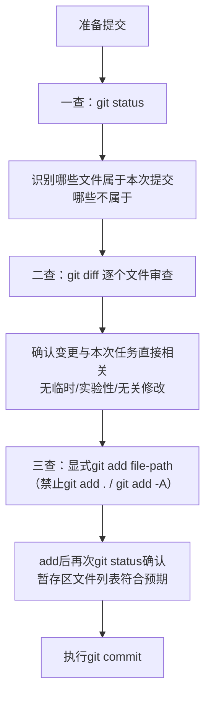

> **来源**：从 `docs/retrospective/reports/competitive-analysis/retrospective-text-to-cad-learning-20260704/insight-extraction.md` 洞察4 提炼，基于多次原子提交实践验证（含forum-posting Skill优化、text-to-cad wiki教程）

# 提交质量门——三查暂存法（Commit Quality Gate: Three-Check Staging Inspection）

## 模式类型
方法论模式（治理策略）

## 成熟度
L2 已验证（2次成功案例：forum-posting Skill优化原子提交、text-to-cad wiki教程提交）

## 适用场景
所有代码/文档提交场景，特别是：
- 工作区存在多个任务变更时
- 子代理执行任务后主代理验收提交时
- 任务间隔较长、可能忘记之前改了什么时
- 需要确保提交边界清晰、可独立回滚时

## 问题背景

原子提交的核心价值不仅是"提交信息清晰"，更重要的是**git add阶段强制审查每个文件**，防止脏提交。直接使用`git add .`或`git add -A`会绕过这个质量门，导致：
- 临时变更、实验性代码意外混入
- 无关修改污染版本历史
- 提交无法独立revert
- 审查者需要理解不相关的上下文

子代理执行任务后尤其危险——盲目信任子代理输出"已创建文件X"而不验证实际变更，可能将子代理产生的临时文件或错误修改一并提交。

## 与session-boundary-commit的关系

本模式与`session-boundary-commit.md`是互补关系：
- **session-boundary-commit**解决"多会话变更混合时如何分组"的问题（会话边界）
- **本模式（三查暂存法）**解决"add阶段如何审查文件边界"的问题（文件边界）

执行顺序：先用session-boundary-commit做归属分析和会话筛选，再用三查暂存法逐一审查每个拟提交文件的内容。

## 核心方法：三查暂存法

### 一查：清单审查（git status）
运行`git status`查看全部变更文件清单，识别：
- 哪些文件属于本次提交
- 哪些文件属于其他会话（留给对应会话提交）
- 哪些是临时文件/实验性修改（不应提交）

### 二查：内容审查（git diff）
对拟提交的**每个文件**运行`git diff`审查变更内容，确认：
- 变更与本次任务直接相关
- 没有遗留的调试代码、注释掉的代码、console.log等
- 没有意外的格式大面积变更
- 子代理创建的文件内容符合预期

### 三查：显式添加（git add + 二次确认）
- 使用`git add <file-path>`**逐个文件**显式添加
- **禁止**`git add .`或`git add -A`（除非100%确认所有变更都属于本次提交）
- add后再次运行`git status`确认暂存区文件列表符合预期
- 子代理说"创建了X文件"不能直接信任，必须验证文件确实存在且内容正确

## 反模式（禁止做法）

| 反模式 | 风险 |
|-------|------|
| ① `git add .`盲目添加 | 临时文件、无关变更混入 |
| ② 信任子代理输出直接add子代理说"创建了"的文件而不验证 | 子代理可能创建了错误文件或遗漏文件 |
| ③ 跳过`git diff`审查直接提交 | 调试代码、错误修改被提交 |
| ④ 混合多个任务的变更到一个提交 | 无法独立revert，责任混乱 |
| ⑤ 长时间间隔后凭记忆提交 | 忘记之前改了什么，遗漏或误提文件 |

## 价值

1. **防止脏提交**：每个提交只包含本次任务相关变更
2. **独立可回滚**：每个提交可独立revert，不影响其他功能
3. **自检即审查**：git diff审查本身就是一次self code review
4. **聚焦审查**：审查阶段能够聚焦于本次任务的变更，而非在噪音中找问题
5. **子代理安全**：为主代理验收子代理工作提供了标准化检查流程

## 正例

**text-to-cad-wiki提交（commit 9083c788）**：
- 变更规模：5个文件，774行新增，9行删除
- 通过三查暂存法：一查确认文件清单，二查逐文件diff确认内容全部与text-to-cad wiki任务相关，三查显式add后再次status确认
- 结果：提交边界非常清晰，无任何无关变更混入，可独立revert

## 与其他模式关系

- `session-boundary-commit.md`：互补模式——先做会话边界分组，再做文件边界审查
- `atomic-commit-cmd` Skill：本模式的工具实现，封装了三查暂存法的完整流程
- `process-vs-experience-intuition.md`：三查暂存法是"流程合规"的典型实践——凭记忆"我改的都对"是经验直觉，按三查流程走才是可预测的质量保证
