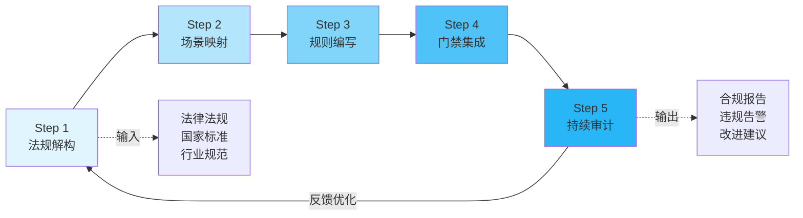

# 合规驱动规则建设五步法

## 模型概述
面对法律法规/国家标准的合规要求时，如何将抽象的法律条文转化为可执行的工程治理规则。本模式提供五步转化法，实现从法条到工程门禁的完整落地。

## 核心原则
**法规→场景→规则→门禁→审计**，不是直接把法条粘贴到规则中。法律条文是原则性要求，必须经过场景化拆解、规则化编写、工程化集成、持续化审计四个转化步骤，才能真正落地。

## 五步法模型

| 步骤 | 名称 | 目标 | 关键产出 |
|---|---|---|---|
| Step 1 | 法规解构 | 将法规条文拆解为可操作的安全要求清单 | 合规要求矩阵 |
| Step 2 | 场景映射 | 将安全要求映射到具体开发/运营场景 | 场景-要求映射表 |
| Step 3 | 规则编写 | 按场景编写具体规则文档 | 规则文档（含检查清单、判定标准） |
| Step 4 | 门禁集成 | 将规则嵌入开发流程阶段守卫 | 自动化/半自动化检查点 |
| Step 5 | 持续审计 | 建立监控审计机制，持续验证合规性 | 监控指标、审计报告 |

## 流程图

## 实施步骤详解

### Step 1：法规解构
| 项 | 说明 |
|---|---|
| **输入** | 法律法规文本、国家标准、行业规范、企业政策 |
| **动作** | 逐条阅读法规，提取"应当/必须/不得/禁止"等强制性要求，去重、分类、编号 |
| **工具** | 法规矩阵表（Excel/Markdown表格）、要求编号体系 |
| **产出** | 合规要求清单，每条要求包含：编号、法规来源、原文摘录、要求类型、责任主体 |
| **验证标准** | 所有强制性条款无遗漏，要求表述可被技术人员理解 |

### Step 2：场景映射
| 项 | 说明 |
|---|---|
| **输入** | 合规要求清单、业务流程梳理、开发生命周期阶段 |
| **动作** | 识别每个合规要求适用的具体业务场景（如：接入第三方API、数据跨境传输、用户数据采集等） |
| **工具** | 场景矩阵、流程梳理工作坊 |
| **产出** | 场景-要求映射表，标注每个场景涉及哪些合规要求 |
| **验证标准** | 每个场景都有对应的合规要求覆盖，无场景无要求、无要求无场景 |

### Step 3：规则编写
| 项 | 说明 |
|---|---|
| **输入** | 场景-要求映射表、现有技术能力、组织流程 |
| **动作** | 按场景编写具体规则，包含：检查清单、判定标准、违规等级、处置流程、操作指南 |
| **工具** | 规则模板、检查清单模板 |
| **产出** | 独立的规则文档（.md），每份规则对应一个或多个场景 |
| **验证标准** | 规则可被开发/测试/运维人员直接执行，判定标准无歧义 |

### Step 4：门禁集成
| 项 | 说明 |
|---|---|
| **输入** | 规则文档、CI/CD流程、阶段守卫机制 |
| **动作** | 将可自动化检查的规则转化为门禁脚本，需要人工审核的转化为审批节点 |
| **工具** | 静态代码扫描、CI/CD流水线、审批系统 |
| **产出** | 集成到开发流程的门禁点，每个门禁关联具体规则 |
| **验证标准** | 违规代码/配置无法通过门禁，审批流程可追溯 |

### Step 5：持续审计
| 项 | 说明 |
|---|---|
| **输入** | 门禁日志、运行数据、审计规则 |
| **动作** | 建立监控指标，定期审计，发现门禁绕过、新风险点，反馈优化前序步骤 |
| **工具** | 监控看板、审计脚本、定期复盘机制 |
| **产出** | 合规报告、违规告警、规则优化建议 |
| **验证标准** | 违规可在约定时间内发现，规则持续迭代 |

## 适用场景
- 法律法规合规落地（数据安全法、个保法、网络安全法等）
- 行业标准落地（等保2.0、PCI-DSS、ISO27001等）
- 企业政策制度工程化
- 监管要求转化为开发规范

## 不适用场景
- 无明确法规依据的内部最佳实践推广
- 技术选型类决策（非合规强制性要求）
- 临时性、一次性合规检查

## 关键原则
1. **不抄法条**：规则文档不是法规原文复制，必须转化为工程语言
2. **场景驱动**：从业务场景出发，而非从法规章节出发
3. **可执行性**：每条规则必须有明确的检查方法和判定标准
4. **闭环迭代**：审计发现的问题必须反馈回规则/门禁优化
5. **分层落地**：能自动化的不人工，能前置的不后置

## 验证案例

| 案例 | Step 1 法规解构 | Step 2 场景映射 | Step 3 规则编写 | Step 4 门禁集成 | Step 5 持续审计 |
|---|---|---|---|---|---|
| AI智能体互联数据安全治理 | 国标+数安法+个保法 → 38项安全要求 | 9个核心场景 | 10份规则文档 | 6个阶段门禁 | 18项监控指标 |

**案例详情**：
- 法规来源：《数据安全法》《个人信息保护法》《网络安全法》及GB/T相关国家标准
- 覆盖场景：第三方API接入、数据跨境传输、敏感数据存储、用户数据采集等9个场景
- 规则产出：data-classification、data-masking、data-encryption、cross-border、vendor-admission等10份文档
- 门禁集成：嵌入需求、设计、开发、测试、上线、运行6个阶段守卫
- 监控审计：18项安全监控指标，定期审计机制，应急响应预案

## 常见陷阱
1. **法规原文堆砌**：直接复制法条到规则文档，开发人员无法执行
2. **跳过场景映射**：按法规章节写规则，而非按业务场景，导致规则与实际工作脱节
3. **门禁缺失**：只写规则文档不集成到流程，规则形同虚设
4. **无审计闭环**：上线后不监控不审计，门禁被绕过也无法发现
5. **一步到位思维**：试图一次性写完美规则，而非通过审计反馈持续迭代

> 来源：AI智能体互联数据安全治理实践萃取
> 关联模块：`docs/retrospective/patterns/methodology-patterns/governance-strategy/five-layer-governance-architecture.md`、`docs/retrospective/reports/project-governance/process-and-compliance/retrospective-ai-agent-data-security-governance-20260629/`
