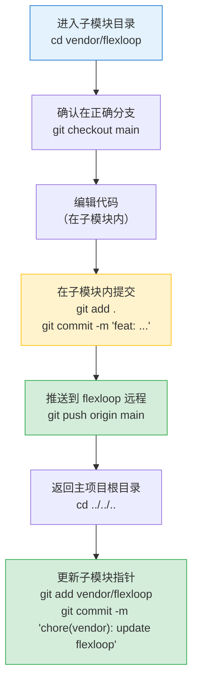

+++
id = "dual-mode-submodule-governance"
domain = "methodology"
layer = "methodology"
maturity = "L2"
validation_count = 1
reuse_count = 0
documentation_level = "detailed"
source = "docs/retrospective/reports/project-governance/dependency-governance/retrospective-vendor-flexloop-governance-adjustment-20260629/insight-extraction.md"

[bindings]
rules = [".agents/protocols/dependency-management.md"]
references = ["docs/knowledge/VENDOR-INTEGRATION.md"]
skills = []
related_patterns = ["three-zone-boundary-model", "four-negatives-external-dependency"]
+++

# 双模式子模块治理框架：分类管理 Git Submodule

## 模式概述

Git submodule 是管理外部代码依赖的常用方式，但"一刀切"的禁止修改策略不适合所有场景。将子模块按归属和控制权分为两类——**第三方只读子模块（third_party）**和**自有协作子模块（owned_collab）**——采用差异化的治理策略，在保持独立性的同时支持协作开发。

## 适用场景

- 项目同时使用第三方开源库和团队自有协作仓库作为 submodule
- 需要在主项目中引用自有仓库的代码，同时保持两个仓库的独立版本历史
- 第三方库需要固定版本防止意外变更，但自有仓库需要跟进最新开发
- 需要执行子模块内的脚本，但要防止子模块代码意外修改主项目

## 双模式对比

### 治理策略差异

| 维度 | third_party（第三方只读） | owned_collab（自有协作） |
|------|--------------------------|--------------------------|
| **典型例子** | 开源库、第三方SDK | 团队自有工具库、协作框架 |
| **版本策略** | 固定 commit（detached HEAD） | 跟踪指定分支（如 main） |
| **本地修改** | ❌ 绝对禁止 | ✅ 允许子模块内开发（需推送上游） |
| **代码引用** | ❌ 禁止直接 import，仅允许萃取代码 | ✅ 条件导入（try/except）+ 萃取双模式 |
| **依赖性质** | 参考实现/代码来源，非运行时依赖 | 可选运行时依赖，按需加载 |
| **访问控制** | 靠规范约束 + 违规检测 | 规范 + 反向依赖检测 + 运行时沙箱三层防护 |
| **更新频率** | 极低（安全更新/版本升级时） | 按需（开发需要时拉取最新） |
| **子模块状态要求** | 必须 clean，无本地提交 | 允许有本地提交（ahead），但工作树必须 clean |

### .gitmodules 配置差异

```ini
# 第三方只读子模块：不配置 branch，固定 commit
[submodule "vendor/third-party-lib"]
    path = vendor/third-party-lib
    url = git@github.com:external/third-party-lib.git

# 自有协作子模块：配置 branch 跟踪分支
[submodule "vendor/flexloop"]
    path = vendor/flexloop
    url = git@gitcode.com:flexloop/flexloop.git
    branch = main
```

## 实施清单

### 配置层

- [ ] `.gitmodules` 中为 owned_collab 类型配置 `branch = <branch-name>`
- [ ] `vendor/VERSION.md` 元数据中新增"类型"和"跟踪分支"列
- [ ] 版本号格式：third_party 用 commit hash，owned_collab 用 `<branch>@<commit>`（如 `main@d618849a`）

### 元数据层示例

```markdown
| 库名称 | 版本号 | 来源地址 | 引入日期 | 许可证 | 类型 | 跟踪分支 | 备注 |
|---|---|---|---|---|---|---|---|
| flexloop | main@d618849a | git@gitcode.com:flexloop/flexloop.git | 2026-06-27 | Apache-2.0 | owned_collab | main | 自有协作子模块 |
| some-lib | v1.2.3 | git@github.com:external/some-lib.git | 2026-06-20 | MIT | third_party | - | 第三方只读 |
```

### 工具层检查逻辑

vendor check 脚本必须按子模块类型区分检查逻辑：

| 检查项 | third_party | owned_collab |
|--------|-------------|--------------|
| 分支跟踪配置 | 不要求，甚至不鼓励 | ✅ 必须配置 branch 字段 |
| 本地未提交修改 | ❌ 错误 | ❌ 错误（两种模式都不允许工作树脏） |
| 本地提交（ahead） | ❌ 错误 | ⚠️ 警告（提醒推送） |
| 直接 import vendor. | ❌ 错误 | ⚠️ 警告（需要用条件导入） |
| 条件导入（try/except） | ❌ 不允许 | ✅ 允许 |
| 反向依赖（子模块引用主项目） | ❌ 错误 | ❌ 错误（两种模式都禁止） |

### 代码层：条件导入模板

```python
"""vendor_sandbox.py - 自有协作子模块运行时沙箱。"""
import sys
import importlib
from pathlib import Path
from typing import Optional, Any

_PROJECT_ROOT = Path(__file__).resolve().parent.parent.parent
_FLEXLOOP_DIR = _PROJECT_ROOT / "vendor" / "flexloop"

FLEXLOOP_AVAILABLE: bool = (
    _FLEXLOOP_DIR.exists()
    and (_FLEXLOOP_DIR / ".git").exists()
    and (_FLEXLOOP_DIR / ".git").is_file()
    and (_FLEXLOOP_DIR / "AGENTS.md").exists()
)

def conditional_import(module_name: str) -> Optional[Any]:
    """条件导入 flexloop 模块，失败返回 None，不污染 sys.path。"""
    if not FLEXLOOP_AVAILABLE:
        return None
    original_path = sys.path.copy()
    try:
        sys.path.insert(0, str(_FLEXLOOP_DIR))
        return importlib.import_module(module_name)
    except (ImportError, ModuleNotFoundError):
        return None
    finally:
        sys.path = original_path
```

使用方式：
```python
from .vendor_sandbox import conditional_import, FLEXLOOP_AVAILABLE

flexloop_cli = conditional_import("apps.chaos.src.taolib.cli")
if flexloop_cli is not None:
    flexloop_cli.main()
else:
    print("flexloop 未安装，跳过相关功能")
```

### 运行时层：子进程沙箱模板

```python
import subprocess
import os
import sys
from pathlib import Path
from typing import Optional, List, Dict

def run_flexloop_script(
    script_path: str,
    args: Optional[List[str]] = None,
    cwd: Optional[Path] = None,
    timeout: int = 60,
) -> subprocess.CompletedProcess:
    if not FLEXLOOP_AVAILABLE:
        raise RuntimeError("flexloop 子模块未初始化")

    full_script_path = _FLEXLOOP_DIR / script_path
    if not full_script_path.exists():
        raise FileNotFoundError(f"脚本不存在: {full_script_path}")

    args = args or []
    cwd = Path(cwd) if cwd else _FLEXLOOP_DIR

    env = os.environ.copy()
    env.pop("PYTHONPATH", None)
    env.pop("PYTHONHOME", None)

    creationflags = 0
    if os.name == "nt":
        creationflags = subprocess.CREATE_NO_WINDOW

    return subprocess.run(
        [sys.executable, str(full_script_path)] + args,
        cwd=str(cwd),
        env=env,
        timeout=timeout,
        capture_output=True,
        text=True,
        creationflags=creationflags
    )
```

## 子模块开发工作流

在 owned_collab 子模块内开发代码的标准流程：



## 注意事项

1. **子模块 .git 是文件指针**：Git submodule 的 `.git` 不是目录，而是指向主仓库 `.git/modules/` 的文件，判断初始化时要用 `.is_file()` 而非 `.is_dir()`
2. **sys.path 污染防御**：条件导入时必须临时修改 sys.path，用 try/finally 确保导入后恢复原状
3. **环境变量隔离**：运行子模块脚本时必须清除 PYTHONPATH/PYTHONHOME，防止通过环境变量注入导入路径
4. **Windows 编码兼容**：输出状态避免使用 emoji，包装器脚本设置 `PYTHONIOENCODING=utf-8` 和 `-X utf8` 参数
5. **反向依赖是红线**：无论哪种模式，子模块代码都不能引用主项目路径，这是保持单向依赖的底线

## 与其他模式的关系

- 继承自 [three-zone-boundary-model](three-zone-boundary-model.md)：三区域模型定义了主权划分，双模式框架是接口层的分类治理策略
- 演进自 [four-negatives-external-dependency](four-negatives-external-dependency.md)：四不原则适用于 third_party，owned_collab 需要调整为"协作四原则"（可编辑、条件引、跟踪分支、沙箱护）
- 依赖 [temporary-syspath-modification](../code-patterns/temporary-syspath-modification.md) 实现条件导入
- 依赖 [cross-platform-encoding-enforcement](../code-patterns/cross-platform-encoding-enforcement.md) 实现 Windows 兼容
