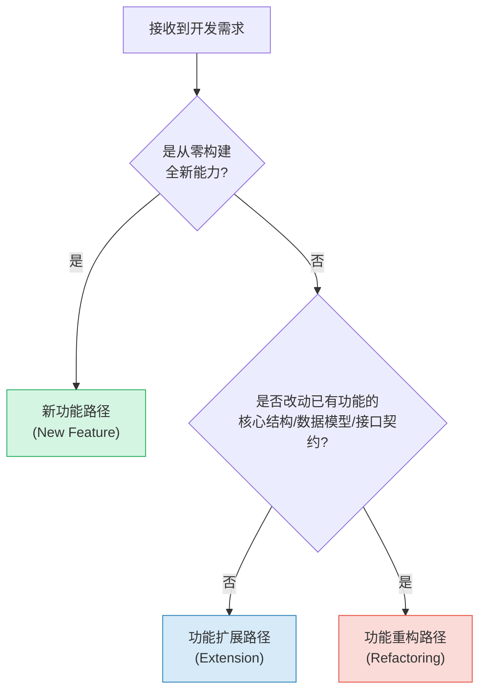

+++
id = "elastic-workflow-classification"
domain = "methodology"
layer = "methodology"
maturity = "L2"
validation_count = 1
reuse_count = 0
documentation_level = "basic"
source = "docs/retrospective/reports/governance/retrospective-stage-guardrails-logging-20260629/insight-extraction.md"

[bindings]
rules = [".agents/rules/stage-guardrails.md"]
references = [".agents/workflows/feature-development.md"]
skills = []
+++

# 弹性流程分级：按变更风险选择流程路径

## 模型概述

好的治理系统不是"管得越严越好"，而是"弹性适配"——给低风险操作留快捷通道，给高风险操作加防护栏。流程严格度与变更风险成正比，避免一刀切导致的两种极端：要么过度官僚化（大家绕过流程），要么过度宽松（高风险变更失控）。

## 核心机制：变更类型判定决策树

在启动任何开发任务前，首先判定变更类型，选择对应流程路径：

## 三路径对比

| 维度 | 新功能 (New Feature) | 功能扩展 (Extension) | 功能重构 (Refactoring) |
|------|---------------------|---------------------|----------------------|
| 颜色标识 | 🟢 绿色 | 🔵 蓝色 | 🔴 红色 |
| 风险等级 | 中（新代码不影响旧功能） | 低（增量添加不改核心） | 高（改动核心可能引入回归） |
| 步骤数 | 8步完整版 | 6步轻量版 | 7步重量版 |
| 必须阶段 | S1-S8全量 | 跳过S2（简化方案） | S2方案设计加重、S6审查加重 |
| 前置文档 | 全量必读 | 必读清单缩减 | 必读清单+额外风险评估 |
| 阶段守卫 | 全部拦截检查点 | 减少拦截点 | 增加拦截点和审批要求 |
| 回滚策略 | 功能开关即可回滚 | 直接回退PR | 需要数据迁移脚本和回滚预案 |
| 典型场景 | 新增认证模块 | 添加一个API端点、修改文案 | 更换认证方案、重构数据模型 |

## 设计原则

1. **决策前置**：在流程最开始就判定类型，而不是中途才发现走错了路径
2. **客观判定**：判定标准是可观察的（是否从零构建？是否改动核心？），不依赖主观判断
3. **权限升级**：高风险路径自动升级审批要求（重构需reviewer确认回退）
4. **文档差异**：不同路径的前置文档清单不同，低风险读少，高风险读多
5. **禁止降级**：一旦判定为重构路径，不得降级为扩展路径走快捷通道

## 反模式

- ❌ **一刀切**：所有变更都走完整8步流程→简单bugfix被过度官僚化，智能体倾向于绕过
- ❌ **一刀切（反向）**：所有变更都走轻量路径→高风险重构缺少必要审查
- ❌ **主观选择**：让开发者自己选走哪条路径→倾向于选最轻量的路径逃避审查
- ❌ **路径跳变**：中途发现走错路径但不回退，硬着头皮继续→流程形同虚设

## 实施检查清单
- [ ] 定义变更类型的客观判定标准（决策树）
- [ ] 为每种类型定义差异化的步骤数、前置文档、审批要求
- [ ] 在工作流入口处强制类型判定（由orchestrator执行）
- [ ] 阶段守卫在拦截时检查路径与操作是否匹配
- [ ] 高风险路径（重构）增加回滚策略和数据迁移要求
- [ ] 三路径的Mermaid决策图嵌入工作流文档，直观可读

> 来源：来自 retrospective-stage-guardrails-logging-20260629 洞察5
> 关联模式：[three-layer-rule-enforcement.md](three-layer-rule-enforcement.md)
