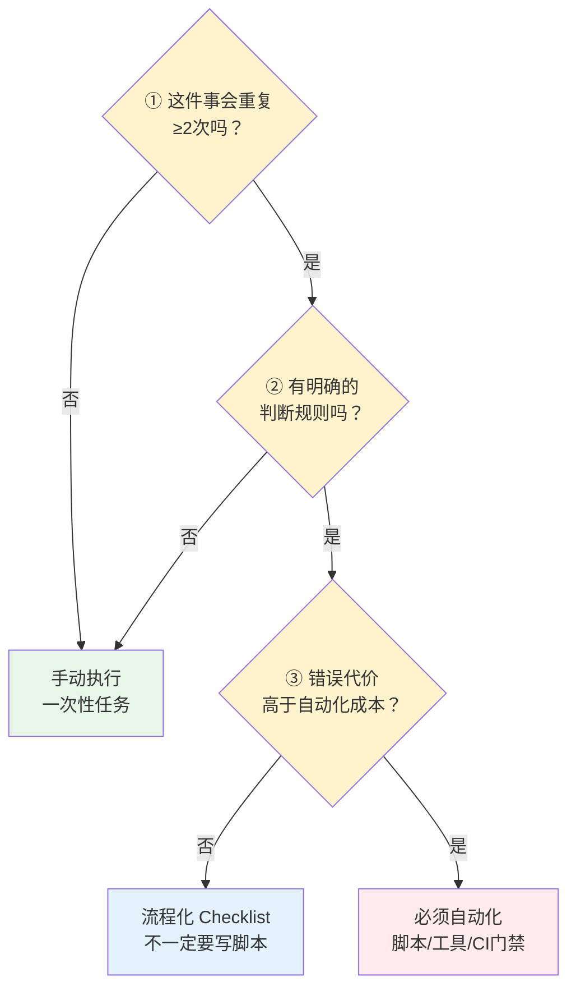

> **提炼自**：[Vibe Coding两大神级Prompt学习分析洞察8](../../../reports/insight-extraction/external-learning/retrospective-vibe-coding-prompts-learning-analysis-20260704/insights/08-entropy-law-automation.md)

# 熵增定律自动化第一性原理（Entropy Law: Automation Against Chaos）

## 模式类型

方法论模式（治理策略/第一性原理/系统思维）

## 成熟度

L2 已验证（5次验证来源：defuddle工具选择、索引自动生成、checklist验收流程、CI/CD自动化、制造业流水线）

## 适用场景

判断何时应该自动化、何时手动即可的决策场景。适用于：

| 场景 | 适用度 | 说明 |
|------|--------|------|
| 重复流程自动化决策 | ✅✅✅ 核心场景 | 判断哪些重复工作应该自动化 |
| 工具开发ROI评估 | ✅✅✅ 核心场景 | 快速判断是否值得投入开发自动化工具 |
| 质量保障体系设计 | ✅✅✅ 核心场景 | 识别哪些质量检查必须自动化 |
| 知识库/文档维护 | ✅✅ 强烈推荐 | 索引生成、链接检查、格式校验等 |
| 团队流程规范制定 | ✅✅ 推荐 | 设计不依赖个人注意力的自动化流程 |
| 个人工作流优化 | ✅✅ 推荐 | 识别个人重复任务并自动化 |
| 创造性/探索性工作 | ❌ 不适用 | 创意工作需要手动探索，自动化会抑制创造力 |
| 一次性临时任务 | ❌ 不适用 | 单次任务自动化成本高于手动成本 |

## 问题背景

在工具自动化决策中，人们常犯两个相反的错误：
- **自动化不足**：觉得"手动做更快"，结果随着系统规模扩大，手动维护成本指数级增长，错误和不一致累积
- **过度自动化**：为了自动化而自动化，投入大量开发成本维护一个很少用的工具，ROI为负

这两个错误的根源是缺乏第一性原理层面的判断标准——要么凭直觉"这个应该自动"，要么凭惰性"手动先凑合"。

从defuddle优先提取、索引自动生成、checklist验收三个经验中，可以提炼出**熵增定律**这一底层第一性原理，作为自动化决策的通用判断标准。

## 核心原则：熵增定律与自动化三问法

### 第一性原理表述

> **在封闭系统中，熵（混乱度）总是趋于增加——手动操作是熵增的来源，自动化是熵减的手段。**

任何重复执行的手动操作，随着执行次数增加和系统规模扩大，必然引入错误、不一致和遗漏。这不是"粗心"问题，而是热力学第二定律在信息系统中的体现：
- 人的记忆不可靠，重复劳动会疲劳 → 遗漏错误
- 不同人对规则理解有差异 → 格式不一致
- 手动步骤越多，中间环节出错概率越高 → 累积性熵增
- 系统规模越大，手动维护成本呈超线性增长 → 复杂度爆炸

### 自动化三问法（可操作化决策）

在决定手动还是自动做某件事时，快速问三个问题：

| 问题 | 判断标准 | 决策 |
|------|---------|------|
| **Q1：会重复≥2次吗？** | 这件事未来还会做吗？还是只做一次？ | 否→手动；是→继续 |
| **Q2：有明确判断规则吗？** | 能否用yes/no或明确步骤描述判断标准？还是需要主观判断/创意？ | 否→手动或辅助工具；是→继续 |
| **Q3：错误代价高于自动化成本吗？** | 出错一次的损失×发生概率 > 开发/配置自动化的投入？ | 否→流程化（Checklist）；是→必须自动化 |

### 三个层次的应对策略

根据三问法的答案，选择对应的熵减手段：

| 层次 | 适用条件 | 熵减手段 | 示例 |
|------|---------|---------|------|
| **手动层** | 一次性/无明确规则/错误代价低 | 直接手动执行，记录经验 | 探索性原型、临时分析、创意写作 |
| **流程层** | 重复≥2次+有规则但错误代价不高 | Checklist、SOP、决策模板 | 代码Review检查清单、发布流程、决策三查 |
| **自动化层** | 三问全"是" | 脚本、工具、CI门禁、自动生成 | 链接检查、索引生成、格式校验、单元测试 |

## 反模式

| 反模式 | 为什么错误 | 正确做法 |
|--------|----------|---------|
| "手动做更快，不用自动化" | 只看到第一次的速度，没看到N次重复的累积成本；第一次手动5分钟，第10次累计50分钟+调试错误30分钟 | 用三问法判断：如果重复≥2次+有规则+错误有代价，第一次就自动化 |
| "一切皆可自动化" | 为了自动化而自动化，创意/判断类工作强行自动化会扼杀灵活性，且ROI为负 | 三问法Q2如果"无明确规则"（需要创意/主观判断），不要强行自动化 |
| "等出了问题再自动化" | 错误已经发生才补救，代价远高于提前预防；熵增后再减熵成本更高 | 识别重复模式时立即判断，不要等事故发生 |
| 自动化了就不再检查 | 自动化工具本身也可能有bug，完全依赖自动化等于把风险转移给工具 | 自动化+抽样验证，关键环节保留人工审核 |
| 只有代码需要自动化 | 文档、流程、沟通、决策等非代码领域同样受熵增定律支配 | 文档索引自动生成、决策Checklist、流程自动化，和代码自动化同等重要 |
| 写了脚本就等于自动化了 | 脚本存在但没人用、不在CI里、需要手动记得运行，等于没自动化 | 必须嵌入工作流（Git Hooks/CI门禁/定时任务），不能依赖"记得运行" |

## 检验标准

做完之后怎么知道做对了？

1. **三问法覆盖**：所有重复任务都经过三问法判断，明确归类到手动/流程/自动化三层
2. **自动化层嵌入工作流**：必须自动化的任务不是"有脚本"，而是"跳不过去"（CI拦截、Hooks强制）
3. **流程层有Checklist**：三问否Q3的任务有明确的Checklist，不是靠记忆
4. **熵减效果可度量**：自动化后错误率/不一致率/维护时间有可观察的下降
5. **没有过度自动化**：创意/探索/一次性工作保持手动灵活，没有被自动化束缚

## 跨场景迁移示例

| 领域 | 手动层（三问任一否） | 流程层（是+是+否） | 自动化层（三问全是） |
|------|-------------------|------------------|-------------------|
| **软件工程** | 架构设计探索、技术选型调研 | Code Review Checklist、发布流程 | CI/CD、单元测试、静态检查、自动部署 |
| **文档维护** | 新主题创作、内容改写 | 写作模板、Review Checklist | 链接检查、索引生成、格式校验、TOML元数据同步 |
| **数据处理** | 探索性数据分析、可视化设计 | 数据校验Checklist、分析流程SOP | ETL自动化、报表自动生成、异常监控告警 |
| **制造业** | 新产品原型试制、工艺研发 | 作业指导书、质量检查清单 | 流水线自动化、机器人焊接、自动质检 |
| **个人生活** | 旅行规划、兴趣探索 | 出行Checklist、每周复盘模板 | 账单自动支付、定期备份、邮件过滤规则 |
| **团队管理** | 人才招聘面试、战略决策 | 面试评估表、决策会议议程 | 考勤统计、绩效数据汇总、请假流程自动化 |

## 5-Whys根因分析示例

以"为什么要优先用defuddle而不是WebFetch？"为例：

| Why层级 | 问题 | 答案 |
|---------|------|------|
| Why1 | 为什么要优先用defuddle？ | 因为WebFetch对微信URL经常失败 |
| Why2 | 为什么WebFetch会失败？ | 因为微信有反爬机制，简单HTTP请求无法处理 |
| Why3 | 为什么不每次都手动判断用哪个工具？ | 因为手动判断会引入人为错误和时间浪费 |
| Why4 | 为什么手动判断容易出错？ | 因为人的记忆不可靠，重复劳动会疲劳 |
| Why5 | **底层本质** | **封闭系统熵增——手动操作是熵增来源，自动化是熵减手段** |

同样的5-Whys链条适用于：
- 为什么索引必须自动生成？→手动编辑会遗漏→熵增
- 为什么链接必须自动检查？→手动检查会漏→熵增
- 为什么格式必须工具校验？→人工校验不一致→熵增

## 与其他模式的关系

| 关联模式 | 关系类型 | 关系说明 |
|---------|---------|---------|
| [tool-automation-decision-model.md](../tools-automation/tool-automation-decision-model.md) | 互补：快速判断→精确定量 | 本模式提供第一性原理三问法快速决策；tool-automation-decision-model提供ROI精确计算，适合大型工具投入决策 |
| [three-tier-governance.md](three-tier-governance.md) | 原则→架构 | 三层治理模型（原子化→自动化→验证）是本原理在治理体系的架构实现 |
| [derived-file-auto-generation.md](../tools-automation/derived-file-auto-generation.md) | 原则→具体应用 | 衍生文件全自动原则是本原理在衍生数据场景的具体落地 |
| [document-entropy-three-strategies.md](../document-architecture/document-entropy-three-strategies.md) | 原则→具体应用 | 文档熵增三策略是本原理在文档统计字段场景的具体策略选择 |
| [axiom-system-consistency-principle.md](axiom-system-consistency-principle.md) | 并列第一性原理 | 熵增定律回答"什么时候自动化"；公理系统一致性回答"自动化/手动都要遵守什么底层规则" |
| [cognitive-practice-gap-recursive-defense.md](cognitive-practice-gap-recursive-defense.md) | 防御补充 | 认知偏差防御解释了为什么人会"觉得手动没问题"——System1捷径倾向于低估重复成本 |

## Changelog

- 2026-07-13 | create | 初始版本，从Vibe Coding Prompt学习分析洞察8沉淀，L2成熟度，5次验证实例，包含自动化三问法
