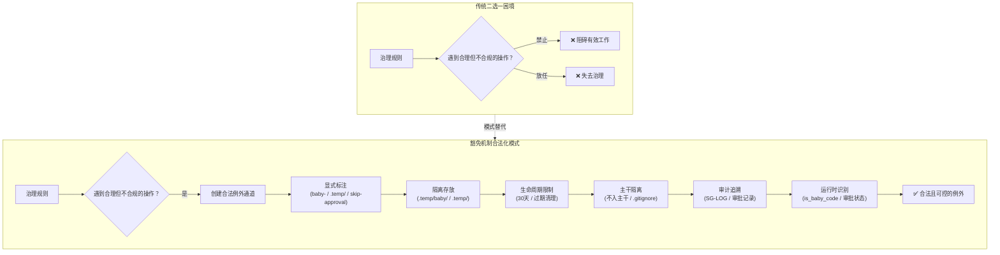

# 豁免机制合法化

## 来源

本模式萃取自以下实践与洞察：

- `docs/retrospective/reports/task-reports/retrospective-l0l3-template-design-20260706/README.md` S3 洞察提炼：`baby-` 前缀让探针代码合法化，通过显式标注创建合法例外通道
- L0-L3 流程分级示例模板（`.agents/templates/l0-l3-process-tier-template.md` §3.3）：探针实现豁免规则的设计
- A3 行动项实现（`lib/stage_guardrails/boundary.py` 的 `is_baby_code()` 函数）：豁免机制的运行时落地
- 回溯性验证：`.temp/` 目录机制、阶段守卫 skip/rollback 审批、选择性归档豁免规则

## 核心思想

**通过显式标注创建合法的例外通道，而非禁止例外情况。**

当治理规则需要面对"合理但不合规"的操作时，传统做法是禁止或放任——禁止会阻碍有效工作，放任会失去治理。本模式提供第三条路：通过明确的标识机制（前缀/路径/标记）将例外情况合法化，使其可识别、可追踪、可回收，同时保持主干治理规则的完整性。

**一句话概括**：与其禁止所有例外，不如为例外创建一条有围栏的合法通道。

## 模型图

## 设计要素

豁免机制合法化模式的 6 个核心设计要素：

| 要素 | 作用 | 实现示例 |
|---|---|---|
| **1. 显式标注** | 让例外可被识别，区别于合规操作 | `baby-` 文件名前缀、`.temp/` 目录前缀、`skip` 请求标记 |
| **2. 隔离存放** | 物理隔离例外与合规产物，避免混淆 | `.temp/baby/` 子目录、`.temp/` 根目录、暂存分支 |
| **3. 生命周期限制** | 防止例外长期存在演变为永久 debt | 30 天过期、迁移后清理、审批有效期 |
| **4. 主干隔离** | 例外不污染主干，不影响 CI/发布 | `.gitignore` 忽略、不入主干、不进 CI 流水线 |
| **5. 审计追溯** | 例外操作可回溯，便于事后审查 | SG-LOG `baby_code: true`、JumpRecord 审批记录、归档日志 |
| **6. 运行时识别** | 工具链支持自动识别豁免，无需人工干预 | `is_baby_code()` 函数、审批状态检查、`.gitignore` 规则 |

> **关键原则**：6 个要素并非全部必须——至少需要"显式标注 + 审计追溯"两项，其余按场景需要选择。但缺少任一要素都会降低模式的治理强度。

## 验证场景

本模式经过 4 次验证（1 次前瞻性 + 3 次回溯性），成熟度 L2。

### 验证 1：L0 探索级探针豁免（前瞻性，2026-07-06）

| 要素 | 实现 |
|---|---|
| 显式标注 | 文件名以 `baby-` 开头 |
| 隔离存放 | `.temp/baby/` 子目录 |
| 生命周期限制 | 30 天过期 |
| 主干隔离 | 不入主干、不进 CI |
| 审计追溯 | SG-LOG `baby_code: true` 字段 |
| 运行时识别 | `is_baby_code()` 函数（A3 行动项实现） |

**来源**：[L0-L3 流程分级示例模板](../../../../../.agents/templates/l0-l3-process-tier-template.md) §3.3 + [A3 实现说明](../../../reports/task-reports/retrospective-l0l3-template-design-20260706/README.md#a3-实现说明baby-前缀运行时识别)

### 验证 2：`.temp/` 目录机制（回溯性，已存在）

| 要素 | 实现 |
|---|---|
| 显式标注 | `.temp/` 目录前缀 |
| 隔离存放 | `.temp/` 根目录及其子目录 |
| 生命周期限制 | 过期清理 / 迁移后清理 |
| 主干隔离 | `.gitignore` 忽略 `.temp/` |
| 审计追溯 | 迁移记录、清理通知 |
| 运行时识别 | `.gitignore` 规则 + 脚本检查 |

**来源**：[双区开发模型](../ai-collaboration/dual-zone-development-model.md) + `.agents/protocols/dependency-management.md`

### 验证 3：阶段守卫 skip/rollback 审批（回溯性，已存在）

| 要素 | 实现 |
|---|---|
| 显式标注 | `skip` / `rollback` 请求标记 |
| 隔离存放 | JumpRecord 状态机（requested/approved/executed） |
| 生命周期限制 | 审批后必须执行，不可长期挂起 |
| 主干隔离 | skip 不可跳至 S8、rollback 有限目标集 |
| 审计追溯 | JumpRecord 记录请求人/审批人/原因 |
| 运行时识别 | `StageStateManager` 的 jump 流程审批检查 |

**来源**：`.agents/rules/stage-guardrails/` + `lib/stage_guardrails/state.py`

### 验证 4：选择性归档豁免规则（回溯性，已存在）

| 要素 | 实现 |
|---|---|
| 显式标注 | 声明"选择性归档" |
| 隔离存放 | 归档目录与源目录分离 |
| 生命周期限制 | 归档后源文件删除 |
| 主干隔离 | 归档文件不回写源目录 |
| 审计追溯 | 归档日志记录 |
| 运行时识别 | 依赖验证 + 索引同步两项必查 |

**来源**：`project_memory.md` 工程约定 — "选择性归档可跳过全量迁移的四项质量门禁，但必须执行依赖验证与索引同步"

### 验证场景对比

| 维度 | baby- 前缀 | `.temp/` 目录 | skip/rollback | 选择性归档 |
|---|---|---|---|---|
| 豁免对象 | 阶段守卫拦截 | 版本控制追踪 | 阶段顺序约束 | 全量迁移门禁 |
| 标注方式 | 文件名前缀 | 目录前缀 | 状态标记 | 声明标记 |
| 审批需求 | ❌ 自动豁免 | ❌ 自动隔离 | ✅ 需审批 | ❌ 自动跳过 |
| 保留门禁 | 无（完全豁免） | 无（完全隔离） | 仅限非关键阶段 | 依赖验证 + 索引同步 |
| 可逆性 | 探针可升级为正式 | 可迁移至正式区 | 可 reject | 不可逆 |

## 与相关模式的关系

### 与双区开发模型的关系

| 维度 | 豁免机制合法化 | 双区开发模型 |
|---|---|---|
| 关注点 | 在已有治理规则中为例外创建合法通道 | 将开发过程划分为不同治理强度的两个区域 |
| 范围 | 局部策略（针对单一治理规则） | 整体策略（覆盖整个工作流） |
| 关系 | 双区开发模型中的"非正式区"是豁免机制的一种实现 | 豁免机制合法化是双区开发模型的治理基础 |

**结论**：两者有交集但不重叠。双区开发模型是整体工作流分区策略，豁免机制合法化是局部治理策略。`.temp/` 目录机制同时是两者的应用案例。

### 与弹性工作流分类的关系

| 维度 | 豁免机制合法化 | 弹性工作流分类 |
|---|---|---|
| 关注点 | 为例外情况创建合法通道 | 根据变更风险选择流程路径 |
| 交互 | L0 探索级是豁免机制的应用 | L0 是弹性工作流的扩展（非原有路径） |

**结论**：L0-L3 模板的 L0 探索级是两个模式的交叉应用——既是对弹性工作流的层级扩展，也是对豁免机制合法化的具体实现。

## 复用场景

| 场景 | 显式标注 | 隔离存放 | 生命周期 | 主干隔离 | 审计追溯 | 运行时识别 |
|---|---|---|---|---|---|---|
| 探索性代码验证 | `baby-` 前缀 | `.temp/baby/` | 30天 | .gitignore | SG-LOG | `is_baby_code()` |
| 临时实验文件 | `experimental-` 前缀 | `.temp/experimental/` | 7天 | .gitignore | 实验日志 | 脚本检查 |
| 紧急修复绕过 | `hotfix-` 标记 | hotfix 分支 | 24小时 | 分支隔离 | 审批记录 | CI 规则 |
| 原型设计验证 | `prototype-` 前缀 | `.temp/prototype/` | 14天 | .gitignore | 设计文档 | 脚本检查 |
| 测试桩代码 | `stub-` 前缀 | `__mocks__/` | 持续 | .gitignore | 测试报告 | 测试框架识别 |

## 约束与注意事项

### 一、必须保留"显式标注"

豁免机制的核心是"可识别"。如果例外操作没有显式标注，就无法与合规操作区分，审计追溯和运行时识别都无从谈起。

- ✅ 正例：`baby-sidebar-chat-probe.tsx`（前缀标注）
- ❌ 反例：在 `src/components/` 下直接写探针代码（无标注）

### 二、必须保留"审计追溯"

豁免不等于不受监督。所有豁免操作必须有日志记录，便于事后审查豁免是否合理。

- ✅ 正例：SG-LOG 中标记 `baby_code: true`，可查询所有探针操作
- ❌ 反例：跳过阶段守卫但不记录原因，无法回溯

### 三、防止豁免通道滥用

豁免通道是为"合理但不合规"的操作设计的，不是"绕过治理的捷径"。需要定期审查豁免使用情况：

- 豁免频率是否异常增长？
- 豁免的代码是否在生命周期内被清理或迁移？
- 是否有应该走正式流程的操作被错误地走豁免通道？

### 四、豁免边界必须明确

豁免机制必须明确"豁免什么"和"不豁免什么"。例如：

- baby- 前缀豁免阶段守卫拦截，但不豁免代码审查
- 选择性归档豁免四项质量门禁，但不豁免依赖验证和索引同步
- skip 审批豁免阶段顺序，但不允许跳至 S8

### 五、生命周期必须有强制回收

没有生命周期限制的豁免会演变为永久 debt。必须定义：
- 过期时间（如 30 天）
- 清理机制（如过期自动删除、迁移后删除）
- 升级路径（如探针代码验证通过后迁移至正式区）

## 反模式警示

### 反模式 1：无标注豁免

直接在正式区写探针代码，不添加任何标注——等于没有豁免机制，只是放任。

### 反模式 2：无限期豁免

豁免的代码永远不被清理或迁移，成为永久 debt——违背了"生命周期限制"要素。

### 反模式 3：全部门禁豁免

豁免通道跳过所有治理规则——应该只豁免与例外性质相关的门禁，保留其他门禁。

### 反模式 4：无审计豁免

豁免操作不留任何日志——无法事后审查，等于失去治理。

## 关联模块

- [L0-L3 流程分级示例模板](../../../../../.agents/templates/l0-l3-process-tier-template.md) — 探针实现豁免规则的设计载体（§3.3）
- [弹性工作流分类](elastic-workflow-classification.md) — L0 探索级是本模式与弹性工作流分类的交叉应用
- [双区开发模型](../ai-collaboration/dual-zone-development-model.md) — `.temp/` 机制是本模式与双区开发模型的共同应用案例
- [三层规则执行](three-layer-rule-enforcement.md) — 本模式是三层执行中的"豁免层"实现
- [L0-L3 模板设计复盘](../../../reports/task-reports/retrospective-l0l3-template-design-20260706/README.md) — 本模式的萃取来源
- [A3 实现说明](../../../reports/task-reports/retrospective-l0l3-template-design-20260706/README.md#a3-实现说明baby-前缀运行时识别) — `is_baby_code()` 运行时识别的实现

## Changelog

<!-- changelog -->
- 2026-07-06 | create | 初始创建，L2 成熟度（4 次验证：1 次前瞻性 + 3 次回溯性），来源于 L0-L3 模板设计复盘 A5 行动项
