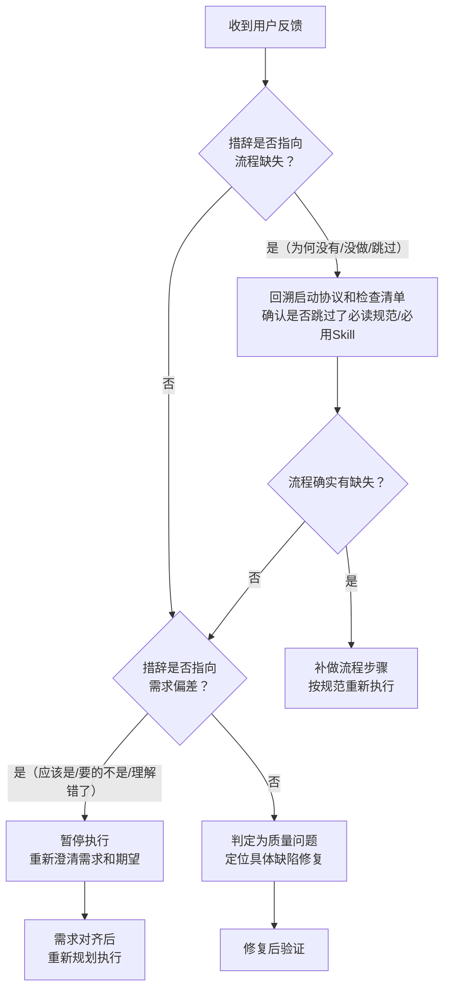

+++
id = "pattern-feedback-wording-diagnosis"
domain = "methodology"
layer = "methodology"
maturity = "L1"
validation_count = 1
reuse_count = 0
documentation_level = "standard"
source = "docs/retrospective/reports/project-governance/tools-and-automation/retrospective-forum-posting-skill-optimization-20260629/insight-extraction.md"

[bindings]
rules = []
references = ["root-cause-diagnosis.md", "three-level-problem-solving.md"]
skills = []
+++

> **提炼自**：[insight-extraction.md](../../../reports/project-governance/tools-and-automation/retrospective-forum-posting-skill-optimization-20260629/insight-extraction.md) —— forum-posting Skill 优化复盘

# 用户反馈措辞诊断模式（Feedback Wording Diagnosis）

## 模式类型

方法论模式（问题诊断）

## 成熟度

L1 首次提炼（forum-posting Skill 优化实践验证）

## 适用场景

当用户对任务结果提出反馈、质疑或不满时，需要快速定位问题根因：是流程合规问题？输出质量问题？还是需求理解偏差？

本模式提供从**用户反馈的自然语言措辞**到**问题类型**的快速映射规则，避免一开始就陷入"修改结果"的误区，先诊断问题类别再对症下药。

## 问题背景

收到用户负面反馈时，Agent 常犯的错误是：
1. 直接修改输出结果，而不反思是否是流程问题
2. 把流程缺失导致的问题归咎于"输出质量不好"
3. 把需求理解偏差当作质量问题反复修改
4. 没有建立反馈措辞→问题类型的映射，每次都从零开始诊断

用户反馈的**措辞本身就是诊断线索**——不同类型的问题会触发不同的自然语言表达模式。

## 核心规则

### 规则 1：三类问题的措辞指纹

| 问题类型 | 典型措辞模式 | 诊断优先级 | 正确应对 |
|---------|------------|-----------|---------|
| **流程缺失** | "为何没有X？"、"怎么没做Y？"、"你跳过了Z？"、"应该先读A再开始啊" | 最高（先排查流程） | 回溯启动协议、检查清单、路由规则，而非直接修改结果 |
| **质量问题** | "X不好用"、"这里写得不对"、"格式错了"、"这个功能有bug"、"效果不好" | 中（流程合规后再看质量） | 定位具体问题点，针对性修复输出或代码 |
| **需求偏差** | "X应该是Y"、"我要的不是这个"、"理解错了"、"方向不对" | 高（立即澄清需求） | 停止执行，回到需求确认环节，重新对齐期望 |

### 规则 2：诊断优先级顺序

收到反馈时必须按以下顺序排查，不能跳过：

### 规则 3：流程缺失问题必须先复盘再重做

如果诊断为流程缺失（如"你怎么没用skill-creator？"），**不能直接补用工具继续做**，必须：
1. 承认流程跳过
2. 回溯完整的启动协议，确认还有没有其他遗漏
3. 评估已经做的工作哪些需要返工
4. 补做流程步骤后再继续

> **为什么？** 流程违规往往不是"漏了一步"这么简单——跳过前置规范读取会导致后续所有决策都建立在错误的上下文上，"补一步"无法修复地基错误。

### 规则 4：警惕混合反馈

有些反馈同时包含多种线索，例如："这个不好用，而且你怎么没先读规范？"
- 主要诊断：流程缺失（"怎么没先读"是强信号）
- 次要诊断：可能伴随质量问题
- 应对顺序：先解决流程问题，流程合规后再评估质量问题是否仍然存在

## 诊断速查表

| 用户说... | 大概率是... | 第一反应应该是... |
|----------|------------|----------------|
| "为什么没有X？" | 流程缺失 | 检查X是否在规范/检查清单中要求必须有 |
| "你没做Y啊" | 流程缺失 | 回溯执行步骤，确认Y是否被跳过 |
| "应该先读Z的" | 流程缺失 | 立即读取Z，重新评估已完成工作 |
| "X不好用" | 质量问题 | 询问具体哪里不好用，定位缺陷 |
| "这里写错了" | 质量问题 | 定位错误位置，修复 |
| "格式不对" | 质量问题 | 对照规范修正格式 |
| "我要的不是这个" | 需求偏差 | 停止执行，重新确认需求 |
| "X应该是Y才对" | 需求偏差 | 澄清Y的具体含义，对齐期望 |
| "方向搞错了" | 需求偏差 | 回到任务目标层面重新讨论 |

## 实施检查清单

- [ ] 收到反馈后第一反应不是修改，而是先读反馈措辞判断类型？
- [ ] 是否按"流程缺失→需求偏差→质量问题"的优先级排查？
- [ ] 判定为流程缺失时，是否回溯了完整启动协议而非只补漏的那一步？
- [ ] 判定为需求偏差时，是否停止执行先澄清？
- [ ] 混合反馈是否抓住了主要信号（强措辞优先）？

## 反例警示

| 错误做法 | 后果 |
|---------|------|
| 用户说"怎么没用skill-creator？"，回答"好的我现在用"然后直接继续 | 上下文已经错了，补用工具也无法修复之前的错误决策 |
| 用户说"方向不对"，回答"我改一下这里" | 没有回到需求层面，局部修改无法解决方向问题 |
| 用户说"这里写错了"，回答"是不是我流程没走对？" | 过度排查流程，浪费时间在不需要的地方 |
| 不看措辞直接问"哪里有问题？" | 放弃了最有价值的诊断线索，增加沟通成本 |

## 正例

forum-posting Skill 优化场景：
- 用户反馈："继续优化"但结果不对，Agent 直接改 SKILL.md 没有读 skill-creator 方法论
- （隐含反馈）："你怎么优化 Skill 不用 skill-creator？"
- 诊断：流程缺失（启动协议任务类型预检步骤遗漏）
- 正确应对：承认流程跳过 → 重新执行完整启动协议 → 读取 vendor/flexloop 中的 skill-creator 规范 → 按方法论重新优化

## 与现有模式的关系

- `root-cause-diagnosis.md`：本模式是根因诊断在"用户反馈"这个特定场景下的具体化应用，提供了可操作的措辞指纹
- `three-level-problem-solving.md`：本模式的诊断结果对应三级问题解决的不同入口——流程缺失对应治理层，需求偏差对应定义层，质量问题对应执行层
