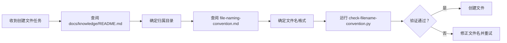

+++
id = "file-creation-precheck-pattern"
domain = "methodology"
layer = "governance"
maturity = "L2"
validation_count = 1
reuse_count = 0
documentation_level = "standard"
source = "docs/retrospective/reports/competitive-analysis/retrospective-tuyaopen-learning-report-optimization-20260630/export-suggestions.md#模式候选-1"

[bindings]
rules = [".agents/rules/file-naming-convention.md"]
references = ["docs/knowledge/README.md", ".agents/scripts/check-filename-convention.py"]
skills = []
+++

> **来源**：从 `docs/retrospective/reports/competitive-analysis/retrospective-tuyaopen-learning-report-optimization-20260630/export-suggestions.md` 模式候选 1 拆分

# 文件创建前置检查模式（File Creation Precheck Pattern）

## 模式类型
方法论模式 → 治理策略

## 成熟度
L2 已验证（基于 TuyaOpen 学习报告优化任务实践验证）

## 适用场景
- 创建新文档
- 创建新代码文件
- 文档迁移和重命名

## 问题背景

在项目中创建新文件时，缺乏标准化的前置检查流程，容易导致：
- 文件放置在错误的目录，破坏分类体系
- 文件名不符合命名规范，影响可发现性和一致性
- 违规文件进入版本库，后续修复成本高

## 核心流程

在创建任何新文件前，强制执行三步检查流程：

### 第一步：确定归属目录
查阅项目知识库入口 [docs/knowledge/README.md](../../../knowledge/README.md)，根据文件内容类型确定应放置的分类目录，如 `learning/`、`operations/`、`troubleshooting/` 等。

### 第二步：确定文件名格式
查阅 [.agents/rules/file-naming-convention.md](../../../.agents/rules/file-naming-convention.md)，确保文件名遵循以下规则：
- 采用 kebab-case（小写字母 + 连字符分隔）
- 纯英文命名，禁止中文
- 符合项目约定的文件命名模式

### 第三步：自动化验证
运行 `python .agents/scripts/check-filename-convention.py <文件名>` 或 `python .agents/scripts/repo-check.py filename --directory <目录>` 验证文件名合规性。

## 检查清单

| 步骤 | 检查项 | 验证方式 |
|------|--------|---------|
| 第一步 | 文件是否放在正确的分类目录 | 查阅 docs/knowledge/README.md |
| 第二步 | 文件名是否符合 kebab-case | 查阅 file-naming-convention.md |
| 第三步 | 文件名是否通过自动化验证 | 运行 check-filename-convention.py |

## 执行标准

| 标准 | 要求 | 达标状态 |
|------|------|---------|
| 目录归属 | 文件必须放在知识分类体系定义的对应目录下 | ✅/❌ |
| 文件名格式 | 必须使用 kebab-case，纯英文 | ✅/❌ |
| 自动化验证 | 必须通过 check-filename-convention.py 检查 | ✅/❌ |
| 根目录禁止 | 禁止在项目根目录创建文档文件 | ✅/❌ |

## 价值

- **规范保障**：创建文件时自动执行规范检查，违规率降为 0
- **流程一致性**：为后续文件创建任务提供标准化方法论
- **可审计性**：三步检查流程可追溯、可验证
- **成本控制**：前置检查避免后续返工成本

## 关联资源

- [文件命名规范](../../../../.agents/rules/file-naming-convention.md)
- [文件名检查脚本](../../../../.agents/scripts/check-filename-convention.py)
- [知识库入口](../../../../docs/knowledge/README.md)
- [文件创建指令集](../../../../.agents/commands/file-creation.md)