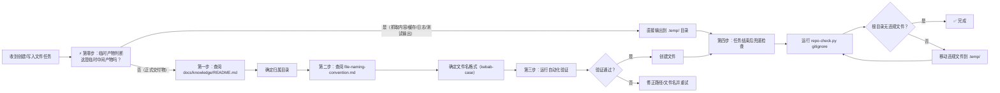

> **来源**：从 `docs/retrospective/reports/competitive-analysis/retrospective-tuyaopen-learning-report-optimization-20260630/export-suggestions.md` 模式候选 1 拆分

# 文件创建前置检查模式（File Creation Precheck Pattern）

## 模式类型
方法论模式 → 治理策略

## 成熟度
L3 已强化（基于 2 次实践验证：TuyaOpen 学习报告 + 2026-07-01 临时文件路径违规事件，新增临时产物判断与工具兜底）

## 适用场景
- 创建新文档
- 创建新代码文件
- 文档迁移和重命名
- **命令行工具输出文件**（defuddle、curl、wget 等 `-o/--output` 参数）
- **Shell 重定向**（`>` / `>>`）和 PowerShell 输出命令（`Out-File`/`Set-Content`）
- **网页抓取/内容提取**的中间产物保存

## 问题背景

在项目中创建新文件时，缺乏标准化的前置检查流程，容易导致：
- 文件放置在错误的目录，破坏分类体系
- 临时中间产物散落在项目根目录，污染版本控制
- 文件名不符合命名规范，影响可发现性和一致性
- 违规文件进入版本库，后续修复成本高（非线性返工成本）

> **教训来源**：2026-07-01 使用 defuddle 提取网页内容时，错误将输出文件写到根目录而非 `.temp/`，违反了 dependency-management.md 规范。根因分析表明：知道规范 ≠ 执行规范，必须在操作点设置强制检查卡点。

## 核心流程

在创建任何新文件前，强制执行**四步检查流程**（新增第零步「临时产物判断」）：

### 第零步：临时产物判断（高优先级，必须最先执行）

**遇到以下高风险触发点时，必须停顿 1 秒执行此检查**：
- 命令行工具的 `-o`/`--output` 参数
- Shell 重定向操作符 `>` / `>>`
- PowerShell 的 `Out-File` / `Set-Content` 等输出命令
- defuddle/curl/wget 等下载/抓取类工具
- Write 工具创建新文件（非编辑已有文件）

**判断标准**：
- 如果是临时中间产物（网页抓取内容、缓存、日志、一次性测试输出、临时分析文件）→ **必须输出到 `.temp/` 目录**
- 如果是正式交付物（需要纳入版本控制的文档/代码/配置）→ 进入后续步骤确定正式目录

**目录存放速查表**：

| 文件类型 | 正确目录 | Git 提交 |
|---------|---------|---------|
| 临时中间产物、抓取内容、缓存、日志 | `.temp/` | ❌ 禁止 |
| 第三方库依赖 | `vendor/` | ❌ 禁止（submodule 除外） |
| Python 虚拟环境 | `.venv/` | ❌ 禁止 |
| 正式文档、知识库、复盘报告 | `docs/` | ✅ 提交 |
| 智能体规范、脚本、模板 | `.agents/` | ✅ 提交 |
| 正式应用（从 .temp/ 迁移） | `apps/` | ✅ 提交 |
| 项目入口文件 | 根目录（仅限 AGENTS.md、README.md、.gitignore 等） | ✅ 仅限入口文件 |

### 第一步：确定归属目录（正式文件）
查阅项目知识库入口 [docs/knowledge/README.md](../../../../knowledge/)，根据文件内容类型确定应放置的分类目录，如 `learning/`、`operations/`、`troubleshooting/` 等。

### 第二步：确定文件名格式
查阅 [.agents/rules/file-naming-convention.md](../../../../../.agents/rules/file-naming-convention.md)，确保文件名遵循以下规则：
- 采用 kebab-case（小写字母 + 连字符分隔）
- 纯英文命名，禁止中文
- 符合项目约定的文件命名模式

### 第三步：自动化验证
运行以下命令验证合规性：
- 文件名验证：`python .agents/scripts/check-filename-convention.py <文件名>`
- 目录合规验证：`python .agents/scripts/repo-check.py filename --directory <目录>`
- Git 忽略规则验证：`python .agents/scripts/repo-check.py gitignore`

### 第四步：任务结束兜底检查
任务完成、提交代码前，运行 `python .agents/scripts/repo-check.py gitignore` 或完整 CI 检查（`ci-check-cmd`），确认项目根目录没有违规临时文件。

## 检查清单

| 步骤 | 检查项 | 验证方式 |
|------|--------|---------|
| 第零步 | 这是临时中间产物吗？命令行输出/-o/重定向等高风险操作是否停顿检查了？ | 自我三问：临时产物?→.temp/；正式文件?→对应目录；路径合规? |
| 第一步 | 正式文件是否放在正确的分类目录 | 查阅 docs/knowledge/README.md |
| 第一步附 | Wiki/知识库类文档：是否参考了1-2个同类现有文档确认格式结构？ | format-evidence-over-memory-pattern：同目录现有文档是格式权威 |
| 第二步 | 文件名是否符合 kebab-case | 查阅 file-naming-convention.md |
| 第二步附 | Wiki/知识库类文档：创建完成后是否更新了对应索引文件？ | 如 docs/knowledge/README.md 中learning分类表格需新增条目 |
| 第三步 | 是否通过自动化验证 | 运行 check-filename-convention.py + repo-check.py gitignore |
| 第四步 | 任务结束后是否做了兜底检查 | 运行 repo-check.py gitignore 确认根目录无违规文件 |

## 执行标准

| 标准 | 要求 | 达标状态 |
|------|------|---------|
| 临时文件路径 | 所有临时中间产物必须放在 `.temp/` 目录，禁止散落根目录 | ✅/❌ |
| 目录归属 | 正式文件必须放在知识分类体系定义的对应目录下 | ✅/❌ |
| 文件名格式 | 必须使用 kebab-case，纯英文 | ✅/❌ |
| 自动化验证 | 必须通过 check-filename-convention.py + repo-check.py 检查 | ✅/❌ |
| 根目录禁止 | 禁止在项目根目录创建非入口类的散文件 | ✅/❌ |
| 兜底检查 | 任务结束必须运行工具检查确认无违规 | ✅/❌ |

## 价值

- **规范保障**：创建文件时自动执行规范检查，违规率降为 0
- **流程一致性**：为后续文件创建任务提供标准化方法论
- **可审计性**：四步检查流程可追溯、可验证
- **成本控制**：前置检查避免后续返工成本（非线性返工成本：5分钟规范检查避免30分钟重构）
- **三层防御**：事前卡点（三问自检）+ 事中提醒（高风险触发点）+ 事后兜底（自动化检查），形成闭环

## 关联资源

- [文件命名规范](../../../../../.agents/rules/file-naming-convention.md)
- [临时依赖管理规范](../../../../../.agents/protocols/dependency-management.md)
- [文件名检查脚本](../../../../../.agents/scripts/check-filename-convention.py)
- [仓库合规检查脚本](../../../../../.agents/scripts/repo-check.py)
- [知识库入口](../../../../knowledge/)
- [文件创建指令集](../../../../../.agents/commands/file-creation.md)
- [CI 综合检查 Skill](../../../../../.agents/skills/ci-check-cmd/SKILL.md)
- [临时文件路径规范洞察](../../../reports/insight-extraction/standalone/insight-temp-file-discipline-20260701.md)
- [Wiki创作三查流程（L3特化模式）](wiki-pre-creation-three-checks.md)
- [项目记忆](../../../../../../.trae-cn/memory/projects/-c-Users-admin-Desktop-Dao-flows-SpecWeave/project_memory.md)

> **更新说明（2026-07-04）**：本模式第一步附、第二步附中的Wiki专项检查项，已在向日葵P4/P1Pro对比任务后特化为独立L3模式 [wiki-pre-creation-three-checks.md](wiki-pre-creation-three-checks.md)。Wiki/知识库类文档创建前建议直接参考该特化模式，本模式的第一步附/第二步附作为通用提示保留。