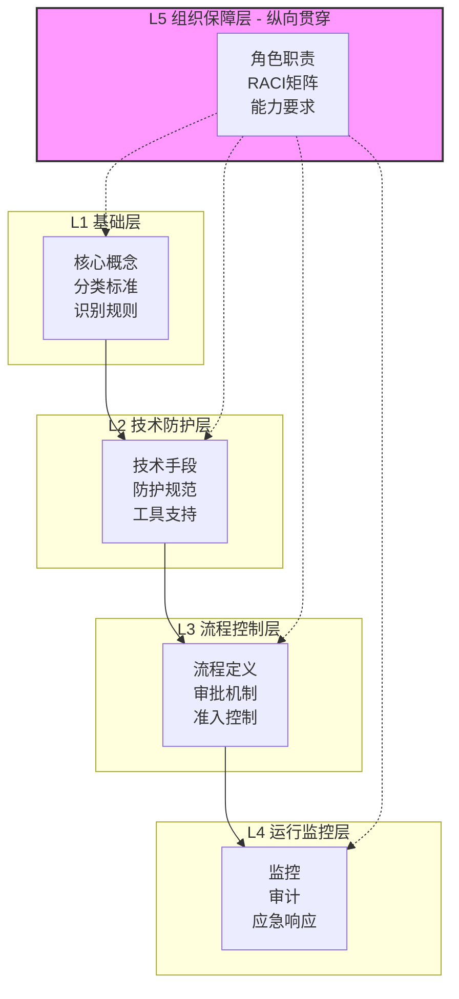
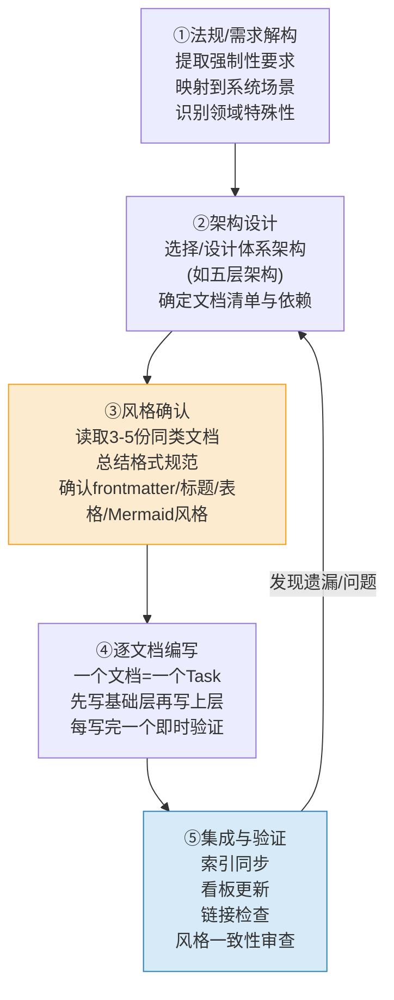

+++
id = "five-layer-governance-architecture"
type = "methodology"
category = "governance-strategy"
maturity = "L2"
source = "docs/retrospective/reports/governance/retrospective-ai-agent-data-security-governance-20260629/"
created = "2026-06-29"
verified_count = 4

[bindings]
rules = [".agents/rules/data-security/"]
references = [
    "convention-driven-creation.md",
    "compliance-driven-rule-building.md",
    "vendor-lifecycle-governance.md"
]
skills = []
+++

# 五层治理体系架构模式

## 模型概述
从零构建一个领域治理规则体系时，缺乏系统化的分层架构指导，容易出现模块遗漏、层次混乱、依赖关系不清。本模式提供五层架构模型，确保治理体系的完整性和层次清晰。

## 五层架构模型

| 层级 | 名称 | 目标 | 关键产出 |
|---|---|---|---|
| L1 | 基础层 | 定义领域核心概念与分类标准 | 分级标准、识别标准、术语定义 |
| L2 | 技术防护层 | 提供可执行的技术手段与规范 | 脱敏/加密方案、替代方案指南、技术工具 |
| L3 | 流程控制层 | 定义流程、审批、准入机制 | 评估流程、审批流程、准入机制 |
| L4 | 运行监控层 | 建立监控、审计、应急机制 | 监控指标、审计规则、应急响应预案 |
| L5 | 组织保障层 | 明确角色职责、RACI矩阵、能力要求 | RACI矩阵、职责说明书、能力要求 |

## 架构图

## 层间依赖关系
- **单向依赖**：上层依赖下层，必须自底向上构建
- **基础先行**：L1 基础层是所有治理的根基，概念不清晰则后续所有层都会混乱
- **组织兜底**：L5 组织保障层最后定义，但纵向贯穿所有层，是执行保障

## 端到端建设流程（五步法）

基于三次治理建设实践（硬编码治理、阶段守卫、数据安全治理），提炼出从零构建治理体系的端到端项目流程：

| 步骤 | 核心动作 | 关键产出 | 注意事项 |
|---|---|---|---|
| ①需求解构 | 提取强制性要求，映射到系统具体场景，识别领域特殊性 | 需求-场景映射表、特殊性清单 | 合规驱动场景使用[compliance-driven-rule-building.md](compliance-driven-rule-building.md)五步法 |
| ②架构设计 | 选择体系架构（五层架构为默认选项），确定文档清单与层间依赖 | 架构图、文档清单、依赖关系图 | 简单领域可裁剪层级，但不建议跳层 |
| **③风格确认** | **读取3-5份同类现有文档，总结格式规范** | 风格模板（隐式） | **成本极低（2-3分钟）但避免大量返工**，遵循[convention-driven-creation.md](convention-driven-creation.md) |
| ④逐文档编写 | 按层自底向上编写，一文一Task，每篇写完即时验证 | 各层规则文档 | 遵循下文"层间构建步骤"顺序；任务粒度参考"一个交付物=一个Task"原则 |
| ⑤集成验证 | 同步索引、更新看板、检查链接、风格一致性审查 | 可导航的完整治理体系 | 发现问题回溯到步骤②修正架构 |

**关键教训**：步骤③风格确认是多次复盘验证的高杠杆环节。跳过此步骤曾导致10个数据安全规则文档全部需要回退修正TOML frontmatter（2-3分钟可避免的30分钟返工）。

## 层间构建步骤

| 步骤 | 动作 | 输入 | 产出 | 验证标准 |
|---|---|---|---|---|
| 1. 基础先行 | 梳理领域核心概念，制定分类分级标准 | 业务需求、法规要求 | 概念定义文档、分级标准 | 所有概念无歧义、分类覆盖100%场景 |
| 2. 技术支撑 | 基于基础标准，制定可落地的技术防护手段 | 基础层标准 | 技术规范、工具指南、替代方案 | 每个风险点都有对应的技术解决方案 |
| 3. 流程管控 | 设计流程节点、审批机制、准入规则 | 技术防护规范 | 流程图、审批矩阵、准入清单 | 关键路径无断点、审批权限清晰 |
| 4. 运行保障 | 建立监控指标体系、审计规则、应急机制 | 流程控制规则 | 监控看板、审计脚本、应急预案 | 异常可发现、违规可追溯、事件可响应 |
| 5. 组织兜底 | 定义角色职责、RACI矩阵、能力要求 | 前四层所有文档 | RACI矩阵、职责说明书 | 每项任务有人负责、每个角色能力匹配 |

## 适用场景
- 数据安全治理体系建设
- 硬编码/敏感信息治理
- 代码质量治理体系
- 安全合规治理体系建设
- 任何需要系统性规则建设的领域

## 不适用场景
- 单一规则/点状补丁式修复
- 临时应急措施
- 已有成熟体系的局部微调

## 验证案例

| 案例 | L1 基础层 | L2 技术防护层 | L3 流程控制层 | L4 运行监控层 | L5 组织保障层 |
|---|---|---|---|---|---|
| 硬编码治理（5模块） | identification-standards | alternatives-guide | allowable-scenarios | detection-and-reporting, enforcement | 阶段守卫角色定义 |
| 阶段守卫机制 | 阶段定义标准 | 拦截技术实现 | 审批流程 | SG-LOG监控 | 角色Non-Goals |
| 数据安全治理（10文档） | data-classification | data-masking, data-encryption | cross-border, vendor-admission | security-monitoring, incident-response | role-responsibilities |

## 注意事项
1. **严格按顺序构建**：不得跳层，上层必须在下层稳定后再建设
2. **组织层最后定义**：避免先定人再定事，职责应基于流程和任务来划分
3. **每层闭环**：每层内部要有自洽的逻辑，不要把上层问题下沉到下层解决
4. **文档化沉淀**：每层的产出必须形成可复用的文档，而非口头约定

> 来源：三次治理建设实践萃取（硬编码治理、阶段守卫机制、数据安全治理）
> 关联模块：`docs/retrospective/patterns/methodology-patterns/governance-strategy/three-tier-governance.md`、`docs/retrospective/reports/governance/retrospective-ai-agent-data-security-governance-20260629/`
