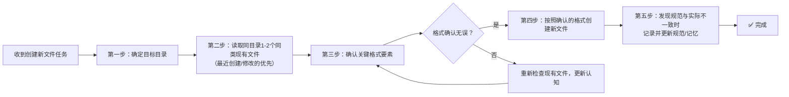

> **来源**：从 `docs/retrospective/reports/competitive-analysis/retrospective-text-to-cad-learning-20260704/insight-extraction.md` 洞察1 提炼

# 格式证据优先于记忆模式（Format Evidence Over Memory Pattern）

## 模式类型
方法论模式 → 治理策略

## 成熟度
L2 已验证（基于1次实践验证：2026-07-04 text-to-cad wiki任务frontmatter格式错误事件，已落地wiki-spec-template.md强制前置检查）

## 适用场景
- 委派子代理创建新文件时
- 对项目规范存在记忆模糊或不确定时
- project_memory中的规范描述与直觉冲突时
- 加入新项目或新目录时
- 任何需要确定文档/代码格式的场景

## 问题背景

在创建新文档/代码时，project_memory或通用规范中描述的格式可能过时、不准确或不适用于当前上下文。

> **教训来源**：2026-07-04 text-to-cad wiki任务中，子代理机械遵循project_memory中"TOML frontmatter"的描述使用了+++分隔符，但实际检查同目录现有文档后发现项目统一使用YAML格式（---分隔），导致返工。根本原因：流程中缺少"检查现有文档"这一强制步骤，依赖执行者"记得要检查"。

## 核心规则

- **唯一权威来源**：同目录下现有同类文档的实际做法是格式问题的唯一权威
- **project_memory仅作参考**：记忆中的规范描述可能过时，必须以实际文档验证
- **强制前置检查**：创建新文件前，必须读取同目录1-2个现有文件确认格式
- **证据优先思维**：建立"看代码/文档"而非"靠记忆"的工作习惯

## 标准操作流程

在创建任何新文件前，强制执行以下五步检查流程：

### 第一步：确定目标目录
明确新文件应放置在哪个具体目录下。

### 第二步：读取同目录现有文件
必须使用 Read 工具实际读取该目录下1-2个同类现有文件，优先选择最近创建或修改的文件。**此步骤不可跳过**。

### 第三步：确认关键格式要素
对比现有文件，确认以下关键格式要素：

| 格式要素 | 检查内容 |
|---------|---------|
| frontmatter风格 | YAML（---分隔）vs TOML（+++分隔） |
| 标题层级结构 | #/##/###的使用惯例 |
| 链接格式 | 相对路径 vs file:///绝对路径 |
| Markdown风格 | 列表/表格/引用等的写法 |
| 特殊约定 | 是否有TOML frontmatter、特殊标记等 |

### 第四步：创建新文件
严格按照确认的格式创建新文件，确保与现有文件风格一致。

### 第五步：规范同步
如果发现project_memory或规范文档与实际做法不一致，记录差异并更新规范/记忆，避免后续重复犯错。

## 反模式（禁止做法）

- ❌ 仅凭project_memory或抽象规范决定格式
- ❌ "我记得应该用XXX格式"而不验证
- ❌ 不同目录使用统一格式假设（不同子模块可能有不同约定）
- ❌ 发现格式不一致时不修正，继续按错误格式创建新文件

## 检查清单

| 步骤 | 检查项 | 验证方式 |
|------|--------|---------|
| 1 | 目标目录是否确定？ | 明确文件应放在哪个目录 |
| 2 | 是否已读取同目录1-2个现有文件？ | Read工具实际读取，不能跳过 |
| 3 | frontmatter格式是否确认？ | 确认是---(YAML)还是+++(TOML) |
| 4 | 链接/标题/表格风格是否确认？ | 与现有文件保持一致 |
| 5 | 新文件格式是否与现有文件一致？ | 自我对比检查 |

## 价值

- **避免返工**：5分钟前置检查避免30分钟格式重构（非线性返工成本）
- **文化建设**：建立"证据优先"的工程文化，而非"记忆优先"
- **错误减少**：减少因规范理解偏差导致的低级错误
- **子代理友好**：可作为明确的检查点指令嵌入委派任务
- **流程兜底**：将"人的疏忽"转化为"流程的强制卡点"

## 关联资源

- [wiki-spec-template.md](../../../../../.agents/templates/wiki-spec-template.md)（已整合强制前置检查）
- [开发规范Wiki制作章节](../../../../development-standards.md)
- [text-to-cad复盘洞察1](../../../reports/competitive-analysis/retrospective-text-to-cad-learning-20260704/insight-extraction.md#洞察1格式一致性优先于记忆规范实际文档是格式问题的唯一权威来源)
- [文件创建前置检查模式](./file-creation-precheck-pattern.md)
