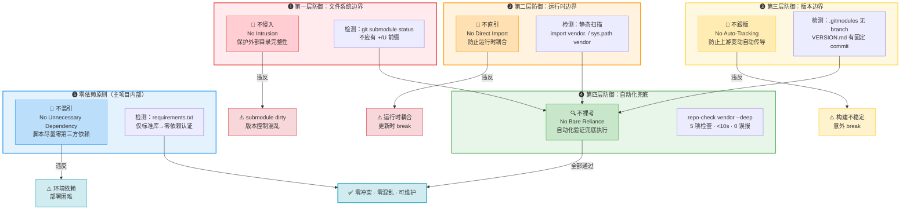
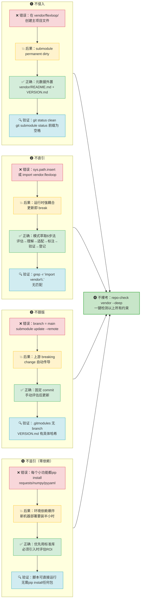
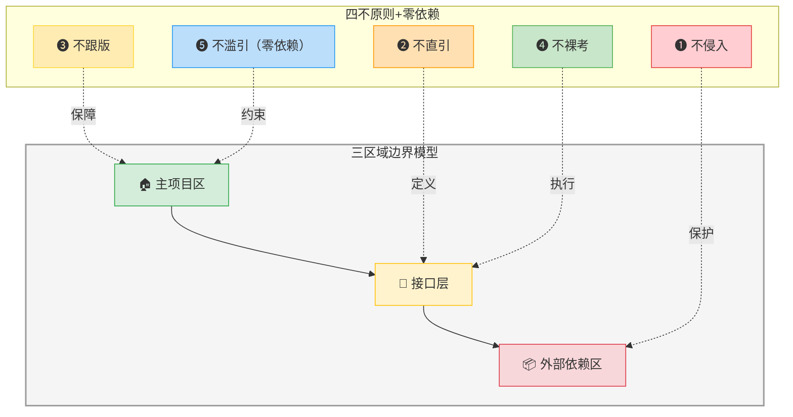
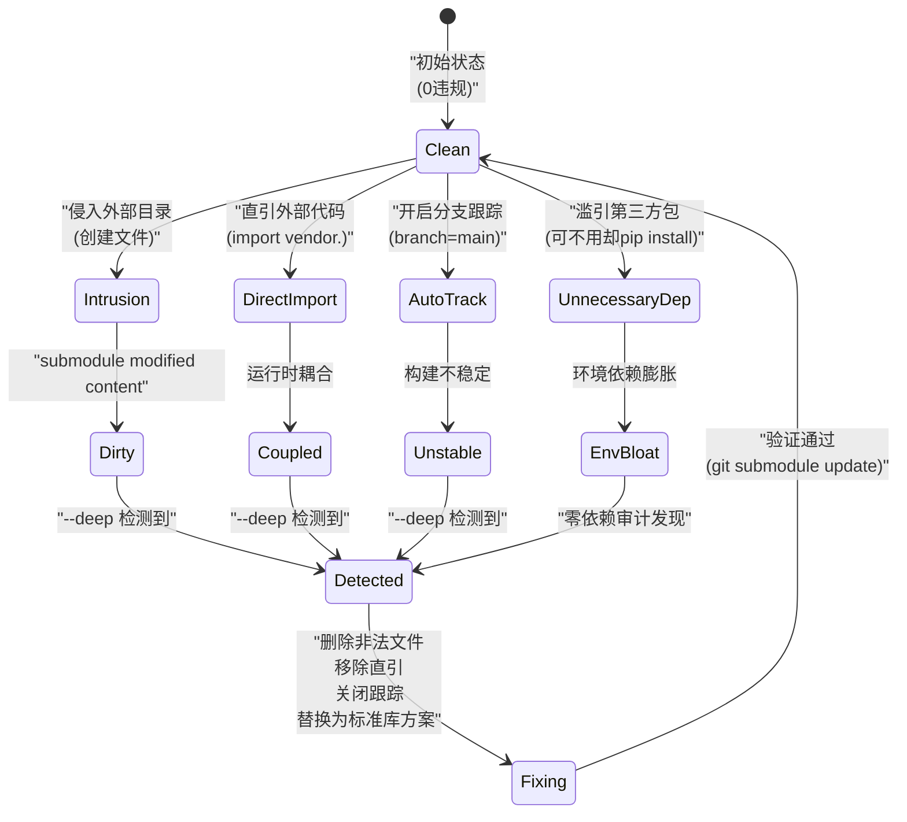

# 外部依赖四不原则：submodule/vendored code 管理铁律

## 模式类型
治理策略模式

## 成熟度
**L3 标准化**（flexloop vendor集成验证 + SpecWeave 13天793次提交实践，150+脚本全部零第三方依赖验证）

## 量化验证结论
- **零依赖验证**：SpecWeave项目150+ Python自动化脚本全部零第三方依赖，仅使用Python标准库
- **跨平台验证**：Windows/macOS/Linux三平台即用，无需pip install、无需虚拟环境配置
- **边界清晰验证**：vendor目录管理遵循四不原则，主项目与外部依赖边界清晰
- **故障隔离验证**：外部依赖问题不影响主项目运行，环境一致性得到保障

## 待跨场景验证项
- [ ] 是否存在必须引入第三方依赖的场景（如复杂YAML/JSON Schema处理、加密算法）
- [ ] 在依赖数量>50个的大型项目中验证边界维护成本
- [ ] 在二进制依赖（C扩展、Rust扩展）场景中验证四不原则适用性
- [ ] 验证零依赖原则与"不要重复造轮子"的平衡边界

## 原则概述

管理外部代码依赖（git submodule、vendored library、第三方Python包）时必须遵循的四条铁律，每条原则对应一类常见错误模式，通过自动化验证脚本兜底执行。

零依赖原则是四不原则在主项目内部的延伸：主项目自身的工具脚本尽可能不引入第三方依赖，确保跨环境即用。

## 四不原则

### 纵深防御架构

四条原则形成四层防御体系，前三条是行为约束（禁止类），第四条是保障机制（检测类），共同构成纵深防御：

### 每条原则的因果链

### 与三区域模型的映射关系

### 违规状态迁移

### ❶ 不侵入（No Intrusion）
- **含义**：外部依赖目录视为只读，不在其中创建或修改主项目维护的文件
- **反面典型**：在 `vendor/flexloop/` 内创建 README.md 记录元数据 → submodule 标记为"modified content"
- **正确做法**：所有元数据（README、VERSION、用途说明）放在接口层（vendor/ 根级或 docs/ 目录）
- **验证手段**：`git submodule status` 前缀检测（不应有 `+`/`U` 标记）；`git status --porcelain <submodule_dir>` 应无输出

### ❷ 不直引（No Direct Import）
- **含义**：不通过 `import`、`sys.path.insert/append` 等方式将外部代码直接引入主项目运行时
- **反面典型**：`sys.path.insert(0, "vendor/flexloop/src")` 然后 `from flexloop import xxx`
- **正确做法**：通过模式萃取流程（评估→理解→适配→标注→验证→登记）将需要的模式复制到主项目并标注来源
- **验证手段**：静态扫描 Python 文件中的 `sys.path.*vendor` 和 `(import|from) vendor\.` 模式

### ❸ 不跟版（No Auto-Tracking）
- **含义**：不自动跟踪上游分支的最新版本，采用固定 commit 锁定策略
- **反面典型**：submodule 配置为跟踪 main 分支，`git submodule update --remote` 自动拉取最新代码
- **正确做法**：
  - VERSION.md 记录具体 commit 哈希（非"见子模块"占位符）
  - 更新前评估兼容性（查看 CHANGELOG、检查 breaking changes）
  - 更新后运行完整验证（--deep 检查 + 测试）
- **验证手段**：检查 .gitmodules 中无 `branch = ` 配置；VERSION.md 包含完整 commit 哈希

### ❹ 不裸考（No Bare Reliance）
- **含义**：不依赖开发者记忆或人工约定来遵守上述三条原则，用自动化验证脚本兜底
- **反面典型**：在文档中写"请不要修改 vendor/ 目录"，但没有工具检测违规
- **正确做法**：
  - 深度集成验证脚本（`repo-check.py vendor --deep`）自动检测违规
  - pytest 配置自动排除 vendor/ 目录
  - CI/pre-commit hook 集成检查（可选）
- **验证手段**：脚本可一键运行，在 <10 秒内完成全部检查

### ❺ 不滥引（No Unnecessary Dependency，零依赖原则）
- **含义**：主项目自身的工具脚本优先使用Python标准库，不滥引第三方依赖；必须引入时严格评估ROI
- **反面典型**：为了读个JSON就引入pydantic，为了处理个路径就引入pathlib2（Python 3已内置）
- **正确做法**：
  - 150+脚本全部零第三方依赖验证通过
  - 标准库能实现的绝不引入第三方包
  - 必须引入时（如复杂加密、特定协议）记录原因和替代方案评估
- **价值**：跨Windows/macOS/Linux即用，无需pip install、无需虚拟环境、不存在版本冲突
- **验证手段**：脚本可直接 `python script.py` 运行，无ImportError

## 与三区域模型的关系

四不原则+零依赖原则是三区域边界模型的操作化规则。如上映射关系图所示：前三条原则分别保护三个区域的边界完整性，第四条"不裸考"通过接口层的自动化工具兜底执行，第五条"不滥引"保障主项目区的可移植性，形成完整的防御闭环。详细区域定义见 [三区域边界模型](three-zone-boundary-model.md)。

## 反模式与后果

| 违反原则 | 后果 | 严重程度 |
|---------|------|---------|
| 侵入外部目录 | submodule 永久 dirty，版本控制混乱 | 🔴 高 |
| 直接 import | 运行时耦合，更新外部依赖时 break | 🔴 高 |
| 跟踪分支 | 上游 breaking change 自动传导，构建不稳定 | 🟡 中 |
| 无自动化验证 | 规则形同虚设，依赖人工 review 容易遗漏 | 🟡 中 |
| 滥引第三方包 | 环境依赖膨胀，部署困难，版本冲突地狱 | 🟡 中 |

## 实施检查清单

- [ ] `repo-check.py vendor --deep` 0 错误 0 警告
- [ ] 项目中无 `sys.path` hack 指向 vendor/
- [ ] 项目中无 `import vendor.` 语句
- [ ] .gitmodules 无 branch 跟踪配置
- [ ] VERSION.md 包含具体 commit 哈希
- [ ] pytest 配置排除 vendor/
- [ ] 所有脚本可直接运行，无需pip install第三方包
- [ ] 新引入第三方包时有ROI评估记录

## 关联模式
- [three-zone-boundary-model.md](three-zone-boundary-model.md)：三区域边界模型是本原则的理论基础
- [shared-lib-gravity.md](../tools-automation/shared-lib-gravity.md)：共享库引力定律——什么时候应该提取共享库而非复制代码
- [tool-bootstrap-effect.md](../tools-automation/tool-bootstrap-effect.md)：工具自举效应与dogfooding
- [VENDOR-INTEGRATION.md](../../../../../.agents/VENDOR-INTEGRATION.md)：vendor子模块协同规范
