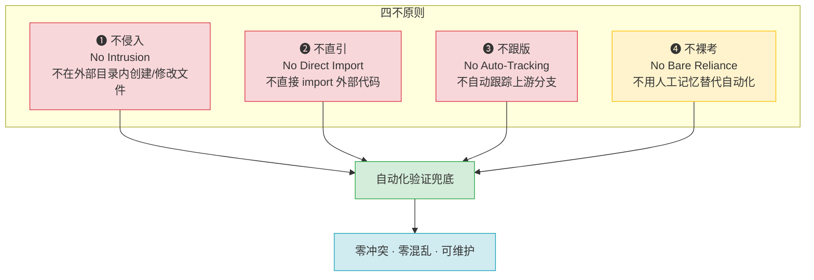

+++
id = "four-negatives-external-dependency"
domain = "methodology"
layer = "methodology"
maturity = "L1"
validation_count = 1
reuse_count = 0
documentation_level = "basic"
source = "docs/retrospective/reports/spec-system/retrospective-vendor-submodule-collaboration-20260629/insight-extraction.md"

[bindings]
rules = [".agents/protocols/dependency-management.md"]
references = ["docs/knowledge/VENDOR-INTEGRATION.md"]
skills = []
+++

# 外部依赖四不原则：submodule/vendored code 管理铁律

## 原则概述

管理外部代码依赖（git submodule、vendored library）时必须遵循的四条铁律，每条原则对应一类常见错误模式，通过自动化验证脚本兜底执行。

## 四不原则

### ❶ 不侵入（No Intrusion）
- **含义**：外部依赖目录视为只读，不在其中创建或修改主项目维护的文件
- **反面典型**：在 `vendor/flexloop/` 内创建 README.md 记录元数据 → submodule 标记为"modified content"
- **正确做法**：所有元数据（README、VERSION、用途说明）放在接口层（vendor/ 根级或 docs/ 目录）
- **验证手段**：`git submodule status` 前缀检测（不应有 `+`/`U` 标记）；`git status --porcelain <submodule_dir>` 应无输出

### ❷ 不直引（No Direct Import）
- **含义**：不通过 `import`、`sys.path.insert/append` 等方式将外部代码直接引入主项目运行时
- **反面典型**：`sys.path.insert(0, "vendor/flexloop/src")` 然后 `from flexloop import xxx`
- **正确做法**：通过模式萃取流程（评估→理解→适配→标注→验证→登记）将需要的模式复制到主项目并标注来源
- **验证手段**：静态扫描 Python 文件中的 `sys.path.*vendor` 和 `(import|from) vendor\.` 模式

### ❸ 不跟版（No Auto-Tracking）
- **含义**：不自动跟踪上游分支的最新版本，采用固定 commit 锁定策略
- **反面典型**：submodule 配置为跟踪 main 分支，`git submodule update --remote` 自动拉取最新代码
- **正确做法**：
  - VERSION.md 记录具体 commit 哈希（非"见子模块"占位符）
  - 更新前评估兼容性（查看 CHANGELOG、检查 breaking changes）
  - 更新后运行完整验证（--deep 检查 + 测试）
- **验证手段**：检查 .gitmodules 中无 `branch = ` 配置；VERSION.md 包含完整 commit 哈希

### ❹ 不裸考（No Bare Reliance）
- **含义**：不依赖开发者记忆或人工约定来遵守上述三条原则，用自动化验证脚本兜底
- **反面典型**：在文档中写"请不要修改 vendor/ 目录"，但没有工具检测违规
- **正确做法**：
  - 深度集成验证脚本（`repo-check.py vendor --deep`）自动检测违规
  - pytest 配置自动排除 vendor/ 目录
  - CI/pre-commit hook 集成检查（可选）
- **验证手段**：脚本可一键运行，在 <10 秒内完成全部检查

## 与三区域模型的关系

四不原则是三区域边界模型的操作化规则：
- **不侵入** → 保护外部依赖主权区的只读性
- **不直引** → 定义接口层的正确交互方式
- **不跟版** → 确保主项目主权区的构建稳定性
- **不裸考** → 通过接口层的自动化工具保障前三原则的执行

## 反模式与后果

| 违反原则 | 后果 | 严重程度 |
|---------|------|---------|
| 侵入外部目录 | submodule 永久 dirty，版本控制混乱 | 🔴 高 |
| 直接 import | 运行时耦合，更新外部依赖时 break | 🔴 高 |
| 跟踪分支 | 上游 breaking change 自动传导，构建不稳定 | 🟡 中 |
| 无自动化验证 | 规则形同虚设，依赖人工 review 容易遗漏 | 🟡 中 |

## 实施检查清单

- [ ] `repo-check.py vendor --deep` 0 错误 0 警告
- [ ] 项目中无 `sys.path` hack 指向 vendor/
- [ ] 项目中无 `import vendor.` 语句
- [ ] .gitmodules 无 branch 跟踪配置
- [ ] VERSION.md 包含具体 commit 哈希
- [ ] pytest 配置排除 vendor/

> 来源：establish-vendor-collaboration-framework spec 实践
> 关联：[三区域边界模型](three-zone-boundary-model.md)、[VENDOR-INTEGRATION.md](../../../../docs/knowledge/VENDOR-INTEGRATION.md)
