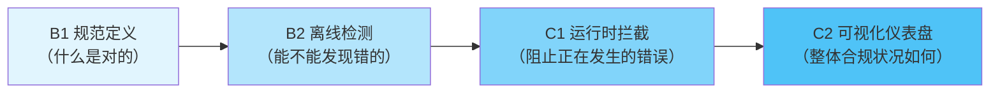

+++
id = "governance-four-layer-progressive"
domain = "methodology"
layer = "methodology"
maturity = "L2"
validation_count = 2
reuse_count = 0
documentation_level = "standard"
source = "docs/retrospective/reports/project-governance/retrospective-daily-20260629-full-day/insight-extraction.md#洞察1治理基建的四层递进交付模型"

[bindings]
rules = [".agents/rules/stage-guardrails.md"]
references = [".agents/scripts/check-stage-guardrails.py", ".agents/scripts/check-stage-guardrail-runtime.py", ".agents/scripts/generate-sg-dashboard.py"]
skills = []
+++

# 治理基建四层递进模型

## 模式概述

任何流程合规类治理机制建设（代码规范、文档规范、安全规范、提交规范、阶段守卫本身等）必须遵循 B1→B2→C1→C2 的四层递进顺序交付，禁止跳层。这不是偶然顺序，而是治理基建的内在递进逻辑。

## 四层模型

### B1：规范定义层
- **核心目标**：建立共识——什么是对的，什么是错的
- **交付物**：规则文档、规范说明、正例反例
- **验收标准**：
  ① 规范文档完整发布
  ② 正例反例清晰可辨
  ③ 团队共识已建立
- **禁止事项**：❌ 没有规范就开始做检测工具

### B2：离线检测层
- **核心目标**：安全网——事后验证检测能力，不阻断流程
- **交付物**：检查脚本、静态分析工具、CI非阻断检查
- **验收标准**：
  ① 能准确识别违规项
  ② 误报率可接受
  ③ 在CI中以warn级别运行（不阻断）
- **禁止事项**：
  ❌ 离线检测未经验证就上运行时拦截
  ❌ 一上来就设为error阻断流程

### C1：运行时拦截层
- **核心目标**：强制执行——阻止正在发生的违规行为
- **交付物**：运行时检查、实时拦截、强制阻断
- **验收标准**：
  ① B2已稳定运行≥3天且误报率<5%
  ② 拦截提示清晰给出修复路径
  ③ 有审批绕过机制
- **禁止事项**：
  ❌ 跳过B2直接上C1
  ❌ 拦截不给出路（只说不行，不说怎么才行）

### C2：可视化仪表盘层
- **核心目标**：反馈闭环——展示整体合规状况与趋势
- **交付物**：仪表盘、趋势报告、统计看板
- **验收标准**：
  ① 能展示历史趋势
  ② 能定位高频问题
  ③ 能识别改进效果
- **禁止事项**：❌ 没有C1拦截数据就做可视化

## Why 四层递进有效

1. **规范层(B1)是共识基础**：没有规范，检测就没有依据，团队会质疑"凭什么说我错了"
2. **离线层(B2)是安全网**：先在事后验证检测能力，不直接拦截生产流程，给团队适应期，避免误拦截导致抵触
3. **运行时层(C1)是强制执行**：需要B2验证无误后再上线，此时团队已熟悉规则，拦截接受度高
4. **可视化层(C2)是反馈闭环**：让团队看到治理效果，用数据证明治理价值，形成正向激励

## 反模式：跳层交付

**典型反模式**：直接跳到C1运行时拦截，没有经过B2离线验证阶段。

**后果**：
- 误拦截率高，干扰正常开发流程
- 团队抵触情绪强，认为是"官僚主义"
- 规则频繁调整，缺乏稳定性
- 治理成本远大于收益

## 验证案例

**案例1：阶段守卫机制（本次验证）**
- B1：.agents/rules/stage-guardrails.md（规范定义）
- B2：.agents/scripts/check-stage-guardrails.py 离线日志分析（不阻断，只报告）
- C1：.agents/scripts/check-stage-guardrail-runtime.py 运行时拦截（阻断违规操作）
- C2：.agents/scripts/generate-sg-dashboard.py 可视化仪表盘

**案例2：Mermaid安全规范**
- B1：code-patterns/mermaid-safe-coding-rules.md（安全模板规范）
- B2：repo-check.py 中的mermaid检查（warn级别）
- C1：（待建设，B2稳定后再上）
- C2：（待建设）

## 适用场景

- 代码规范落地（lint规则、命名规范）
- 文档规范执行（链接检查、frontmatter验证）
- 安全规范强制执行（密钥检测、权限检查）
- 提交规范校验（commit message格式）
- 任何需要团队遵守的流程规则

## 实施检查清单

- [ ] B1：规范文档包含明确的操作边界、正反例、判定标准
- [ ] B2：离线检测脚本可准确识别违规，先以warn级别运行
- [ ] B2：离线检测稳定运行一段时间（≥3天），误报率可控后再考虑C1
- [ ] C1：运行时拦截有清晰的修复指引和审批绕过机制
- [ ] C2：可视化仪表盘基于真实拦截数据构建，展示趋势而非单点
- [ ] 严格按B1→B2→C1→C2顺序交付，不跳层

> 来源：来自 retrospective-daily-20260629 洞察1
> 关联模式：[three-layer-rule-enforcement.md](three-layer-rule-enforcement.md)（三层规则落地模型）、[three-tier-governance.md](three-tier-governance.md)（三层治理模型）、[root-cause-diagnosis.md](root-cause-diagnosis.md)（根因诊断模式）
