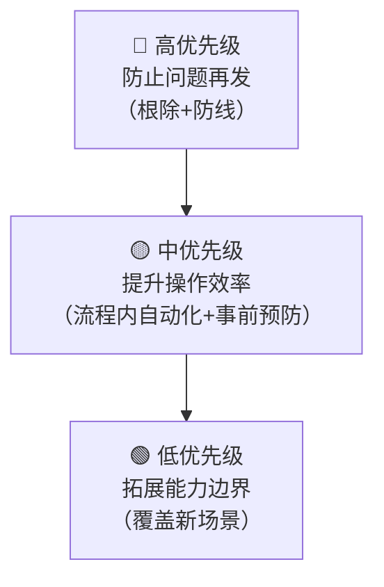

+++
id = "governance-tier-priority"
domain = "methodology"
layer = "methodology"
maturity = "L1"
validation_count = 1
reuse_count = 0
documentation_level = "standard"
source = "retrospective-link-fix-depth-adjustment-20260626/suggestions/meta-sug-02-priority-tiering-logic.md"

[bindings]
rules = []
references = ["actionable-suggestion-five-elements.md", "suggestion-priority-driven-execution.md", "three-tier-governance.md", "toolchain-maturity.md"]
skills = []
+++

# 治理层级优先级排序法（Governance Tier Priority）

## 模式类型
方法论模式

## 成熟度
L1 实验性（1 次成功案例：断链修复复盘 5 项建议按此排序 100% 落地）

## 适用场景
为改进建议、技术债偿还、工具链建设、治理措施排优先级时使用。

## 问题背景

给改进措施排优先级时，最容易犯的错误是**按难度排序**（先做容易的）或**按感知度排序**（先做显眼的），导致：
- 根本问题反复出现，不断消耗维护精力
- 做了很多优化但防线没建立，问题还是会流入主干
- 锦上添花的事做了不少，真正的痛点没解决

## 核心原则

**优先级按治理能力的演进逻辑排序，而非按难度或感知度：**

## 三级分层详解

| 优先级 | 治理层级 | 核心目的 | 判断标准 | 典型措施 |
|--------|---------|---------|---------|---------|
| 🔴 高 | **根除反复出现的问题** | 让某类问题**永远不再需要手动修** | 如果不做，同类问题会反复出现 | 自动修复工具、CI门禁防线 |
| 🔴 高 | **建立门禁防线** | 让"新问题"根本进不了主干 | 在问题流入下游之前拦截 | CI集成检查、pre-commit hook |
| 🟡 中 | **流程内自动化** | 在操作流程中自动修复，不让问题流到事后 | 嵌入现有工作流，无需额外操作 | 一键收尾脚本、原子化操作工具 |
| 🟡 中 | **事前预防** | 在做操作前就能评估影响面 | 操作前自动分析影响范围 | 反向引用索引、影响面预览 |
| 🟢 低 | **能力拓展** | 覆盖之前没覆盖的检查范围 | 非紧急、非痛点，属于锦上添花 | 外部链接检查、Mermaid渲染检查 |

## 判断口诀

给改进项排优先级时，不要问"哪个容易做"，要问：

> **"哪个能从根本上减少未来的工作量？"**

排序决策流程：
1. 先问：不做这个，同类问题会不会反复出现？→ 是则🔴
2. 再问：能不能把问题拦截在流入主干之前？→ 能则🔴
3. 再问：能不能嵌入现有流程自动处理，不需要额外手动步骤？→ 能则🟡
4. 再问：能不能在操作前预防问题发生？→ 能则🟡
5. 剩下的：拓展覆盖范围、锦上添花 → 🟢

## 与现有优先级模式的关系

| 模式 | 视角 | 用途 |
|------|------|------|
| **本模式**（governance-tier-priority） | **战略层**：决定先做哪一类事情 | 排改进backlog、规划工具链建设顺序 |
| suggestion-priority-driven-execution | **战术层**：单个建议的执行决策 | 执行时根据投入估算和紧急依赖决定立即做/延期/提升优先级 |

两个模式互补使用：先用本模式决定做什么顺序，再用suggestion-priority-driven-execution决定具体怎么执行。

## 反例警示

| 错误排序 | 后果 |
|---------|------|
| 按难度排序（先易后难） | 容易的做了一堆，根本问题反复出现，总工作量不减反增 |
| 按感知度排序（先做显眼的） | 看得见的优化做了，看不见的防线没建，问题持续流入 |
| 全标高优先级 | 等于没有优先级，资源分散，防线迟迟建不起来 |
| 只做🟢拓展类 | 能力边界在拓展，但核心痛点没有解决，体验为"做了很多但问题照旧" |

## 成功案例

断链修复复盘的5项建议按此排序后100%落地：
- 🔴 A1看板自动生成 + A2 CI链接检查：先建防复发防线
- 🟡 B1一键收尾 + B2反向引用索引：再建流程效率工具
- 🟢 C1外部链接检查：最后拓展边界

## 与现有模式的关系

- `actionable-suggestion-five-elements.md`：本模式是五要素中"优先级"要素的判断依据
- `suggestion-priority-driven-execution.md`：互补模式，战术层执行决策
- `three-tier-governance.md`：三级治理防线模型（事前/事中/事后）
- `toolchain-maturity.md`：工具链成熟度L1-L5演进，优先级排序推动成熟度跃迁
