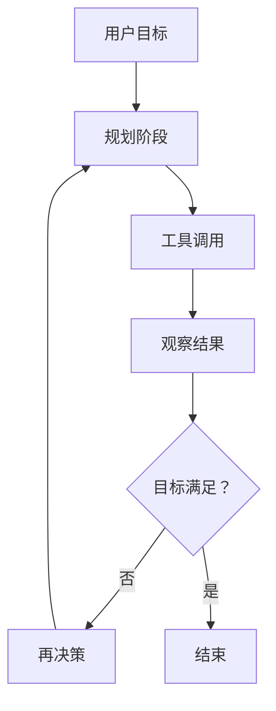
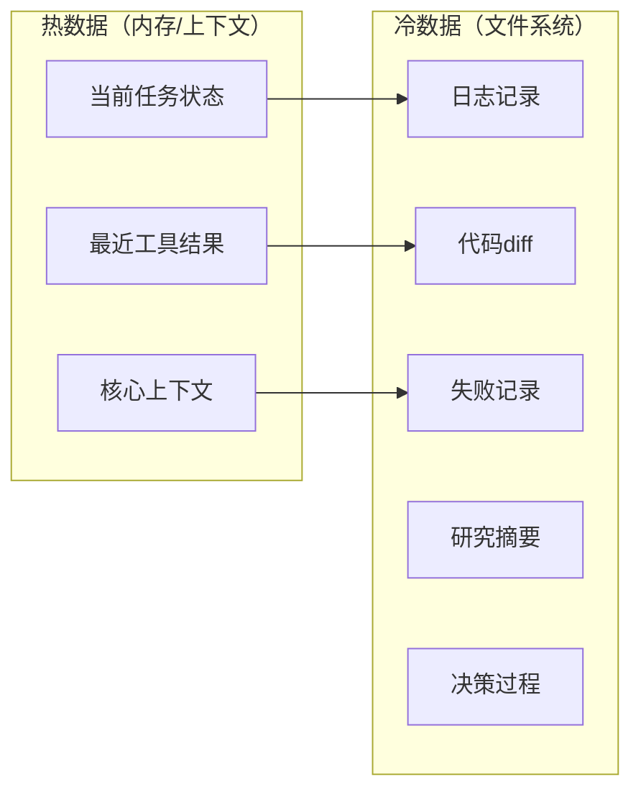

> **来源**：从《新ClaudeCode和Codex变得越来越强的5个Harness设计》洞察中萃取
> **原始案例**：Claude Code、Codex等AI编程工具的体验差距，不在模型参数，而在Harness架构——workflow编排、文件系统记忆、子代理分工、权限控制、context engineering

# Harness架构分层模式

## 一、来源

Claude Code、Codex等AI编程工具的竞争力正在从"谁更会答题"转向"谁更像一个靠谱的工程同事"。行业普遍存在"参数崇拜"，认为更大的模型、更长的上下文就是答案，但真实场景中，决定工具是否能用、是否好用的，是workflow编排、文件系统记忆、子代理分工、权限控制这些"系统层能力"。

**核心反常识结论**：模型只是引擎，Harness才是让引擎在真实工程世界持续工作的整辆车。同样是MySQL，有的系统跑起来像丝滑的交易引擎，有的系统一到大促就抖——差别不在数据库内核，而在连接池、事务边界、缓存策略、限流、重试、索引设计、故障恢复。

## 二、核心思想

Harness是模型接入真实世界之前的运行骨架，至少需要解决5件事：

| 层级 | 名称 | 核心职责 | 类比 |
|------|------|---------|------|
| L1 | Workflow | 这一轮先想什么，再做什么，失败后怎么继续 | 工作流引擎 |
| L2 | Tools | 模型能调哪些工具，返回值怎么喂回去 | 工具编排层 |
| L3 | Permissions | 哪些操作可以直接做，哪些必须停下来问用户 | 权限系统 |
| L4 | Memory | 哪些信息要放上下文，哪些要落文件，哪些要压缩 | 持久存储层 |
| L5 | Evaluation/Recovery | 结果好不好，错了怎么修，能不能恢复执行 | 评估与恢复层 |

**最小核心骨架**：
```
模型只负责 think
真正把任务跑起来的是：chooseTool → runTool → updateContext → saveArtifacts → shouldStop
```

## 三、操作步骤

### 步骤1：Workflow设计——打破单轮问答循环



关键原则：
- 目标进来先规划，再执行
- 拿到观察结果后进入下一轮决策
- 形成持续推进任务的loop

### 步骤2：文件系统做记忆——实现冷热分层



关键原则：
- 热数据放内存（上下文窗口）
- 冷数据放持久层（文件系统）
- 文件可以分层、归档、搜索、跨轮次重用、中断后恢复

### 步骤3：权限与恢复设计——建立三级权限

| 级别 | 操作类型 | 处理方式 | 示例 |
|------|---------|---------|------|
| 1 | 低风险操作 | 直接执行 | 读取文件、搜索代码 |
| 2 | 中等风险操作 | 提醒用户 | 编辑本地文件、运行测试 |
| 3 | 高风险操作 | 必须确认 | 删除目录、push到主分支 |

恢复机制：
- 失败后系统继续执行，而非直接终止
- 类比后端系统的熔断+回滚+人工确认

## 四、典型误判与反模式

### 反模式1：参数崇拜

**表现**：认为模型参数越大、上下文越长，工具体验就越好。

**纠正**：模型之间的纯能力差距还在，但正在变得没那么决定性。长任务、真项目、真实仓库越来越考验运行时设计，而非单次问答智商。

### 反模式2：上下文窗口越大越好

**表现**：追求1M+ tokens的超长上下文，把所有东西都硬塞进prompt。

**纠正**：长上下文带来成本、延迟和注意力分散问题。文件系统提供了更经济、更稳定、更可管理的持久记忆方案——"上下文需要治理，文件系统是最佳治理工具"。

### 反模式3：单轮问答逻辑

**表现**：把AI工具当成搜索框，问一句答一句就结束。

**纠正**：真正的Harness是持续推进任务的loop——目标进来→规划→调用工具→观察结果→再决策→再执行。只有把计划、执行、观察、修正连起来，它才开始像一个能把事做完的系统。

## 五、迁移验证

### 迁移场景1：智能体测试平台

- **适用度**：高
- **说明**：测试平台需要执行长任务、管理测试状态、处理失败恢复——完全匹配Harness的5个设计要点

### 迁移场景2：文档自动化工具

- **适用度**：中
- **说明**：文档工具的workflow和memory需求明确，但permission需求较低

### 迁移场景3：数据分析平台

- **适用度**：中
- **说明**：数据分析需要工具调用和结果评估，但对subagent分工需求较低

## 六、验证标准

使用本模式后，系统能力提升的标志：

| 标志 | 说明 |
|------|------|
| 长任务可完成 | 不再在上下文溢出时崩溃，能处理跨轮次任务 |
| 中断可恢复 | 任务中断后能从文件系统恢复状态 |
| 风险可控 | 高风险操作有明确的权限控制和确认机制 |
| 上下文可治理 | 实现了冷热数据分层，而非无限扩展上下文窗口 |

## 七、关联模式

- [dual-quality-gate-subagent.md](dual-quality-gate-subagent.md) — 子代理双重质量门：与Harness的permission层协同
- [index-over-memorization.md](index-over-memorization.md) — 索引优于记忆原则：与文件系统记忆机制一致
- [elastic-workflow-classification.md](elastic-workflow-classification.md) — 弹性流程分级：与Workflow设计原则互补

> 来源验证：本模式从Harness Engineering文章单一案例萃取，maturity=L1。需要在智能体架构设计、测试平台、文档工具等场景中验证和完善。
