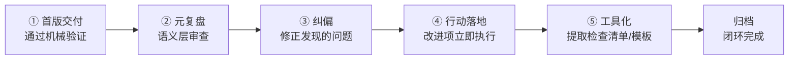

> **来源**：从 `retrospective-sunlogin-security-wiki-20260704` 向日葵安全产品复盘的元复盘实践萃取

# 元复盘闭环：交付后主动自我审查的完整改进循环

## 模式概述

任务交付并通过首次质量验证后，不停留在"交了就算"，而是主动进行元复盘（对复盘本身的复盘），发现首版中"看起来对但其实不对"的语义层问题，立即纠偏，并将改进建议在同一会话内落地为模式升级、检查清单、模板等可复用资产，完成"交付→元复盘→纠偏→行动落地→工具化"的全闭环。

## 问题现象

任务交付后的常见失败模式：

1. **交了就算**：通过格式检查和基础验证后就认为任务完成，不再审视内容本身的正确性
2. **改进建议停留在文档中**：复盘提出的改进项写入export-suggestions.md就结束，不执行
3. **错误入库污染后续**：首版中成熟度标注偏高、关联关系错误等问题未被发现，错误模式入库导致后续任务基于错误前提
4. **只在格式层验证**：检查清单能发现文件名错误、缺TOML、链接断裂等机械问题，但无法发现"对成熟度标准理解偏差"这类语义错误
5. **多会话漂移累积**：多个并行会话编辑同一索引文件，计数不一致但无人发现，直到偏差大到影响使用

这些失败模式的共同后果是：初版"零错误"交付，实际上问题被隐藏，在后续任务中爆发时修正成本呈非线性增长（参见nonlinear-correction-cost模式）。

## 解决方案

### 核心机制：五步闭环流程

**Step 1：首版交付**——完成Spec规划的所有任务，通过检查清单的机械验证（格式、命名、链接、TOML等）

**Step 2：元复盘**——交付后主动回答三个问题：
- 首版中是否有"看起来对但其实不对"的地方？（如成熟度标注是否严格符合标准？）
- 改进建议是否可以立即执行，而非等"下次迭代"？
- 模式中的核心决策模型是否可以提取为独立工具？

**Step 3：纠偏**——发现问题立即修正，不因为"已经提交了"就回避：
- 成熟度标注错误：L2→L1，L3→L1，严格按validation_count判定
- 配套文件缺失：补充创建TOML、更新索引
- 描述不准确：修正为符合标准定义的表述

**Step 4：改进项落地**——复盘提出的改进不在文档中"待规划"，而是在同一会话内执行：
- 需要固化到模式的 → 升级模式并增加validation_count
- 需要创建新工具的 → 创建检查清单/模板
- 需要修复脚本Bug的 → 直接修复并验证
- 确实需要前置条件的（如"在下个功能迭代中试点"）→ 明确标记为⏸️待迭代

**Step 5：工具化**——将改进过程中验证有效的方法论提取为可复用工具：
- 决策模型 → 检查清单（.agents/checklists/）
- 标准化流程 → 模板（.agents/templates/）
- 自动化检查 → 脚本（.agents/scripts/）

### 元复盘检查清单

每次首版交付后，过一遍以下检查项：

| # | 检查项 | 发现方式 |
|---|--------|---------|
| 1 | 成熟度标注是否严格按validation_count？ | 对照成熟度定义逐模式核查 |
| 2 | 所有frontmatter字段是否符合标准？ | 检查id/source/x-toml-ref/maturity等必填字段 |
| 3 | 索引文件计数是否与实际文件数一致？ | 运行pattern-maturity.py check-index |
| 4 | 改进项有多少可以立即执行？ | 逐条评估前置条件，无前置条件的立即做 |
| 5 | 模式中是否有可提取为工具的决策模型？ | 识别评分表、决策矩阵、检查清单等结构化内容 |
| 6 | 是否有工具缺陷被绕过而非修复？ | 检查是否用了--no-verify或跳过了某项检查 |

## 正反例

### 正例（本次向日葵安全复盘）

首版交付（`7c966761`）通过全部30检查点后，主动元复盘发现：
- 3个模式成熟度标注偏高（标为L2/L3，实际只有1次验证，应为L1）
- 7项改进建议中6项无前置条件可立即执行
- 风险评分模型可提取为独立检查清单

纠偏+落地+工具化共追加5次提交（`ff497ae9`→`ff2919e8`），最终：
- 3模式成熟度正确标注
- 6/7改进项落地（2模式升级L2，1检查清单，1模板，1聚合索引，1脚本修复）
- 风险评分检查清单可立即用于后续Agent授权决策

### 反例（之前的向日葵系列学习）

向日葵PDU/硬件等复盘完成后：
- 没有元复盘环节，"写完Wiki就结束"
- 改进建议停留在报告中，未执行
- 模式提取后未工具化，难以在后续任务中直接复用
- 结果：同类任务中可复用资产积累慢，每次都从零开始

## 适用场景

- 所有模式入库/知识库更新类任务
- 产品学习复盘、项目复盘、故障复盘等需要沉淀方法论的任务
- 多会话并行编辑后需要验证一致性的场景
- AI Agent执行任务后的自我审查环节

## 不适用场景

- 紧急热修复（hotfix）——元复盘在修复验证后补做即可
- 纯信息查询类任务（无模式/方法论产出）
- 一次性脚本/临时文件（无需沉淀）

## 模式价值

1. **防止错误入库**：语义层审查发现机械验证无法覆盖的问题，避免污染模式库
2. **非线性返工成本规避**：首版发现问题修正成本为1，后续任务中爆发修正成本为10+
3. **方法论资产周转加速**：改进项立即落地+工具化，使复盘产出从"文档"变为"可用资产"
4. **闭环学习**：每次任务不仅完成交付，还改进方法论本身，形成正向循环
5. **AI Agent自我改进**：为AI Agent提供了"执行→审查→纠偏→工具化"的自我改进框架

## 与其他模式的关系

- **root-cause-diagnosis（根因诊断）**：根因诊断是分析问题原因的方法，元复盘闭环是发现问题并落地改进的完整流程
- **nonlinear-correction-cost（非线性修正成本）**：元复盘闭环的核心动机——越早发现问题修正成本越低
- **spec-triple-sync（规范三同步）**：元复盘纠偏时需要检查Spec-代码-文档的三方同步
- **learn-validate-adopt（学习-验证-采用）**：L-V-A是外部标准采用的三步法，元复盘闭环是任务交付后的自我改进循环
