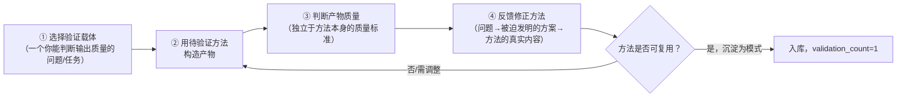

# 方法论构造性验证（Methodology Constructive Validation）

## 模式类型
方法论模式（元方法论/认知层）

## 成熟度
L1 实验性（1次验证：第一性原理资料搜集项目的自指实践）

## 问题场景

如何验证一个新方法论/思维方式是否真正有效？常见的失败模式：

1. **理论论证替代实践验证**：用逻辑推导证明方法"应该有效"，但从未真正用它解决过实际问题
2. **学习与应用分离**：先花大量时间"学会"方法论，认为学完了再应用——结果在应用时发现理解有根本性偏差
3. **权威背书替代自验证**：因为某名人/某大厂使用了某方法，就认为它是对的，不自己验证
4. **类比判断有效性**："这个方法和X方法类似，X方法有效所以这个也有效"——继承了类比对象的隐含假设
5. **"我理解了"的错觉**：能背诵方法论的原则≠能在具体问题中正确运用

这些失败模式的共同后果是：方法"看起来对"，但在关键时刻应用时失效，且失效时无法判断是方法本身的问题还是使用者的问题。

## 核心定义

```
构造性验证（Constructive Validation）= 通过用待验证的方法论构造一个可独立判断质量的产物，来验证方法论本身的有效性
```

与理论验证和权威验证不同，构造性验证的核心逻辑是：

> **如果你能用一个方法论构造出一个质量可判断的好产物，那么这个方法论至少在这个场景下是有效的；构造过程中遇到的问题和被迫发明的方案，才是方法论的真实内容，而非文档中的抽象描述。**

## 与相关模式的区别

| 模式 | 核心关注点 | 与构造性验证的区别 |
|------|-----------|-----------------|
| bootstrap-driven-self-evolution | 规范系统何时达到自持续演化能力（分类/模板/检查/复盘/导航五个维度的自举点） | 自举关注**系统能力**，构造性验证关注**方法有效性的认知确认** |
| self-referential-spec-system | 规范文档是否自我遵循（格式/流程/验证自指） | 自指规范关注**文档一致性**，构造性验证关注**方法通过实践被验证** |
| meta-retrospective-closed-loop | 交付后的语义层审查与纠偏 | 元复盘关注**交付后质量改进**，构造性验证关注**方法在构造过程中被验证** |
| learn-validate-adopt | 外部标准采用的三步法（学习→验证→采用） | L-V-A关注**外部标准的采用**，构造性验证关注**新方法的自我验证** |

## 解决方案

### 核心机制：构造性验证四步法



### 步骤详解

**Step 1：选择验证载体**
- 选择一个**你有能力独立判断输出质量**的问题/任务作为验证载体
- 载体的输出必须有独立于待验证方法的质量标准（如：知识档案的质量可以用来源可信度、返工率、信息准确性等来判断，不需要依赖"是否按某方法论执行"来判断）
- 载体复杂度要适中：太简单无法暴露方法的边界条件，太复杂难以归因成败
- 最佳载体：用方法论研究方法论本身（自指载体），因为研究者对方法论内容有最深入的理解

**Step 2：用待验证方法构造产物**
- 严格按照方法的原则执行，不要因为"感觉不对"就偷换回类比思维
- 记录构造过程中遇到的问题、做出的决策、被迫发明的方案
- **关键**：构造过程中遇到的问题才是方法的真实边界——文档中没有提到的问题才是最有价值的发现

**Step 3：独立判断产物质量**
- 用独立于方法论的标准评估产物质量（来源是否可靠、逻辑是否自洽、返工率多少等）
- 区分"方法执行错误导致的质量问题"和"方法本身的缺陷导致的质量问题"
- 如果产物质量好，方法在该场景下得到初步验证；如果产物质量差，分析是方法问题还是执行问题

**Step 4：反馈修正方法**
- 构造过程中被迫发明的解决方案，是方法最有价值的补充——它们不是"偏离"，而是方法在实践中的真实展开
- 将这些方案沉淀为方法的具体操作化（在本项目中即沉淀为模式）
- 明确方法的适用边界：哪些问题是方法能解决的，哪些是方法不能解决的

### 验证载体选择原则

| 载体类型 | 优势 | 风险 | 适用阶段 |
|---------|------|------|---------|
| **自指载体**（用方法研究方法本身） | 对方法内容理解最深，问题暴露最直接 | 可能存在自我强化的偏差 | 初始验证 |
| **邻近领域迁移**（用方法解决邻近领域问题） | 能发现方法的边界条件 | 需要邻近领域的领域知识 | 第二次验证 |
| **跨领域应用**（用方法解决完全不同领域问题） | 最强的泛化验证 | 可能因领域差异导致错误归因 | L2升L3阶段 |

## 本案例验证（第一性原理资料搜集项目）

| 维度 | 内容 |
|------|------|
| **待验证方法** | 第一性原理思维（回归基本事实、反类比、从根本问题推导） |
| **验证载体** | 用第一性原理思维构建关于第一性原理的知识档案（自指载体） |
| **初始理解** | 模糊概念："回归基本事实"、"不做类比" |
| **构造中遇到的问题** | 来源不可靠怎么办？认知偏差如何防御？信任如何建立？跨领域术语不一致如何处理？质量如何保证？ |
| **被迫发明的方案** | 对抗性审查协议、四层知识架构、可信度双轨制、语义漂移防御（共4个模式） |
| **独立质量判断** | 0返工、77.3%一级来源、78.5% A级可信度、零D级内容——产物质量可独立判断为高 |
| **验证结论** | 第一性原理思维在知识工作场景有效；其操作化体现为4个可复用模式 |
| **关键洞察** | 一开始对第一性原理的理解是模糊的，但在构造过程中被迫推导的方案反过来定义了第一性原理在知识工作中的具体含义 |

## 核心洞察

> **方法论不是一种可以"记住然后应用"的静态知识，而是一种在实践中通过反复追问"为什么"来动态构造解决方案的思维方式。** 构造过程本身就是理解过程——你不是先学会方法再用它，而是在使用它构造产物的过程中，才真正理解了它是什么。

这形成了一个看似悖论但实际上是认知科学基本事实的结论：

- 类比推理的路径：先理解 → 再应用 → 可能正确也可能错误（继承类比对象缺陷）
- 构造性验证的路径：先应用（在构造中推导） → 在应用中理解 → 用产物质量验证理解

## 反模式

| 反模式 | 表现 | 后果 |
|--------|------|------|
| **纸上谈兵** | 读了很多方法论书籍/文章，能精确引用原文，但从未用它构造过任何东西 | 理解停留在表面，关键时刻不会用或用错 |
| **权威崇拜** | "X大佬用了这个方法成功了，所以这个方法是对的" | 无法区分方法本身的效果和大佬的其他因素（资源、时机、能力） |
| **完美准备** | "等我把这个方法彻底搞懂了再开始实践" | "彻底搞懂"是一个永远无法达到的状态——理解只能在实践中深化 |
| **选择性验证** | 只用方法解决简单问题，回避会暴露方法边界的难题 | 获得虚假的"有效"感，方法的缺陷在真正重要的时刻才暴露 |
| **无视反面证据** | 构造过程中发现方法有问题，但归因于"我执行得不对"而非方法本身的缺陷 | 方法无法迭代，错误反复出现 |

## 实施检查清单

- [ ] 是否选择了一个能独立判断输出质量的验证载体？
- [ ] 在用方法构造产物的过程中，是否记录了遇到的问题和被迫发明的方案？
- [ ] 产物质量的评估标准是否独立于待验证方法本身？
- [ ] 构造过程中发现的新方案是否沉淀为方法的具体操作化（模式/检查清单）？
- [ ] 是否明确了方法的适用边界（在哪些场景有效，哪些场景未验证）？

## 可迁移启示

1. **学习任何方法论时**：不要只读方法论的描述，而是用它来构造一个实际产物——构造过程本身就是最好的理解
2. **验证新方法时**：用新方法去处理一个你能直接判断结果质量的问题，通过结果质量反推方法有效性
3. **模式沉淀时**：最好的模式不是从理论中推导出来的，而是在"做"的过程中被迫发明、然后被证明有效的方案

## 关联模式

- [bootstrap-driven-self-evolution.md](bootstrap-driven-self-evolution.md)：自举是系统层面的持续演化能力，构造性验证是认知层面的方法有效性确认
- [self-referential-spec-system.md](self-referential-spec-system.md)：自指规范是构造性验证在文档系统中的一个具体应用
- [meta-retrospective-closed-loop.md](meta-retrospective-closed-loop.md)：元复盘在交付后审查质量，构造性验证在构造过程中验证方法
- [pattern-tooling-progressive-extraction.md](pattern-tooling-progressive-extraction.md)：渐进式工具提取是构造性验证后模式工具化的具体路径
- [learn-validate-adopt.md](learn-validate-adopt.md)：L-V-A验证外部标准的合规性，构造性验证验证新方法本身的有效性
