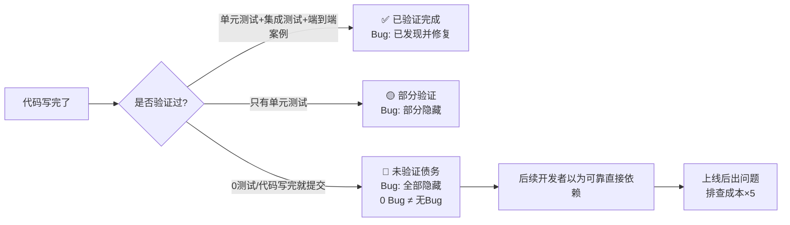

> **提炼自**：[insight-extraction.md](../../../reports/project-reports/retrospective-mdi-project-completion-20260702/insight-extraction.md) —— MDI项目完成复盘（洞察8）

# MVP未验证代码债务模式（MVP Unvalidated Code Debt）

## 模式类型

方法论模式（治理策略）

## 成熟度

L1 首次提炼（MDI项目942行未验证代码实践验证）

## 适用场景

MVP（最小可行产品）开发、原型验证、项目冲刺收尾、技术债务识别与管理；当你在想"这个功能写完了但没来得及测"或"这个模块代码写完了等下次再验证"时使用。

## 问题背景

MVP开发中常见的"看起来完成了"幻觉：
- "核心流程跑通了，这个辅助功能代码写完了，应该没问题"
- "先提交吧，等后面有时间再补测试"
- "0个Bug说明代码写得好，质量高"
- "这个功能是扩展，不影响核心价值，先放着"

这些判断的危险在于：**混淆了"代码写完了"和"代码验证过了"两个状态。0 Bug不是质量高，而是没被测试过。**

## 核心数据：MDI项目的隐性债务

MDI项目代码状态分类：

| 代码状态 | 代码行数 | 占比 | Bug数 | 端到端验证 | 风险等级 |
|---------|---------|------|-------|----------|---------|
| ✅ 已验证（核心流程，测试覆盖） | ~7000行 | 78% | 10个（已修复） | 3个案例全覆盖 | 🟢 低 |
| ⚠️ 写完未验证（MCP Server） | 942行 | 10.5% | 0个 | ❌ 无 | 🔴 高 |
| ⚠️ 写完未充分验证（Jest生成器） | 607行 | 6.8% | 0个（但功能简陋） | ❌ 只有单元测试无案例 | 🟡 中 |
| ⚠️ 写完未充分验证（GraphQL Profile） | 291行 | 3.2% | 0个 | ❌ 无对应验证案例 | 🟡 中 |

**关键发现**：
1. **10.5%的核心代码（942行）是写完了但完全没被端到端验证的**
2. 这部分代码0 Bug——不是因为质量高，而是因为没被跑过
3. Jest生成器代码行数（607行）和pytest生成器（606行）几乎一样，但功能差距明显，说明"写完"≠"可用"
4. 如果后续开发者以为这些模块是"可靠的"直接依赖，会踩坑

## 代码状态四象限

不要用"写完/没写完"二元判断，用四象限分类：

| | 核心路径 | 扩展路径 |
|---|---------|---------|
| **验证通过** | ✅ **Done（完成）** 代码+测试+案例都有，可放心依赖 | 🟢 **Ready（可用）** 有测试覆盖，虽然不是核心但质量可靠 |
| **未验证** | 🔴 **Blocker（阻塞）** 核心路径没验证，项目不算完成 | ⚠️ **Debt（债务）** 扩展功能写完了但没验证，必须显式标记 |

**关键认知**：MVP阶段可以有Debt，但绝对不能有Blocker——核心路径必须100%验证通过，扩展路径可以有未验证代码但必须显式标记。

## 核心规则

### 规则1：0 Bug = 可疑，不是优秀

如果一个模块：
- 代码写完了
- 0个Bug
- 但没有端到端测试/真实场景使用记录

**不要认为它质量高，它只是还没被暴露问题。** 未验证代码的Bug率经验值：每1000行未验证代码可能有5-15个Bug（参考行业平均水平）。

### 规则2：所有未验证代码必须显式标记

不能让未验证代码"隐身"在代码库中。标记方式（三选一即可，推荐组合使用）：
1. **代码注释标记**：在文件头部/类docstring标注 `STATUS: UNVALIDATED - 写完未测试，使用风险自负`
2. **文档标记**：在README/功能列表中明确标注哪些功能是"实验性"/"未验证"
3. **测试标记**：用 `@pytest.mark.skip(reason="未实现端到端验证")` 或在测试文件头部说明

### 规则3：MVP阶段的"合理债务"三标准

不是所有未验证代码都是坏的。MVP阶段可以接受债务，但必须满足三个条件：
1. **不阻塞核心路径**：未验证部分是扩展功能，核心流程100%验证完成
2. **显式标记**：所有相关人员都知道这部分没验证，不会误用
3. **有还债计划**：有明确的"什么时候补验证"的时间点/触发条件（如下次迭代/有真实用户使用前）

不满足任何一条就是"不合理债务"，必须在MVP结束前补上验证或删除代码。

### 规则4："功能简陋"也是一种债务——行数≠完成度

Jest生成器的教训：
- 代码行数：607行，和pytest生成器（606行）几乎一样
- 功能完整度：pytest有示例提取+检查清单转换+Mock数据，Jest只有基础骨架
- 问题：看代码行数会以为两个生成器完成度差不多，但实际质量差很多

**判断完成度看功能覆盖而非代码行数**，要对照功能清单检查，而不是看写了多少行代码。

## 决策速查表

当你想提交"写完但没验证"的代码时：

| 问题 | 如果是 | 如果否 |
|-----|-------|-------|
| 这是核心路径吗？ | 🔴 不能提交，必须验证完再提交 | 继续看其他项 |
| 是否显式标记了未验证状态？ | 可以提交，但属于技术债务 | 先加标记再提交 |
| 有没有明确的还债计划/时间点？ | 记录债务和计划 | 没计划=会忘记，要么补验证要么删代码 |
| 后续会有人误以为这部分可靠吗？ | 必须加更醒目的警告+文档说明 | 小范围使用，风险可控 |
| 删掉这部分代码影响MVP核心价值验证吗？ | 保留并标记为债务 | 🟢 考虑直接删掉，等需要时再重写（YAGNI原则） |

## 实施检查清单

- [ ] MVP结束时，是否区分了"已验证完成"和"写完未验证"的代码？
- [ ] 核心路径是否100%有端到端测试/验证案例？
- [ ] 所有未验证代码是否显式标记（注释/文档/README）？
- [ ] 每个债务项是否有明确的还债触发条件/时间点？
- [ ] 是否统计了未验证代码的行数和占比，让团队有清晰认知？
- [ ] 功能完成度判断是否基于功能清单而非代码行数？

## 反例警示

| 错误做法 | MDI项目实际风险 |
|---------|---------------|
| 看到0 Bug就觉得模块质量高 | mcp_domain.py+mcp_server.py 942行0 Bug，但如果直接拿来用大概率出问题 |
| 代码写完就提交，不标记状态 | 下一个开发者可能以为MCP生成器是可靠的，直接集成到项目中踩坑 |
| "以后有时间再补测试" | "以后"永远不会来，技术债务会越积越多，直到某天爆发 |
| 按代码行数判断完成度 | 以为Jest生成器和pytest生成器完成度差不多，实际上差很多 |
| 舍不得删掉未完成的扩展代码 | "写都写了删了可惜"——但留着会误导后人，债务成本>保留价值 |

## 正例：MDI项目的正确做法

MDI项目在复盘中正确处理了债务问题：
1. **在执行复盘3.3节明确列出了"做得不够好的地方"**：MCP未深度集成/Jest简陋/CLI测试缺失/双向转换未实现
2. **在action items里区分了优先级**：Jest/CLI测试是高优先级，MCP集成中优先级
3. **洞察萃取阶段识别出了"未验证代码≠无Bug代码"这个模式**：避免以后再犯同样错误
4. **README中明确说了3个验证案例是user-api/todo-api/file-cli**：不会有人误以为GraphQL/MCP也被验证过

**可改进点**：代码本身没有加STATUS标记，文档标记了但代码层没标记，后续开发者看代码文件本身可能不知道哪些是验证过的。

## 还债触发时机

以下情况必须还债（补验证或删除未验证代码）：
1. 有真实用户/其他开发者开始使用这个功能前
2. 下一个迭代开始，这个功能要从"扩展"变为"核心"前
3. 要基于这个未验证模块开发新功能前（先验证底层再做上层）
4. 代码重构时碰到这部分代码
5. 发现第一个Bug时——这说明已经有人在踩坑了，必须立即补全验证

## 与现有模式的关系

- `nonlinear-correction-cost.md`：未验证代码就是典型的"现在省1小时验证，以后花10小时排查"的非线性成本场景
- `prove-usefulness-check.md`：证明有用模式是避免未验证债务的前置关卡——先证明有用再投入写完整代码，而不是写完才发现不需要
- `session-boundary-commit.md`：会话边界提交时必须检查有没有未验证代码混在提交中，债务要单独标记
- `root-cause-diagnosis.md`：当某个模块上线后Bug集中爆发，用5-Whys追问往往会发现根因是"这部分从来没被验证过"
