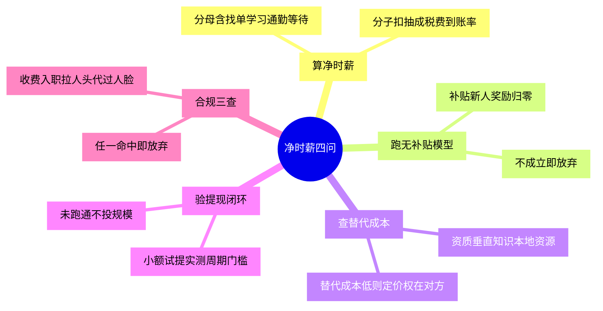

# 净时薪四问

## 模式概述

任何"外部机会"——副业平台、SaaS 工具、外包供应商、开源依赖——在推广口径里都以**标称收益**示人：单价、时薪、功能清单、免费额度。而决策者真正拿到的，是标称收益扣掉抽成、税费、到账损耗、隐性时间成本与退出成本之后的**净收益**。二者之间的缺口，是绝大多数"看起来不错"的选择最终令人失望的原因。

三类缺口最隐蔽：

1. **计量缺口（标称 ≠ 到手）**：单价不等于到手价。平台抽成、个税代扣、提现手续费、到账周期、汇率损耗层层扣减；更常被忽略的是"找单、学习、通勤、等待、售后"这些不计薪却必须投入的时间。
2. **时点缺口（当期 ≠ 稳态）**：几乎所有平台/工具在获客期都会发放补贴、抬高单价、放宽门槛。用补贴期数据外推长期收益，等于用促销价做十年预算。
3. **退出缺口（进入成本 ≠ 全部成本）**：进入门槛常被反复比较，退出成本却几乎无人评估——押金、资格证、设备沉没、数据迁移、主体登记、合规责任。

核心思想：**任何外部机会的收益都必须先做"三缺口收敛"，再比较大小；未经收敛的标称数字之间不具备可比性。**

该模式由 2026 中国副业平台全面调研（73 条事实、覆盖技能变现/内容创作/本地服务三大板块）萃取。调研中最反直觉的发现是：**收益下滑最快的赛道，恰恰是门槛最低的那些**——美团众包单价从 2025 夏 8–9 元降至 3–4 元/单，爱标客时薪从 25–40 元降至 10–15 元，社区团购团长佣金从 15% 降至 1%–2%；而有专业门槛的方向（Appen 金融量化 100–300 元/时、专家级标注时薪由 100 元升至 400 元+）单价反而被保护。门槛低意味着替代成本低，意味着定价权在对方手里——这正是"替代成本"必须成为四问之一的原因。

## 触发场景

**适用于**：

- 在多个外部平台/机会之间做取舍（副业平台、众包、外包供应商、SaaS 工具、开源依赖、服务商）
- 决策依据主要来自对方提供的宣传口径或当期数据
- 收益以"单价 × 数量"形式呈现，但中间存在抽成/税费/到账周期等扣减环节
- 该机会所在市场近期存在补贴、红利或政策窗口
- 需要为"是否投入时间/资金"给出可被他人复算的依据

**不适用于**：

- 已进入长期事业投入阶段的选择——本框架只做筛选，不做战略
- 收益与成本可在单一合同内完全确定、无中间环节的一次性交易
- 时间窗口极短、错过成本高于误判成本的机会（此时应转为快速试错，而非精细测算）

## 核心做法（5 步）

1. **算净时薪**：`净时薪 = [(单价 × 可稳定获得的任务量) × 到账率 − 显性成本] ÷ 实际投入小时数`。其中「实际投入小时数」必须包含找单、学习、通勤、等待、售后；「显性成本」必须包含平台抽成、税费、设备、交通、工具订阅。**分母漏项是本步骤最常见的失真来源**——只按"干活时间"计算会把收益高估 2–3 倍。

   *示例*：某平台单价 20 元/单、每天稳定 5 单、到账率 95%、交通与设备日均 15 元、含找单等待实际投入 3 小时 → `(20×5×0.95 − 15) ÷ 3 ≈ 26.7 元/小时`。

2. **跑无补贴模型**：把一切补贴、新人奖励、红利期溢价归零，重算第 1 步。模型不成立即放弃。这一步的作用不是悲观，而是**把"促销价"还原为"标价"**。

3. **查替代成本**：对方换掉我的成本有多高？我是否持有资质、垂直知识、本地资源或信任资产？替代成本低 = 定价权在对方手里 = 单价长期下行。

4. **验提现闭环**：小额试提一笔，实测到账周期、门槛、扣税、是否触发主体登记要求。未跑通闭环前不投入规模——**闭环失败的成本远高于试提成本**。

5. **合规三查（任一命中即放弃）**：① 入职/接入前任何名义收费（押金、保证金、培训费、体检费）；② 收益主要来自"拉人"而非交付真实服务或商品；③ 要求提供身份证件与人脸视频"代过验证"。

### 核心做法思维导图

## 反模式（5 个）

### 反模式1：用头部案例当普遍水平

- **来源**：本案例——比心宣传"全职月薪超 5000 元"，同期数据显示**超六成陪玩师月收入不足 3000 元、稳定过万仅 7%**；宠物寄养"春节日接 18 单到手约 1.4 万元"属极端峰值，非常态
- **表现**：以平台官方宣传的头部收益作为自己的收益预期，据此决定投入强度
- **正确做法**：只采用"中位数/众数"口径，或直接按自己可稳定获得的任务量自行推算

### 反模式2：用补贴期数据做长期决策

- **来源**：本案例——美团众包单价 2025 夏 8–9 元 → 2026 年 3–4 元/单；社区团购团长佣金 15% → 1%–2%；美团优选 2025-12-15 全国撤仓关停；B站创作激励退坡至月上限 2000 元且仅覆盖低变现 UP 主；闲鱼职业卖家费率 0.6% → 1.6%
- **表现**：以入局时的单价/补贴为基准做 6–12 个月规划，补贴退坡后模型崩坏
- **正确做法**：先跑无补贴模型；并回看该平台近 12 个月的费率/单价趋势，趋势向下者按趋势外推而非按现值

### 反模式3：只看单价不看结算

- **来源**：本案例——PayPal 中国仅提供企业账户且 payout 不支持转大陆本币；Payoneer 收款 1% + 年费 $29.95；漏洞盒子金币提现收 20% 税费；知识星球 2026-08-01 起个人星球手续费 20%；Testin 众测月超 800 元部分扣 20% 个税；DataAnnotation 时薪 $25–30 但**仅接受 6 国、中国不在列**
- **表现**：按时薪/单价排序候选平台，忽略到账率、周期与税费，实际到手与预期相差 20%–100%
- **正确做法**：把"到账率 × 税费 × 提现成本"并入净时薪分子；跨境机会先验证收款通道是否存在，再评估接单能力

### 反模式4：只算进入成本不算退出成本

- **来源**：本案例——码市入驻约 1 万元起；网约车须"三证"且私家车须变更为预约出租客运；得物年交易额累计超 10 万元须依法办理市场主体登记；连续 12 个月自平台取得服务收入超 500 万元须办营业执照；公务员/事业编/国企人员违规兼职最重开除党籍
- **表现**：比较"哪个好上手"时只算押金与学习成本，忽略资格证、车辆性质变更、主体登记与身份合规带来的长期约束
- **正确做法**：把退出成本与合规成本作为独立项前置评估；身份受限人群（公务员/事业编/国企）应先书面报批，且经批准原则上也不得取酬

### 反模式5：把"零门槛"当优点

- **来源**：本案例——零门槛赛道单价下行最快（众包配送、基础标注、问卷微任务月入普遍不足 500 元），而有门槛方向单价被保护（Appen 中文项目需 CET-4 及专业门槛，金融量化 100–300 元/时）
- **表现**：优先选择"谁都能做"的方向，误以为风险更低，实际是把自己放进了可替代性最高的定价区间
- **正确做法**：把门槛重新理解为**定价权来源**；选择时主动寻找自己相对稀缺的那一项（资质/专业/本地资源/信任积累）

## 检验标准

- [ ] 能为该机会写出一个具体的净时薪数字，且分母包含找单/学习/等待/售后时间
- [ ] 补贴归零后的模型仍成立，或已明确记录该机会的补贴退坡趋势
- [ ] 已完成一次小额提现/交付闭环，并记录到账周期与全部扣减项
- [ ] 已识别自己的替代成本来源，能说明为何对方不易替换自己
- [ ] 合规三查（收费入职 / 收益靠拉人 / 代过人脸）全部未命中
- [ ] 结论可在 30 分钟内由他人按同一算法复算，不依赖决策者的主观感觉

## 跨场景迁移示例

### 迁移示例1：SaaS 工具选型

- **场景**：候选工具 A 报价 6800 元/年且功能更全，工具 B 报价 12800 元/年
- **迁移应用**：标称价 → 净成本（含迁移期人力、集成工时、按订单抽成的平台服务费、存储扩容）；补贴项（首年折扣、免费额度）归零后重算；退出成本含数据导出能力与格式锁定程度
- **迁移可行性**：与案例同构——同为"标称价 ≠ 全周期成本 + 促销价 ≠ 稳态价 + 进入便宜 ≠ 退出便宜"

### 迁移示例2：外包供应商评估

- **场景**：在整包报价 1–8 万的外包商与按人天计价 500–900 元/人天的团队之间选择
- **迁移应用**：净成本需计入沟通成本、返工率、验收周期；"低价整包"的补贴等价物是"用低价换案例"的阶段策略，需验证其可持续性；退出成本含代码交付质量与知识转移完整性
- **迁移可行性**：跨领域验证——"单价 × 数量"型报价的中间扣减环节在任何采购场景中同构

### 迁移示例3：开源依赖引入（非商业场景）

- **场景**：在两个功能相近的开源库之间选择
- **迁移应用**：标称收益 = 功能覆盖度；净收益需扣除集成工时、构建配置成本、升级维护成本；"无补贴模型"对应"上游停止维护后是否仍可用"；替代成本 = 迁移到另一个库的改造成本；退出成本 = 锁定程度与许可证约束
- **迁移可行性**：完全非商业领域——三缺口（计量/时点/退出）对开源生态同样成立，说明该框架不依赖"金钱"这一载体

## 失败案例

以下均为源调研（2026 中国副业平台全面调研）中记录的真实决策失败案例，用于防止成功偏误——**它们都不是"运气不好"，而是跳过了四问中的某一步**。

### 失败案例1：一品威客 VIP 投入——跳过第 4/5 步（提现闭环 + 合规三查）

- **决策依据**：平台宣称悬赏中标率 80%、计件 90%
- **实际投入**：购买 5000–30000 元 VIP 会员
- **结果**：付款后长期无单、不予退款，黑猫投诉平台 2025–2026 年出现大量同类投诉
- **失败环节**：第 5 步合规三查第 ① 项（入职前任何名义收费）**直接命中却未执行**；第 4 步提现闭环从未验证——在付费之前先跑一次免费投标、确认是否真能拿到单，成本为零
- **反模式对应**：反模式5「把零门槛当优点」的反面——这里是"把付费门槛当保障"

### 失败案例2：社区团购团长——跳过第 2 步（无补贴模型）

- **决策依据**：入局时团长佣金 15%
- **实际演变**：佣金降至 1%–2%；美团优选于 2025-12-15 全国撤仓关停，平台本身消失
- **结果**：月佣金从预期水平跌至 2000–3000 元，投入的时间与社群关系无法收回
- **失败环节**：第 2 步无补贴模型未跑——若按 1%–2% 回算，该投入从一开始就不成立；且未做"平台存续风险"评估（该平台半年后关停）
- **反模式对应**：反模式2「用补贴期数据做长期决策」

### 失败案例3：基础数据标注岗——跳过第 3 步（替代成本）

- **决策依据**：2018 年前后爱标客等平台时薪 25–40 元，门槛极低（免费注册）
- **实际演变**：时薪降至 10–15 元，部分不足 10 元；基础岗位被 AI 大量替代
- **结果**：同等劳动时间收益下降 50%–70%，且未积累可迁移技能
- **失败环节**：第 3 步替代成本未查——"谁都能做"在当时被视为优点，实为定价权完全在平台侧的标志
- **反模式对应**：反模式5「把零门槛当优点」

### 失败案例4：无货源电商店群——跳过第 3/4 步（替代成本 + 退出成本）

- **决策依据**："0 元入驻、身份证开店"的低进入门槛
- **实际演变**：2026 年 2–3 月淘宝闪购、微信小店、京东集中打击无货源（淘宝直接关店冻资；微信小店违规 4 次永久禁售并锁仓 2 个月货款；京东关联店铺连坐）；2026 年 8 月起平台倒查真实经营地址，集群/挂靠地址基本无法通过
- **结果**：店铺被关停、货款被锁，前期投入的铺货与运营成本沉没
- **失败环节**：只评估了进入成本（0 元），未评估退出成本（货款锁定、店铺封禁、关联连坐）；亦未评估替代成本（无货源模式可被任何有供应链的人替代）
- **反模式对应**：反模式4「只算进入成本不算退出成本」

## 反目标用户与边界场景（不适用）

本框架**不是通用决策工具**，以下人群/场景套用会产生误导，属明确的适用边界：

| # | 反目标用户/场景 | 为何不适用 | 若强行套用的后果 |
|---|---------------|-----------|----------------|
| 1 | **身份受限人群**（公务员、事业编、现职国企领导人员） | 该群体的约束不是"收益算不算得清"，而是**是否被允许**。相关规定下违规兼职最重开除党籍，经批准兼职原则上也不得取酬 | 用四问算出"净时薪可观"进而投入，直接触碰纪律红线——收益再高也是负值 |
| 2 | **已进入长期事业投入阶段者** | 本框架只做**筛选**，其算法对"前期零收益、后期非线性回报"的路径天然不利（如播客、开源影响力、个人品牌） | 会系统性误杀需要长期积累的选项——把"延迟满足型"机会按当期净时薪判为不合格 |
| 3 | **时间窗口极短的机会** | 四问需要检索、试提、复核，本身有数小时到数天的成本 | 测算成本高于误判成本，错失窗口；此时应转为快速小额试错 |
| 4 | **收益不可货币化的场景**（开源贡献、社群互助、技能练手） | 四问的分子是货币收益，此处"收益"是能力、声誉或关系 | 算法无法给出有意义的数值，会得出"净时薪为 0 故不值得做"的错误结论 |
| 5 | **已具备强议价权的专家** | 四问的答案对该群体是显然的（替代成本高、提现无障碍、合规无虞） | 框架退化为形式主义流程，增加无谓开销——此时应直接进入加权比较或凭经验决策 |

**前提条件**：使用本框架的前提是——决策者的身份允许从事该活动、收益可货币化衡量、且时间窗口允许完成至少一次小额闭环验证。任一前提不成立时，本框架不适用。

## 早期预警信号

出现以下任一信号时，说明该机会大概率存在未收敛的缺口，应暂停投入并回到对应步骤复核：

| # | 预警信号 | 指向的缺口 | 应回查的步骤 |
|---|---------|-----------|------------|
| 1 | 对方宣传使用"最高/月入过万/轻松"等上限词，且拒绝给出中位数 | 计量缺口（标称 ≠ 到手） | 第 1 步：自行按中位数重算 |
| 2 | 该平台近 12 个月出现过单价下调、抽成上调或费率规则变更 | 时点缺口（当期 ≠ 稳态） | 第 2 步：按最新费率跑无补贴模型 |
| 3 | 需要先付费（会员/VIP/培训/保证金）才能获得接单资格 | 合规红线 | 第 5 步：合规三查 ①，命中即放弃 |
| 4 | 收益说明中出现"推荐好友""团队业绩""层级奖励" | 合规红线 | 第 5 步：合规三查 ②，命中即放弃 |
| 5 | 要求提供身份证正反面、人脸视频或"代过验证" | 合规红线（可能涉帮信罪） | 第 5 步：合规三查 ③，命中即放弃 |
| 6 | 提现规则含糊、门槛高、周期长，或需先完成"流水/任务量"才能提现 | 计量缺口 + 退出成本 | 第 4 步：立即小额试提验证 |
| 7 | 该模式的唯一优势是"门槛低、谁都能做" | 替代成本过低 | 第 3 步：重新评估定价权归属 |
| 8 | 平台自身商业模式依赖外部融资或补贴，而非向用户收费 | 时点缺口 + 存续风险 | 第 2 步：评估补贴归零及平台关停风险 |

## 与现有模式的关系

本模式经与库内相邻模式逐一比对后新建，边界如下（避免重复萃取）：

| 相邻模式 | 关注点 | 与本模式的分工 |
|---------|-------|--------------|
| [最佳实践隐性成本 best-practice-hidden-cost](../tools-automation/best-practice-hidden-cost.md) | 推广**内部**最佳实践时的隐性成本（如原子化的"链接税"） | 该模式处理"我方推行某事"的成本；本模式处理"**对方承诺的收益**"的缺口。二者共享"隐性成本"视角，但主体方向相反（付出方 vs 收取方） |
| [Agent 平台选型评分卡 agent-platform-selection-scorecard](P-AGENT-SELECT-001-agent-platform-selection-scorecard.md) | 企业级 AI Agent 平台的 **9 维度加权评分**（多准则决策） | 该模式是**多维度加权**工具，适合候选相近、需综合权衡的场景；本模式是**单值收敛**工具，先用四问剔除不合格项，再进入加权比较。两者是筛选与排序的前后两段，可串联使用 |
| [技术选型三查 tech-selection-three-checks](tech-selection-three-checks.md) | 技术选型前查权威文档、查现有实例、查本质目标 | 该模式是**信息充分性**检查（我查够资料了吗）；本模式是**收益真实性**检查（这个数字可信吗）。互补而非重复 |
| [非线性返工成本 nonlinear-correction-cost](nonlinear-correction-cost.md) | 返工成本随阶段非线性增长 | 该模式解释了"为什么必须前置检查"；本模式的第 4/5 步（提现闭环、合规三查）是其在该场景下的具体前置项 |

## 案例来源

| 案例 | 来源 | 验证对象 | 关键证据 | 结果 |
|------|------|---------|---------|------|
| 2026 中国副业平台筛选 | 七概念知识沉淀（sc-20260919-cn-sidehustle-platforms） | 技能变现/内容创作/本地服务三大板块共 73 条平台事实 | 零门槛赛道单价普遍下行（众包 8–9→3–4 元/单、标注 25–40→10–15 元/时、团长佣金 15%→1%–2%）；有门槛方向单价被保护（专家标注 100→400 元/时） | 形成四问框架；报告落于私域 `playground/reports/sidehustle-platforms-20260919/` |
| 跨域迁移（待验证） | 本模式的迁移示例 1–3 | SaaS 选型 / 外包供应商 / 开源依赖 | 同构推演：标称价≠全周期成本、促销价≠稳态价、进入便宜≠退出便宜 | 尚未实测，构成 L2 升级所需的候选第二案例 |

## 配套资产

- 源报告（私域）：[2026 中国副业平台全面调研报告](../../../../../playground/reports/sidehustle-platforms-20260919/analysis-report.md)（73 条事实、9 条对抗审查攻击、按人群分路径建议）
- 私域索引：[playground 报告索引](../../../../../playground/reports/README.md)
- 元数据副本：[net-value-four-questions.toml](../../../../../.meta/toml/docs/retrospective/patterns/methodology-patterns/governance-strategy/net-value-four-questions.toml)
- 关联模式：[最佳实践隐性成本](../tools-automation/best-practice-hidden-cost.md)、[Agent 平台选型评分卡](P-AGENT-SELECT-001-agent-platform-selection-scorecard.md)、[技术选型三查](tech-selection-three-checks.md)、[非线性返工成本](nonlinear-correction-cost.md)

## 对抗审查记录

本模式在源任务的七概念知识沉淀链路 V 阶段经 4 视角对抗审查（9 条意见，采纳 7 条），模式内容据审查结论修正：

1. **魔鬼代言人·幸存者偏差**：源报告数据多来自平台官方口径与媒体报道，缺少"做了半年后退出"的失败样本 → 在源报告中加入口径声明；本模式据此把「只采用中位数口径」写为反模式1，并在 frontmatter `maturity_note` 中标注"单案例待验证"
2. **魔鬼代言人·结构分化被误述为行业升级**：标注时薪 100→400 元是"筛出专家"的结果，不等于行业整体涨价 → 源报告洞察改用"结构分化"表述；本模式在概述中据此表述为"两端同时变陡"而非"行业升级"
3. **魔鬼代言人·数据时效不齐**：部分平台规则页为 2023–2024 版 → 源报告统一加 `官`/`实` 口径与检索时间标注；本模式把"回看近 12 个月趋势"写入反模式2 的正确做法
4. **魔鬼代言人·数据利益冲突**：闲鱼"1962 万卖家、人均年收入 4317 元"来自与平台有合作的研究中心 → 源报告直接标注数据来源性质；本模式据此要求证据须注明口径
5. **新人视角·分母不可执行**：原框架未说明"实际投入小时数"包含哪些项，新手无法执行 → 核心做法第 1 步补充完整分母定义与计算示例，并提炼为"分母漏项是最高频失真来源"
6. **新人视角·缺少第一步**：看完知道要筛选，不知从何下手 → 源报告补充"今天就能做的第一步"；本模式在检验标准中要求"可由他人 30 分钟内复算"，把可执行性固化为验收项
7. **未来视角·平台存续风险**：腾讯课堂已于 2024-10-01 全面停止运营、美团优选已关停，结论可能因平台消失而失效 → 源报告对已衰落/关停平台逐条标注；本模式把"上游停止维护后是否仍可用"写入迁移示例3，作为存续风险的对应项
8. **老板视角·报告过长**（部分采纳）：源报告以表格压缩事实层；本模式以"四问"压缩为 5 步，未采纳"进一步砍掉跨域迁移示例"的建议——迁移示例是 G3 门要求的必备项
9. **模式重复性审查**：与 `best-practice-hidden-cost`、`agent-platform-selection-scorecard`、`tech-selection-three-checks`、`nonlinear-correction-cost` 逐一比对 → 认定不重复，新增"与现有模式的关系"章节显式划界，并明确与评分卡的**串联关系**（先四问筛选、后加权排序）
