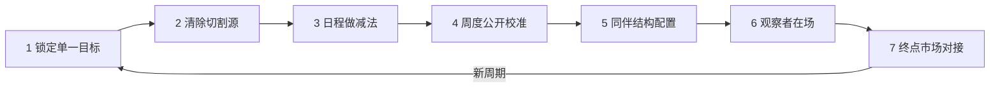

# 去噪容器：固定周期高密度冲刺的双层组织设计

> **来源**：量子位微信公众号文章《德邻杯2026AI创业大赛》报道（2026-09，作者田晏林）——德邻资本 Delin Residency（德邻乌托邦）10 周驻场孵化机制
> **验证次数**：1 个案例（首期尚未开营，为机制设计萃取，非成效回溯萃取）

## 证据与边界声明

| 维度 | 说明 |
|------|------|
| **信源性质** | 唯一信源为带招募导向的媒体报道（文末附报名入口），文中成效性数字（4000万投入、200万奖金、最高500万投资、30多家VC、90%深度孵化比例、5个申报IPO项目）均为主办方单方陈述，未经独立核验 |
| **归因限制** | 即使入营团队后续取得结果，也无法在现金、投资、同伴、空间与团队自身能力之间分离归因；入选者经选拔产生，存在选择效应 |
| **成熟度判定** | 单案例 + 机制未经完整周期验证 → **L1（单案例待验证）**，跨域迁移为结构性推演，非实证结论 |
| **待验证假设** | ①物理同址对产出的增量贡献（相对远程方案）；②10周是否为最优周期长度；③同辈压力在非精英密度样本下是否仍成立；④离场后行为习惯的留存率 |

## 模式概述

当一个已经具备产品或能力基础的团队，需要在时间窗口敏感的环境中完成关键验证时，将其放入一个**预先去除注意力切割源、日程做减法、按周公开校准、同伴高密度共处、设有固定终点**的"容器"中，迫使团队在有限周期内对"当前最关键的问题"形成明确、可验证的进展。

模式的反直觉起点是：**早期高潜力团队的稀缺品不是资源总量，而是完整的注意力块**。传统孵化器以"提供更多"（课程、工位、人脉、活动）为价值主张；去噪容器以"消除与拿走"（通勤、后勤琐事、塞满日程的泛泛课程、无结果的忙碌）为价值主张。其判断前提是：泛泛的常识性输入并不稀缺，连续的深度工作状态才稀缺。

## 核心命题

| 设计选择 | 注意力状态 | 节奏来源 | 结果可验证性 | 典型形态 |
|---------|-----------|---------|-------------|---------|
| **去噪容器** | 连续工作块，切割源被预先移除 | 固定终点 + 同伴横向可见性 | 入营目标即验收契约，结论必须客观 | 10周驻场、日程留白、周仪式校准 |
| **资源堆叠型孵化** | 注意力被通勤、琐事、课程、活动反复切割 | 自上而下的考核与活动日历 | 以活动量（参加了什么）代替结果 | 课程排满、工位密集、节点汇报 |
| **自由放养** | 注意力完整但缺乏外部节奏 | 团队自驱 | 目标易漂移，忙碌与结果不分 | 给资金不给结构 |

## 双层结构：制度内核与物理载体

> 本分层为对抗审查修正项——物理形态昂贵且可能被远程协作替代，真正可迁移的是制度内核。

**第一层：制度内核（低成本、可远程实现，四件必备）**

1. **单一验证目标契约**：入营前锁定周期内一个"明确、可验证的关键结果"（关键迭代/付费验证/融资里程碑），拒绝泛泛成长目标。
2. **日程减法原则**：不以输入型活动（课程、讲座）填满日历，仅保留固定复盘仪式。
3. **周度公开校准**：固定周仪式，三段式口径——关键进展 / 卡点 / 下周验证项，面向平级同伴公开。
4. **高密度同伴配置**：小规模（建议 ≤15）、不同赛道、同等水平，以同伴可见性制造横向压力与跨界反馈。

**第二层：物理载体（高成本、可替换实现，三件按需）**

5. **同址空间**：生活与工作同一空间，通勤归零——远程实现为高同步率的虚拟驻地。
6. **后勤全包**：吃住、办公条件、算力等统一供给，资源配置时间归零——轻量化实现为后勤外包/ stipend。
7. **观察者持续在场**：组织者或资助方驻场，观察行为样本而非只听节点汇报——远程实现为高频异步在场与周期性共线工作。

## 实施七步

| 步骤 | 动作 | 成本档 |
|------|------|--------|
| **1. 锁定单一目标** | 每个参与者开营前写下周期内"关键验证项"，须满足可证伪、有客观判据；一团队一主题 | 低 |
| **2. 清除切割源** | 列出"注意力切割源清单"（通勤、餐饮、行政琐事、设备配置），逐项统一供给或消除 | 中-高（轻量版可外包/发补贴） |
| **3. 日程做减法** | 默认日历留白；输入型课程改为按需调用；仅保留固定复盘与周仪式 | 低 |
| **4. 周度公开校准** | 固定时间周仪式：进展（产品/用户/收入数据）→ 卡点 → 下周验证项；同伴跨视角反馈 | 低 |
| **5. 配置同伴结构** | 选拔同等水平、不同赛道、小规模团队；公开承诺名额不降格，把"入选"做成认证信号 | 中（选拔成本） |
| **6. 观察者在场** | 组织者持续观察团队处理反馈与不确定决策的行为，即时响应资源请求，替代节点听汇报 | 中（人力投入） |
| **7. 终点市场对接** | 结营日面向外部市场（客户/VC/评审）集中路演，以外部反馈收口并衔接下一阶段 | 中 |

## 案例速览：Delin Residency

| 要素 | 内容 |
|------|------|
| 周期 | 10 周，11月1日开营；从约 60 支决赛团队中选出不超过 15 支（不同赛道） |
| 目标口径 | 关键产品迭代 / 首批客户与付费验证 / 下一轮融资推进，三选一为主线 |
| 去噪供给 | 办公、住宿、餐饮、算力、硬件实验室、产业资源免费，工作生活同址 |
| 节奏装置 | 每周 Demo Dinner（进展/问题/下周验证）+ 结营 Demo Day（30多家VC，数字未核验） |
| 选拔纪律 | 参赛零门槛但要求已有 MVP/Demo；入驻"3个合格就3个"，公开不降格 |
| 项目判据 | 真实场景需求、能运行的产品、持续迭代形成差异化的能力（主办方称为"肌肉"） |

## 失败案例：重容器轻契约的两次真实破产

> 以下为公开商业史案例，用于对照"物理容器成立但制度内核缺失"的失败路径，非本次报道对象。

| 案例 | 容器形态 | 失效环节 | 结局 |
|------|---------|---------|------|
| **Quirky（美国，2009-2015）** | 纽约驻场发明家社区 + 硬件实验室 + 供应链全包，重资产容器 | 缺乏单一验证目标契约：社区创意海量涌入、项目并行铺开，每个想法未完成真实付费验证即进入量产；同伴结构追求数量而非密度 | 累计融资/举债约 1.85 亿美元后破产，被证明"资源与空间全包"不产生聚焦 |
| **封闭式创业集训营退潮（2019-2024，多家中美加速器）** | 要求团队全职搬迁、课程排满的 3-6 个月驻场营 | 日程做反成加法：导师课、路演排练切割连续工作块；名额靠凑数维持出租率，入选信号贬值；部分项目为 demo day 做应试包装 | 多家机构缩短周期、改为"周晚餐+不要求驻场"的轻量形态，物理驻地被制度内核替代 |

**对照结论**：两个失败案例都拥有豪华物理容器，失效点全部落在制度内核四件（目标契约、日程减法、同伴密度、真实验证）——支持本模式"物理载体可替换、制度内核不可省"的分层主张。

## 反模式

| # | 反模式 | 表现 | 后果 | 正确做法 |
|---|--------|------|------|---------|
| 1 | **资源堆叠** | 以预算、工位、排满的课程表定义加速项目价值 | 连续注意力被泛泛输入切割，"学得很多、推进很少" | 先做切割源消除与日程减法，资源按需调用 |
| 2 | **凑数填坑** | 为填满名额/空间降格选拔 | 同伴密度与"入选"认证信号同步稀释 | 公开名额上限与不凑数承诺，宁缺毋滥 |
| 3 | **忙碌表演** | 周仪式汇报活动量（"做了什么"）而非验证结论（"验证了什么、数据如何"） | 无结果的忙碌被当成进展，周期耗尽无结论 | 三段式口径强制绑定开营验证项与客观数据 |
| 4 | **节点式遥控** | 只在节点听包装过的汇报，人不在现场 | 真实卡点（方向/需求/资源缺口）识别滞后 | 观察者持续在场，用行为样本替代表达样本 |
| 5 | **容器依赖** | 容器内高效率，离场即打回原形；把借来的资源误当自有能力 | 差异化能力未内化，下一次环境变化即掉队 | 周期内显式安排"肌肉沉淀"任务，离场后追踪 |
| 6 | **应试式冲刺** | 为结营日的漂亮指标做短期包装（冲客户数、造数据、排演示） | 动作变形，长期方向探索被挤压 | 目标区分"真实验证型"与"包装型"，允许并奖励证伪结论 |

## 检验标准

**营内**

- [ ] 开营写下的每个验证项在结营时有客观结论（达成/证伪 + 数据），无"进行中"悬置
- [ ] 结营时外部可观测指标较入营时发生变化（客户数/付费收入/产品里程碑/融资协议）
- [ ] 连续工作块占比、周仪式反馈条数与跨团队协作事件数达到预设阈值

**离场追踪（3-6 个月）**

- [ ] 团队是否保持"周验证"节奏，不依赖容器
- [ ] 差异化能力（产品/数据/客户关系）是否留存于组织内部——区分"容器效应"与"肌肉生长"

## 早期预警信号

容器运行中出现以下信号时，说明机制正在失效，须当周干预：

| # | 信号 | 指向的失效 |
|---|------|-----------|
| 1 | 连续 2 次周仪式无法出示客观数据，汇报内容退回"做了什么"活动量 | 忙碌表演，目标契约脱锚 |
| 2 | 同伴反馈条数/跨团队协作事件较首周下降 ≥50% | 同伴密度虚置，容器退化为合租工位 |
| 3 | 参与者开始缺席周仪式或抱怨"会议太多" | 日程减法未执行，注意力重新被切割 |
| 4 | 后勤、算力、设备等供给问题当周未闭环、重复出现 | 去噪层失效，琐事重新占用注意力 |
| 5 | 目标在无显式变更记录的情况下被悄悄改写或加码 | 应试式包装或目标漂移 |
| 6 | 多支团队同期把全部时间投入路演彩排而非用户接触 | demo day 指标绑架，验证让位于表演 |
| 7 | 观察者只能看到"接待式工作状态"，接触不到真实卡点讨论 | 在场不深，信息样本被包装 |

## 反目标用户与边界场景

**适用前提**

- 时间窗口敏感、延迟验证会改变市场格局
- 参与者已具备产品或能力基础（非零基础），目标可在有限周期内被验证或证伪
- 团队规模小、可物理或虚拟收拢，成员自驱水平高

**反目标用户/场景（明确排除）**

| 类别 | 对象 | 为什么是反目标 | 替代方案 |
|------|------|---------------|---------|
| ① 无产物的想法阶段团队 | 仅有概念、无 MVP/可演示 Demo | 压缩周期内无反馈载体，高投入只会放大错误方向 | 先过 MVP 关再入容器 |
| ② 长周期慢变量任务承担者 | 基础研究、底层基础设施、长周期技术攻关团队 | 验证周期远超容器长度，硬设终点会诱发结论造假 | 采用有界迭代预算等长周期治理模式 |
| ③ 无法收拢的外部协同型任务 | 依赖广泛客户/监管/供应链协同、工作现场不可迁移的团队 | 去噪前提不成立，驻场反而切断真实工作现场 | 在原场景内嵌轻量节奏装置 |
| ④ 独处型创作者 | 同伴在场与公开进度显著降低其产出的个人 | 同辈压力对其是负效用，容器机制反向作用 | 减法闭关 + 异步低频校准 |
| ⑤ 合规/安全禁止驻场场景 | 数据不出域、人员不可集中的涉密或强监管项目 | 物理同址与数据集中触碰合规红线 | 纯制度内核的虚拟驻地方案 |

## 跨领域迁移

| 领域 | 同构形态 | 制度内核的借用方式 |
|------|---------|-------------------|
| **教育** | 寄宿制集训（高考/考研/竞赛） | 固定终点 + 后勤全包 + 周测公开 + 同伴密度；反向迁移点是避免反模式6（纯应试），周校准应包含真实能力项 |
| **企业创新** | 新产品团队 30-60 天 offsite 冲刺、驻场版黑客松 | 无需自建空间：锁定单一验证目标 + 日程减法 + 周公开 Demo + 跨部门同伴编组即可运行制度内核 |
| **专业训练** | 医疗住院医师规培、运动队封闭集训 | 高密度同伴 + 教练持续在场（观察者）+ 节点外部考核（市场对接） |
| **个人知识工作** | 写作闭关营、论文冲刺工作坊 | 减法日程 + 同伴公开进度 + 固定交稿终点，远程共写社群为低成本实现 |

## 与其他模式的关系

| 关联模式 | 关系 | 说明 |
|---------|------|------|
| [bounded-iteration-budget](bounded-iteration-budget.md) | 姊妹模式 | 有界迭代预算给自主系统的循环设硬性上限；本模式给人类团队的冲刺设时间容器与节奏装置，两者都以"强制收敛"为核心 |
| [mvp-unvalidated-code-debt](mvp-unvalidated-code-debt.md) | 前后衔接 | MVP 硬门槛是进入容器的资格条件；未验证产物在压缩周期内会放大错误投入 |
| [learn-validate-adopt](learn-validate-adopt.md) | 同构呼应 | 容器七步对应"学习—验证—采用"的加速化版本，结营不是学习终点而是采用起点 |
| [simple-task-high-risk](simple-task-high-risk.md) | 互补约束 | 周期内的即时资源响应虽看似简单动作，但在高强度冲刺中失效代价高，需要显式责任机制 |

## Changelog

- 2026-09-29 | revise | 按模式文档V2质量门补强：新增真实失败案例（Quirky、驻场营退潮）、5类反目标用户/场景、7项早期预警信号
- 2026-09-29 | create | 基于量子位德邻杯报道，经七概念知识沉淀链路（R→I→E→V）萃取，L1 成熟度
