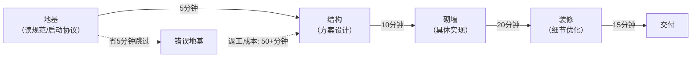

+++
id = "pattern-nonlinear-correction-cost"
domain = "methodology"
layer = "methodology"
maturity = "L1"
validation_count = 1
reuse_count = 0
documentation_level = "standard"
source = "docs/retrospective/reports/project-governance/tools-and-automation/retrospective-forum-posting-skill-optimization-20260629/insight-extraction.md"

[bindings]
rules = []
references = ["process-vs-experience-intuition.md", "availability-heuristic-structural-guard.md"]
skills = []
+++

> **提炼自**：[insight-extraction.md](../../../reports/project-governance/tools-and-automation/retrospective-forum-posting-skill-optimization-20260629/insight-extraction.md) —— forum-posting Skill 优化复盘

# 协议违规非线性纠偏成本模式（Nonlinear Correction Cost for Protocol Violations）

## 模式类型

方法论模式（治理策略）

## 成熟度

L1 首次提炼（forum-posting Skill 优化实践验证）

## 适用场景

评估"要不要跳过某个前置步骤"、"省这点时间值不值"时，作为决策依据；解释为什么启动协议、检查清单这类"看起来增加负担"的前置步骤实际上是最高效的选择。

## 问题背景

人（和 Agent）做决策时天然倾向于短期成本收益计算：
- "读规范要5分钟，省了吧"
- "就改这一点，不用走检查清单了"
- "启动协议太麻烦，直接开始干活"

这种计算的错误在于：**只算了前置步骤的显性时间成本，没算违规后的返工成本——而返工成本是非线性增长的。**

## 核心规则

### 规则 1：成本曲线是指数级而非线性的

| 阶段 | 发现问题的时机 | 返工成本 | 类比 |
|-----|-------------|---------|------|
| 规范读取阶段 | 开工前5分钟发现漏读 | 5分钟（补读） | 地基打之前发现图纸错了，改图纸就行 |
| 方案设计阶段 | 做了10分钟发现路线错了 | 15分钟（补读+改方案） | 地基刚挖发现错了，填了重挖 |
| 实现阶段 | 做了30分钟发现方向错了 | 45分钟+（补读+改方案+推倒重来） | 墙砌了一半发现地基错了，拆墙+重建 |
| 交付阶段 | 快做完了才发现根本不对 | 60分钟+全部返工 | 房子快盖好了发现地基不稳，拆整栋楼重盖 |

**核心洞察**：在前置步骤花5分钟读规范，可以避免后面花50分钟返工。ROI是10:1。

### 规则 2："看起来省时间"是认知错觉

跳过前置步骤时，人感知到的是：
- ✅ 显性收益：省了5分钟
- ❌ 隐性风险："应该不会那么巧出问题吧"

但真实的概率分布是：
- 80%的概率：真的没出大问题，你觉得"省时间真明智"
- 15%的概率：出了点小问题，多花10分钟修补，你觉得"虽然有点小麻烦但总体还是省了"
- 5%的概率：出大问题，全部返工花1小时，这时候你才后悔

**期望值计算**：
- 省时间的期望收益：5分钟 × 95% = 4.75分钟
- 返工的期望成本：60分钟 × 5% = 3分钟？不对，算错了——
- 正确计算：80%概率省5分钟，15%概率亏5分钟（10-5），5%概率亏55分钟（60-5）
- 期望值 = 0.8×5 + 0.15×(-5) + 0.05×(-55) = 4 - 0.75 - 2.75 = **0.5分钟**

花这么大风险，期望净收益只有0.5分钟？而且这还没算：
- 返工期间的上下文切换成本
- 返工导致的士气下降
- 可能引入的新bug
- 对流程信心的侵蚀

### 规则 3："凭经验不会错"是过度自信

即使你"确定"自己记得规范内容，也要花2分钟扫一遍检查清单：
- 你记得可能是旧版本的规范
- 你可能记错了关键细节
- 你可能忽略了最近新增的规则
- 确认一下只花2分钟，比事后返工便宜得多

> **为什么？** 这就是飞机起飞前飞行员要念检查清单的原因——不是他们不会开飞机，而是"我记得"在复杂系统中不可靠。

## 决策速查表

当你想跳过某个步骤时，问自己三个问题：

| 问题 | 如果答案是"是" | 如果答案是"否" |
|-----|-------------|-------------|
| 1. 跳过这个步骤，如果错了，返工成本是多少？ | 成本≥30分钟 → 别跳，花5分钟做完 | 成本低 → 可以考虑，但还是推荐做 |
| 2. 我上一次跳过这种步骤是什么时候？结果如何？ | 上次跳过就出问题了 → 这次别跳 | 上次没出问题 → 不代表这次不会（见规则2） |
| 3. 做这个步骤要花多长时间？ | ≤10分钟 → 做，ROI极高 | >30分钟 → 评估是否真的需要，或者有没有简化版本 |

## 实施检查清单

- [ ] 评估是否跳过步骤时，是否计算了返工成本而非只看前置时间？
- [ ] 是否理解了成本曲线的非线性特征？
- [ ] 有没有"上次没做也没事"的过度自信偏差？
- [ ] 前置步骤≤10分钟时，是否默认选择执行而非跳过？

## 反例警示

| 错误想法 | 真实成本 |
|---------|---------|
| "读AGENTS.md要5分钟，直接开始吧" | 没读vendor路由表，优化Skill没用skill-creator，返工花了40分钟 |
| "就改一行代码，不用跑测试了" | 改了A坏了B，排查bug花了30分钟 |
| "不用写提交信息，直接commit" | 后来想回溯为什么改这个，花了20分钟翻历史还没找到原因 |

## 正例

forum-posting Skill 优化场景：
- 第一轮：跳过启动协议任务类型预检，没读skill-creator方法论
- 花了20分钟凭经验改SKILL.md，看起来不错
- 后来发现方向错了，应该用skill-creator五要素模型
- 补读规范+推倒重来花了50分钟
- 净损失：50 - 5（省的读规范时间）= 45分钟
- 教训：前置5分钟的规范读取，可以避免45分钟的非线性返工

## 与现有模式的关系

- `process-vs-experience-intuition.md`：本模式解释了为什么"凭经验做对"长期来看是亏本的——期望返工成本远高于省下来的时间
- `availability-heuristic-structural-guard.md`：解释了为什么人/Agent会系统性低估返工概率——可得性启发让我们只记得"上次跳过也没事"，不记得小概率的大返工事件
