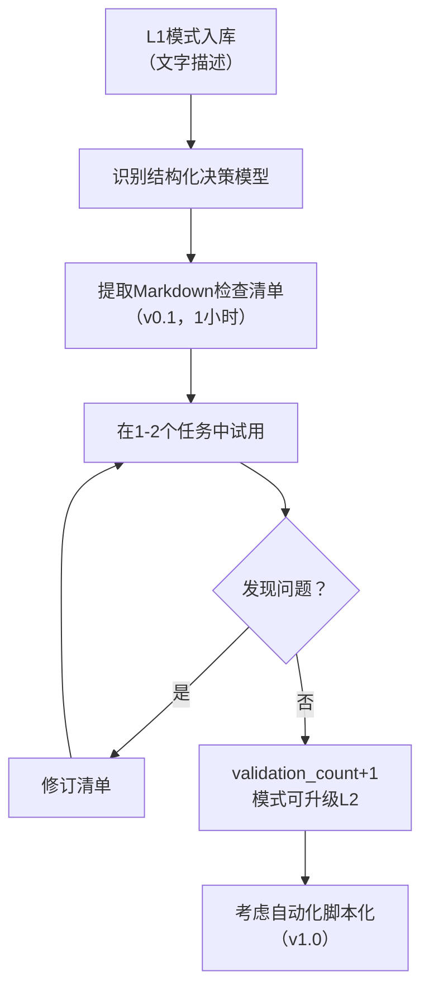

> **来源**：从 `retrospective-sunlogin-security-wiki-20260704` 向日葵安全产品复盘的风险评分检查清单提取实践萃取

# 模式渐进式工具提取：L1实验阶段即可提取轻量工具

## 模式概述

不等待模式升级到L2（≥2次跨场景验证）才进行工具化，而是在模式处于L1实验阶段时，就将其中结构化的决策模型（评分表、决策矩阵、检查清单等）提取为轻量可复用工具（检查清单、模板、速查表），使方法论资产在实验阶段就能指导实践，工具使用过程反过来为模式积累validation_count，形成"提取→使用→反馈→升级"的正向循环。

## 问题现象

模式工具化的传统反模式：

1. **等成熟才工具化**：认为模式必须L2/L3才值得做工具，导致L1模式中的高价值决策模型长期锁在长文模式文档中，无法直接使用
2. **工具化门槛过高**：一想到工具化就想做全自动脚本、CLI工具、Web应用，成本高周期长，反而不如不做
3. **模式入库即遗忘**：模式创建后写入库就完事，没有配套工具，后续任务中需要使用时必须重新阅读整篇模式文档
4. **成熟度升级缺乏验证来源**：模式停留在L1长期无法升级，因为没有被使用→没有validation_count→不能升L2→更没人用→死循环
5. **完美主义阻塞**：想做"完美工具"再发布，结果永远在计划中，什么都没交付

这些反模式的共同后果是：模式库越来越大，但真正在日常工作中被使用的很少，方法论资产周转率极低。

## 解决方案

### 核心机制：渐进式工具化三层路径

```
L1实验模式 → ①提取轻量工具（检查清单/模板/速查表）→ 使用中积累验证 → ②升级工具（脚本/自动化检查）→ 模式升级L2 → ③深度集成（CI门禁/IDE插件/Skill）→ 模式升级L3
```

| 工具层级 | 适用成熟度 | 形式 | 工作量 | 示例 |
|---------|-----------|------|--------|------|
| **轻量工具** | L1即可 | Markdown检查清单/模板/速查表 | 0.5-2小时 | 风险评分检查清单、跨领域映射模板 |
| **自动化工具** | L2适合 | Python脚本/自动化验证器 | 0.5-1天 | pattern-maturity.py check-index |
| **深度集成** | L3适合 | CI门禁/IDE插件/Skill工具 | 1-3天 | commit-quality-gate-staging-inspection |

### 关键原则

**1. L1阶段提取轻量工具的判断标准**

模式中有以下结构化内容时，立即提取：
- 评分表/加权矩阵（如四维度风险评分）
- 决策树/流程图（如"如果X则Y"的明确判断逻辑）
- 检查清单（≥5条验证项的结构化清单）
- 参数速查表（如权限配置默认值表格）
- 标准化流程模板（可复用的文档结构）

**2. 轻量工具的三要素**

| 要素 | 要求 | 反例 |
|------|------|------|
| **独立可用** | 不读完整模式文档也能用 | "详见第X章的完整分析" |
| **即查即用** | ≤10分钟能完成一次决策 | 需要花1小时阅读理解 |
| **关联溯源** | 标注来源模式，方便深入理解 | 孤立的表格没有上下文链接 |

**3. 工具与模式的双向引用**

- 模式文件中增加"配套工具"章节，链接到提取的工具
- 工具文件的TOML元数据中`source`字段指回来源模式
- 工具使用中发现问题或改进，直接反哺模式修订

**4. 渐进式而非一次到位**



## 本次验证案例

以non-intrusive-security-ux模式中的风险评分模型为例：

| 阶段 | 做法 | 结果 |
|------|------|------|
| 模式入库（L1） | 风险评分模型作为文字描述在模式文档"四、风险分级响应矩阵"中 | 模型在长文里，做Agent授权决策时需要翻文档找评分标准 |
| 传统做法（等L2） | 等模式在≥2个场景验证后才工具化 | 至少等下一个安全项目，可能数周后 |
| 渐进式做法 | 立即提取为risk-scoring-checklist.md，包含四维度评分表+5级响应+信任累积+Agent权限速查表+Mermaid决策图 | 半天完成v1.0，现在任何Agent工具授权决策都可以直接打开清单对照使用 |

**关键洞察**：检查清单的价值不依赖于模式的成熟度——即使模型本身只经过1次验证，以结构化形式呈现也比埋在长文里有用10倍。使用过程中发现的问题本身就是最好的validation_count来源。

## 正反例

### 正例

- **风险评分检查清单**（本次）：从L1模式non-intrusive-security-ux提取，v1.0即包含完整评分矩阵+响应指南+信任规则+权限速查表+决策流程图，半天工作量立即可用
- **跨领域映射模板**（本次）：将"产品经验→AI Agent启示"的映射过程固化为四段式模板+质量检查清单+反模式警告，1小时工作量
- **context-recovery-protocol**规则3（L2升级时）：将"配套文件检查"直接写入模式规则中，作为协议的一部分

### 反例

- 等模式L2/L3才做工具：模式入库后6个月仍无工具，做新项目时必须重读2000字模式文档才能用
- 一上来就写全功能脚本：想做"智能风险评分CLI工具"带参数解析/JSON输出/配置文件，规划2天工作量，优先级排不上就一直没做
- 检查清单不独立可用：清单写"按模式第五章的风险矩阵评估"，等于没提取

## 适用场景

- 安全/权限/风险类模式（评分表、决策矩阵天然适合提取为检查清单）
- 流程类模式（标准化步骤适合提取为模板）
- 配置类模式（默认值/对照表适合提取为速查表）
- AI Agent协作类模式（Agent需要结构化决策依据）

## 不适用场景

- 纯原则性/理念性模式（如"用户主权默认"是理念，无法直接提取为清单）
- 需要复杂上下文判断的模式（决策依赖太多变量，无法简化为清单）
- 极度成熟已有深度集成的模式（L3已有CI/Skill集成，不需要再单独提取清单）

## 模式价值

1. **方法论资产周转率提升**：L1阶段即可用，不需要等数周/数月的验证周期
2. **正向循环建立**：工具使用→发现问题→模式改进→validation_count增加→升级L2，打破"没人用→不升级→更没人用"的死循环
3. **交付门槛降低**：检查清单/模板形式的工具化成本极低（半天），远低于脚本/系统
4. **AI Agent友好**：结构化清单比长篇文字更适合AI Agent作为决策输入
5. **渐进式完善**：v0.1检查清单在使用中自然迭代为v1.0脚本，不需要一开始就完美规划

## 与其他模式的关系

- **meta-retrospective-closed-loop（元复盘闭环）**：渐进式工具提取是元复盘Step 5（工具化）的具体方法论
- **mvp-unvalidated-code-debt（MVP未验证代码债）**：两者都强调"先可用再完善"，但MVP模式针对代码，本模式针对方法论工具
- **convention-driven-creation（约定驱动创建）**：约定驱动创建强调遵循现有约定，本模式强调将约定提取为可独立使用的工具
- **non-intrusive-security-ux（安全不打扰UX）**：本模式的首个验证案例，其风险评分模型被提取为检查清单
