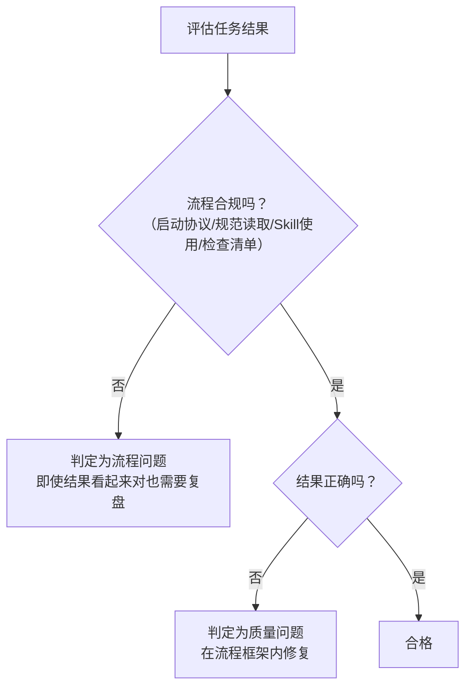

+++
id = "pattern-process-vs-experience"
domain = "methodology"
layer = "methodology"
maturity = "L1"
validation_count = 1
reuse_count = 0
documentation_level = "standard"
source = "docs/retrospective/reports/project-governance/tools-and-automation/retrospective-forum-posting-skill-optimization-20260629/insight-extraction.md"

[bindings]
rules = []
references = ["nonlinear-correction-cost.md", "availability-heuristic-structural-guard.md", "governance-tier-priority.md"]
skills = []
+++

> **提炼自**：[insight-extraction.md](../../../reports/project-governance/tools-and-automation/retrospective-forum-posting-skill-optimization-20260629/insight-extraction.md) —— forum-posting Skill 优化复盘

# 流程合规 vs 经验直觉区分模式（Process Compliance vs Experience Intuition）

## 模式类型

方法论模式（治理策略）

## 成熟度

L1 首次提炼（forum-posting Skill 优化实践验证）

## 适用场景

评估任务执行质量时，需要区分"这次做对了"是因为遵循了流程方法论，还是因为凭经验直觉偶然做对；制定流程规范时，需要明确流程的价值主张。

## 问题背景

AI 协作中常见误区：
1. 某次任务凭经验做对了，就认为"不需要按流程来"
2. 结果看起来正确，就跳过了前置规范读取和检查清单
3. 把"偶然正确性"等同于"方法论正确"
4. 流程违规但结果没错时，不认为这是问题

这种认知偏差会导致：流程规范逐渐被架空，质量方差越来越大，直到某次"凭经验"做错了才付出惨重代价。

## 核心规则

### 规则 1：两种正确性的本质区别

| 维度 | 经验直觉做对 | 按方法论做对 |
|-----|------------|------------|
| **可预测性** | 不可预测——这次对不代表下次对 | 可预测——按流程走每次都能对 |
| **可审计性** | 无法审计——不知道为什么对，也无法复现 | 可审计——每一步都有规范依据，可以追溯 |
| **可转移性** | 不可转移——换个Agent/换个场景就失效 | 可转移——遵循相同流程的任何人都能得到一致结果 |
| **返工成本** | 失败时非线性——地基错了要全部重来 | 失败时线性——只需要修复出错的那一步 |
| **质量方差** | 方差大——依赖执行者状态和经验 | 方差小——流程保证下限 |

### 规则 2："凭经验做对"也是流程问题

即使结果看起来完全正确，如果执行过程跳过了规范要求的步骤（如没读AGENTS.md、没用指定Skill、没做自检），**仍然判定为流程违规**。

> **为什么？** 因为你无法保证下次还能"凭经验"做对。流程的价值是保证下限，不是追求每次都靠高手发挥。

### 规则 3：评估质量的顺序

评估任务结果时必须按以下顺序，不能跳过：
1. **先看流程合规性**：启动协议执行了吗？该读的规范读了吗？该用的Skill用了吗？检查清单过了吗？
2. **再看结果正确性**：流程合规的基础上，结果是否满足需求？

### 规则 4：流程不是束缚，是安全网

不要把流程合规看作"增加负担"：
- 对新手：流程是step-by-step指南，不用从零开始摸索
- 对老手：流程是检查清单，防止"我以为我记得"的疏忽
- 对协作：流程是共同语言，减少沟通和交接成本

## 判断速查表

| 情况 | 判定 | 正确应对 |
|-----|------|---------|
| 没读规范但结果对了 | 流程违规 | 补读规范，确认有没有遗漏的隐患 |
| 没用指定Skill但结果看起来不错 | 流程违规 | 按Skill方法论重新评估结果质量 |
| 跳过检查清单但没出问题 | 流程违规 | 补走检查清单，确认真的没问题 |
| 流程全走了但结果有错 | 质量问题 | 在流程框架内定位具体缺陷修复 |
| 流程走了但流程本身有缺陷 | 流程改进 | 更新规范，而不是下次跳过流程 |

## 实施检查清单

- [ ] 评估结果时是否先看流程合规性，再看结果质量？
- [ ] 是否区分了"偶然做对"和"按流程做对"？
- [ ] 流程违规但结果正确时，是否仍然要求复盘和补走流程？
- [ ] 流程本身有问题时，是改进流程还是绕过流程？
- [ ] 是否把流程看作安全网而非束缚？

## 反例警示

| 错误想法 | 为什么错 |
|---------|---------|
| "结果对了不就行了吗？" | 这次对不代表下次对，你在赌运气 |
| "我知道怎么做，不用读规范" | 规范里可能有你"以为知道"但其实记错了的内容 |
| "这个流程太麻烦了，省一步没事" | 省5分钟读规范，可能导致30分钟返工 |
| "上次我就是这么做的也没问题" | 上次没问题是运气，不是方法论正确 |

## 正例

forum-posting Skill 优化场景：
- 初轮优化：直接修改SKILL.md，凭经验增加了触发词，结果看起来不错
- 问题：没有执行启动协议的任务类型预检，不知道vendor里有skill-creator方法论
- 判定：流程违规（即使结果有改进）
- 正确应对：承认流程跳过 → 重新执行完整启动协议 → 读取skill-creator规范 → 按方法论重新优化 → 产出比"凭经验改"质量高得多（95分vs初轮的60分水平）

## 与现有模式的关系

- `nonlinear-correction-cost.md`：解释了为什么流程违规即使结果对也要纠正——返工成本是非线性的
- `availability-heuristic-structural-guard.md`：解释了为什么人/Agent会倾向于凭经验直觉——可得性启发认知偏差，需要结构性机制对抗
- `governance-tier-priority.md`：流程合规属于治理层优先级，高于执行层的结果正确性
