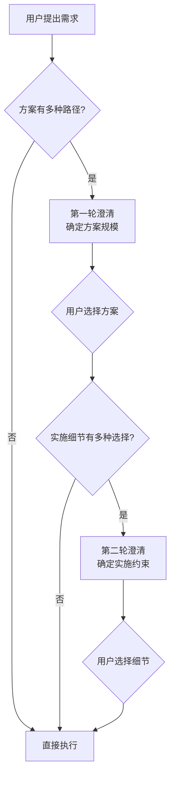

+++
id = "progressive-requirement-clarification"
domain = "methodology"
layer = "methodology"
maturity = "L1"
validation_count = 1
reuse_count = 0
documentation_level = "standard"
source = "docs/retrospective/reports/spec-system/retrospective-report-specs-theme-task-board-system-20260626/insight-extraction.md"

[bindings]
rules = []
references = ["spec-driven-development", "convention-driven-creation"]
skills = []
+++

# 递进式需求澄清：先定范围、再定细节

## 模式概述

当方案有多种实施路径且需要用户决策时，采用"先粗后细"的两轮澄清策略：第一轮确定方案规模/方向（选项互斥），第二轮确定实施细节/约束（选项互补）。避免一次性问太多导致决策疲劳，也避免问太少导致方向偏差。

## 两轮澄清策略

### 第一轮：确定方案规模/方向

| 维度 | 说明 |
|------|------|
| 目标 | 确定方案的总体范围和方向 |
| 选项特征 | 选项互斥（不能同时选择） |
| 问题特征 | 影响范围大、改变方案规模 |
| 示例 | "三层体系 vs 单层看板 vs 仅模板" |

**设计要点**：
- 提供 2-4 个互斥选项
- 每个选项附带说明，降低理解成本
- 推荐选项放在第一位并标注"（推荐）"
- 支持"其他"选项，允许用户自定义

### 第二轮：确定实施细节/约束

| 维度 | 说明 |
|------|------|
| 目标 | 确定实施方式和约束条件 |
| 选项特征 | 选项互补（可组合，但通常各选一个） |
| 问题特征 | 影响实施方式、不改变方案规模 |
| 示例 | "静态维护 vs 动态脚本"、"立即执行 vs 仅记录" |

**设计要点**：
- 可一次问 2-3 个互补问题（各问题独立选择）
- 每个问题有明确的默认推荐
- 问题之间无依赖（避免"如果选A则问B"的条件分支）

## 执行流程



## 选项设计规范

### 互斥选项（第一轮）设计

```
问题：你希望采用哪种方案？
选项：
  1. 方案A（推荐）— 说明A的优缺点
  2. 方案B — 说明B的优缺点
  3. 方案C — 说明C的优缺点
  4. 三者结合 — 说明组合方案
```

**原则**：
- 选项之间互斥（选了A就不能同时选B）
- 但可以提供"组合"选项作为兜底
- 每个选项必须附带说明，解释选择后的影响

### 互补选项（第二轮）设计

```
问题1：状态如何维护？
  1. 静态手动维护（推荐）— 说明
  2. 动态脚本自动统计 — 说明

问题2：遗留问题如何处理？
  1. 仅记录到看板，不立即执行（推荐）— 说明
  2. 记录并立即补全/执行 — 说明
```

**原则**：
- 多个问题可并行提问（各问题独立）
- 每个问题有自己的推荐选项
- 问题之间无依赖关系

## 为什么不一次性问所有问题

| 策略 | 优点 | 缺点 |
|------|------|------|
| 一次性问所有 | 减少交互轮次 | 用户决策疲劳；细节问题在方向未定时难以回答；选项组合爆炸 |
| 递进式（推荐） | 每轮问题聚焦；第一轮回答后用户对方案更清晰，第二轮回答更精准 | 交互轮次多 1 轮 |

**关键洞察**：用户在第一轮回答后，对方案有了更清晰的认识，第二轮的问题更容易回答。这种"先粗后细"的策略利用了认知的渐进式建立过程。

## 与其他澄清策略的对比

| 策略 | 适用场景 | 风险 |
|------|---------|------|
| 不澄清，直接执行 | 需求明确、方案唯一 | 方向偏差导致返工 |
| 一次性问所有 | 问题少且独立 | 决策疲劳、组合爆炸 |
| 递进式（本模式） | 方案多路径、细节有选择 | 多一轮交互 |
| 逐个追问 | 问题间有依赖关系 | 交互轮次过多 |

## 质量检查清单

- [ ] 第一轮选项互斥（不能同时选择）
- [ ] 第一轮每个选项附带说明
- [ ] 第一轮有推荐选项（标注"推荐"）
- [ ] 第二轮问题互补（各问题独立）
- [ ] 第二轮每个问题有推荐选项
- [ ] 第二轮问题之间无依赖
- [ ] 两轮之间有逻辑递进（先范围后细节）
- [ ] 选项数量 ≤ 4（避免选择困难）

## 适用场景

- 方案有 2 种以上实施路径，需要用户决策
- 用户对方案细节可能有偏好
- 细节选择会影响实施方式（而非仅影响内容）
- 需求模糊，需要澄清范围和约束

## 不适用场景

- 需求明确、方案唯一（直接执行即可）
- 问题之间有复杂依赖（需逐个追问）
- 简单任务（不值得两轮澄清的开销）
- 用户已明确表达所有偏好（直接按偏好执行）

> 来源：SpecWeave specs 主题任务看板体系构建中的两次 AskUserQuestion 实践
> 关联模式：`spec-driven-development`（需求先于实施）、`convention-driven-creation`（在已有规范中减少决策）
