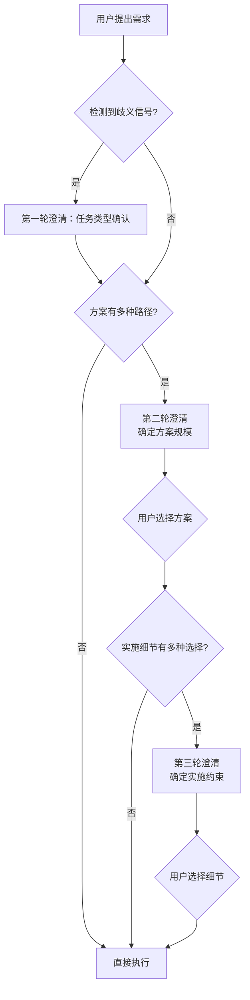

# 递进式需求澄清：先定范围、再定细节

## 模式概述

当方案有多种实施路径且需要用户决策时，采用"先粗后细"的两轮澄清策略：第一轮确定方案规模/方向（选项互斥），第二轮确定实施细节/约束（选项互补）。避免一次性问太多导致决策疲劳，也避免问太少导致方向偏差。

## 两轮澄清策略

### 第一轮：确定方案规模/方向

| 维度 | 说明 |
|------|------|
| 目标 | 确定方案的总体范围和方向 |
| 选项特征 | 选项互斥（不能同时选择） |
| 问题特征 | 影响范围大、改变方案规模 |
| 示例 | "三层体系 vs 单层看板 vs 仅模板" |

**设计要点**：
- 提供 2-4 个互斥选项
- 每个选项附带说明，降低理解成本
- 推荐选项放在第一位并标注"（推荐）"
- 支持"其他"选项，允许用户自定义

### 第二轮：确定实施细节/约束

| 维度 | 说明 |
|------|------|
| 目标 | 确定实施方式和约束条件 |
| 选项特征 | 选项互补（可组合，但通常各选一个） |
| 问题特征 | 影响实施方式、不改变方案规模 |
| 示例 | "静态维护 vs 动态脚本"、"立即执行 vs 仅记录" |

**设计要点**：
- 可一次问 2-3 个互补问题（各问题独立选择）
- 每个问题有明确的默认推荐
- 问题之间无依赖（避免"如果选A则问B"的条件分支）

## 执行流程



## 任务类型歧义触发信号

当出现以下信号时，必须先进行任务类型澄清（作为第0轮/第一轮澄清），再进入方案规模澄清：

### URL信号（高置信度）

- URL包含 `console.` 前缀（如 `console.volcengine.com`、`console.aliyun.com`）
- URL路径包含 `/console/`、`/openManagement/`、`/dashboard/`、`/admin/` 等后台管理路径
- URL包含区域参数如 `region:cn-beijing`、`region=cn-`
- URL指向需要登录认证的产品页面而非公开文档站

### 语言信号

- 用户提到"页面"但未明确是"学习分析"还是"开发实现"
- 用户使用了"补充完善"、"确保功能完整"、"做一个一样的"等带有开发实现暗示的词汇
- 用户同时提到"学习"和"开发"相关词汇，存在方向混淆

### 内容信号

- URL对应产品既有公开文档又有控制台界面
- 任务描述中同时包含"分析"和"实现"两种动作词汇
- 用户没有明确说明产出物形态（是报告/笔记还是代码/页面）

## 任务类型澄清话术模板

检测到歧义信号时，使用以下AskUserQuestion模板进行任务类型确认（第一轮澄清）：

```
问题：我注意到这个URL指向控制台页面，请问您希望我如何处理？
选项：
  1. 学习分析该页面（推荐）— 系统性学习页面功能、业务逻辑、交互设计，形成结构化学习笔记与洞察报告
  2. 开发实现一个仿该页面的原型 — 在本地创建HTML/前端页面原型，模拟页面功能和交互
  3. 将该页面内容补充到已有分析报告中 — 作为相关产品生态的一部分补充
```

**设计要点**：
- 选项1（学习分析）作为默认推荐，符合知识库建设的主要场景
- 选项2（开发实现）明确说明产出物是本地HTML原型，避免过度承诺
- 选项3（补充到已有）适用于连续任务场景，处理增量内容
- 每个选项明确说明产出物形态，避免歧义

## 选项设计规范

### 互斥选项（第一轮）设计

```
问题：你希望采用哪种方案？
选项：
  1. 方案A（推荐）— 说明A的优缺点
  2. 方案B — 说明B的优缺点
  3. 方案C — 说明C的优缺点
  4. 三者结合 — 说明组合方案
```

**原则**：
- 选项之间互斥（选了A就不能同时选B）
- 但可以提供"组合"选项作为兜底
- 每个选项必须附带说明，解释选择后的影响

### 互补选项（第二轮）设计

```
问题1：状态如何维护？
  1. 静态手动维护（推荐）— 说明
  2. 动态脚本自动统计 — 说明

问题2：遗留问题如何处理？
  1. 仅记录到看板，不立即执行（推荐）— 说明
  2. 记录并立即补全/执行 — 说明
```

**原则**：
- 多个问题可并行提问（各问题独立）
- 每个问题有自己的推荐选项
- 问题之间无依赖关系

## 为什么不一次性问所有问题

| 策略 | 优点 | 缺点 |
|------|------|------|
| 一次性问所有 | 减少交互轮次 | 用户决策疲劳；细节问题在方向未定时难以回答；选项组合爆炸 |
| 递进式（推荐） | 每轮问题聚焦；第一轮回答后用户对方案更清晰，第二轮回答更精准 | 交互轮次多 1 轮 |

**关键洞察**：用户在第一轮回答后，对方案有了更清晰的认识，第二轮的问题更容易回答。这种"先粗后细"的策略利用了认知的渐进式建立过程。

## 与其他澄清策略的对比

| 策略 | 适用场景 | 风险 |
|------|---------|------|
| 不澄清，直接执行 | 需求明确、方案唯一 | 方向偏差导致返工 |
| 一次性问所有 | 问题少且独立 | 决策疲劳、组合爆炸 |
| 递进式（本模式） | 方案多路径、细节有选择 | 多一轮交互 |
| 逐个追问 | 问题间有依赖关系 | 交互轮次过多 |

## 质量检查清单

- [ ] 第一轮选项互斥（不能同时选择）
- [ ] 第一轮每个选项附带说明
- [ ] 第一轮有推荐选项（标注"推荐"）
- [ ] 第二轮问题互补（各问题独立）
- [ ] 第二轮每个问题有推荐选项
- [ ] 第二轮问题之间无依赖
- [ ] 两轮之间有逻辑递进（先范围后细节）
- [ ] 选项数量 ≤ 4（避免选择困难）

## 适用场景

- 方案有 2 种以上实施路径，需要用户决策
- 用户对方案细节可能有偏好
- 细节选择会影响实施方式（而非仅影响内容）
- 需求模糊，需要澄清范围和约束

## 不适用场景

- 需求明确、方案唯一（直接执行即可）
- 问题之间有复杂依赖（需逐个追问）
- 简单任务（不值得两轮澄清的开销）
- 用户已明确表达所有偏好（直接按偏好执行）

## 实际案例

### 案例1：Spec主题任务看板体系（首次验证）

在Spec主题任务看板体系构建中，两次使用递进式澄清：
1. 第一轮澄清确定方案规模（三层体系 vs 单层看板 vs 仅模板）
2. 第二轮澄清确定实施细节（静态维护 vs 动态脚本、立即执行 vs 仅记录）
有效避免了一次性问太多问题导致的决策疲劳。

### 案例2：火山引擎协作奖励计划任务类型澄清（第二次验证）

**触发信号**：
- URL：`https://console.volcengine.com/ark/region:cn-beijing/openManagement/rewardPlan`
- URL包含`console.volcengine.com`前缀
- URL路径包含`/openManagement/`和区域参数`region:cn-beijing`
- 用户提到"页面"但未明确任务类型

**澄清过程**：
- 使用任务类型澄清话术模板发起AskUserQuestion
- 用户明确选择选项1："学习分析该页面"
- 成功避免了方向性错误（如果误判为开发实现，会浪费大量时间尝试创建HTML原型）

**后续处理**：
- 确认任务类型为学习分析后，触发外部网站分析降级策略
- 从控制台URL切换到公开文档站`www.volcengine.com/docs/`获取完整内容
- 最终产出了高质量的结构化分析报告

**关键发现**：
- URL中的`console.`前缀和`/openManagement/`路径是极强的歧义信号
- 任务类型澄清是方向性澄清，优先级高于方案规模澄清
- 一句话澄清避免了可能30分钟以上的方向性返工

> 来源：SpecWeave specs 主题任务看板体系构建中的两次 AskUserQuestion 实践；火山引擎双产品学习复盘
> 关联模式：`spec-driven-development`（需求先于实施）、`convention-driven-creation`（在已有规范中减少决策）、`external-website-analysis-fallback-strategy`（控制台页面降级策略）
