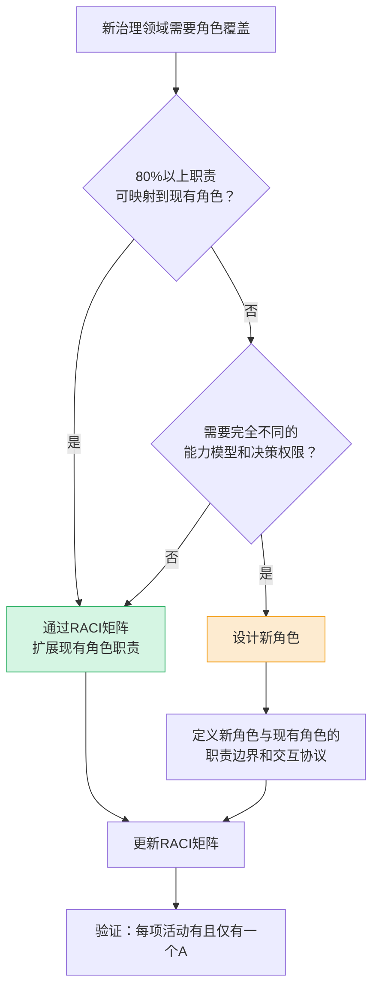

+++
id = "role-minimization-principle"
type = "methodology"
category = "governance-strategy"
maturity = "L1"
source = "docs/retrospective/reports/project-governance/process-and-compliance/retrospective-ai-agent-data-security-governance-20260629/"
created = "2026-06-29"
verified_count = 1

[bindings]
rules = [".agents/rules/data-security/role-responsibilities.md"]
references = [
    "five-layer-governance-architecture.md",
    "availability-heuristic-structural-guard.md"
]
skills = []
+++

# 角色最小化原则（RACI扩展优先于角色新增）

## 模型概述
在治理体系建设中进行角色设计时，常见的冲动是"新领域→新角色"。但每新增一个独立角色都会带来角色膨胀、职责灰色地带、认知负担三重问题。本原则提供角色设计的决策框架：优先通过RACI矩阵扩展现有角色职责，而非新增独立角色。

## 核心原则
**新增角色判断标准**：只有当某项职责完全无法被现有角色覆盖（需要完全不同的能力模型和决策权限）时，才考虑新增角色。

**经验法则（80%规则）**：如果某个角色80%的职责都可以映射到现有角色，就不应该新增。

## 新增角色三重问题分析

| 问题 | 表现 | 影响 |
|---|---|---|
| 角色膨胀 | 每新增一个治理维度就新增角色 | 角色体系庞大，智能体上下文窗口被角色定义占据 |
| 职责灰色地带 | 新角色与现有角色的边界需重新定义 | 职责重叠或真空，出现"三个和尚没水喝" |
| 认知负担 | 智能体需加载更多角色定义 | 执行时注意力分散，角色特征被稀释 |

## 决策流程图

## RACI扩展实践步骤

| 步骤 | 动作 | 产出 |
|---|---|---|
| 1. 职责盘点 | 列出新领域的所有关键活动 | 活动清单（15-25项） |
| 2. 映射试分配 | 尝试将每项活动分配给现有角色（R/A/C/I） | 初始RACI矩阵 |
| 3. 冲突检查 | 检查是否有活动无人负责（无A）或多人负责（多A） | 冲突清单 |
| 4.  gap分析 | 对无法合理分配的活动，分析gap原因 | gap分析报告 |
| 5. 决策 | 80%可分配→扩展现有角色；不可分配→设计新角色 | 角色决策结论 |
| 6. 更新 | 更新角色定义文档和RACI矩阵 | 更新后的角色体系 |

## 验证案例

| 案例 | 新领域需求 | 决策 | RACI分配结果 |
|---|---|---|---|
| 数据安全治理 | 数据安全审查（DSO角色） | **不新增**，reviewer扩展承担 | reviewer承担数据安全审查+供应商审计+监控研判；重大决策orchestrator+architect+co-founder三方审批（24项RACI活动） |

## 适用场景
- 治理体系建设初期的角色设计
- 新功能/新领域引入时的角色扩展
- 智能体角色体系优化
- 组织架构精简决策

## 不适用场景
- 治理领域高度专业化（如财务审计、法律合规）且现有角色完全无相关能力
- 新角色的能力模型与现有角色完全正交（如完全不同的技能集、工具链、决策权限）
- 外部合规要求明确要求设立独立岗位（如某些行业的DPO强制要求）

## 与五层架构的关系
本原则是五层架构L5组织保障层的设计指导原则：在定义角色职责矩阵时，应先尝试RACI扩展，无法覆盖时才新增角色。这确保了角色体系的精简性和可维护性。

## 注意事项
1. **避免"为了清晰而新增"**：看似清晰的独立角色，实际增加了协调成本
2. **RACI的A唯一原则**：每项活动必须有且仅有一个A（Accountable），无论新老角色
3. **新角色需定义边界**：如确需新增角色，必须同步定义与所有现有角色的职责边界和升级路径
4. **定期审计角色体系**：随着治理领域增加，定期检查角色是否可合并或精简

> 来源：AI智能体互联数据安全治理复盘（数据安全官DSO角色不新增决策）
