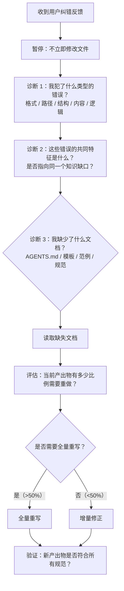

> **来源**：从 `retrospective-session-agents-md-violation-20260624` 洞察 2「表层修正循环」萃取

# 根因诊断模式

## 一、来源

本轮会话中，智能体在生成产出物时连续触发了三重错误（格式/路径/结构），用户每轮指出一个问题，智能体每轮只修正被指出的那一个。经过 3 轮表层修正后，用户直接要求「按 AGENTS.md 来」，智能体才读取 AGENTS.md——此时一次读取 + 一次全量重写就修复了所有问题。

这个模式揭示了 AI 智能体的一个默认行为倾向：**纠错反馈是症状信号，但智能体的默认响应是「修症状」而非「诊根因」**。

## 二、核心思想

当收到用户纠错反馈时，智能体不应立即修正被指出的具体问题，而应首先执行「根因诊断」——追溯「为什么我犯了这些错误？我缺少了什么知识？我应该先读什么文件？」。只有在确认知识完整后，才执行修正操作。

```
用户纠错 → 暂停修正 → 根因诊断 → 读取缺失文档 → 全量修正 → 验证
```

与默认的「修症状」模式对比：

```
用户纠错 → 立即修正当前症状 → 用户再纠错 → 再修正 → ...（循环）
              ↑ 质量差                         |
              └─────────────────────────────────┘
```

## 三、操作步骤



## 四、诊断检查清单

收到纠错反馈后，依次检查以下问题：

| # | 检查项 | 如果答案为「是」 |
|---|--------|----------------|
| 1 | 我是否在本次会话开始时读取了 AGENTS.md？ | 否 → 立即读取 |
| 2 | 我输出的文件格式是否与项目规范（如 Marp/Markdown/特定模板）一致？ | 否 → 查阅对应模板 |
| 3 | 我输出的文件路径是否遵循项目目录约定？ | 否 → 查阅目录命名规范 |
| 4 | 我的文档结构是否遵循项目的原子化/模块化模板？ | 否 → 查阅现有范例 |
| 5 | 我的文件命名是否使用了 kebab-case 等约定格式？ | 否 → 查阅命名规范 |
| 6 | 是否存在多个 Skill 被同时加载且语义重叠的情况？ | 是 → 确认只有正确的 Skill 生效 |

## 五、使用原则

1. **纠错触发即诊断**：任何用户纠错反馈都应触发诊断步骤，即使反馈只涉及一个症状
2. **诊断先于修正**：在完成检查清单之前，不执行任何文件修改操作
3. **全量优于增量**：若诊断发现多个输出维度偏离规范，优先全量重写而非逐个修补
4. **诊断结果需透明**：在修正完成后，向用户说明诊断的根因和修正策略

## 六、验证标准

根因诊断模式有效的标志是：单次纠错后，**残留错误数为 0**。如果用户连续纠错 2 次以上，说明根因诊断未被触发或诊断不充分。

| 轮次 | 修正动作 | 触及根因？ | 残留错误数 |
|------|---------|-----------|-----------|
| 第 3 轮 | 修格式 | 否 | 2 |
| 第 4 轮 | 修路径 | 否 | 2 |
| 第 5 轮 | 读 AGENTS.md → 全量重写 | 是 | 0 |

> **关联模块**：
> - `docs/retrospective/reports/project-governance/retrospective-session-agents-md-violation-20260624/`
> - `docs/retrospective/patterns/methodology-patterns/retrospective-knowledge/review-insight-export-loop.md`
> - `docs/knowledge/troubleshooting/agents-md-startup-protocol-skipped.md`
> - `docs/retrospective/patterns/code-patterns/mermaid-safe-coding-rules.md`

## 七、扩展：分层错误屏蔽效应

在多层解析系统中（如 Markdown → Mermaid 语法 → Mermaid 渲染、编译器多阶段解析、复杂配置加载），存在"分层错误屏蔽"现象——这是根因诊断时需要特别注意的认知陷阱。

### 概念定义

**分层错误屏蔽（Layered Error Masking）**：在多层解析/处理系统中，表层错误会阻止解析器到达深层，只有修复表层错误后，深层错误才会暴露。修复一个错误后新错误立即出现，不是因为"修复引入了新问题"，而是因为"被屏蔽的旧错误现在可见了"。

### 表现特征


| 阶段 | 表现 | 常见误判 | 正确认知 |
|------|------|---------|---------|
| 初始 | 只报表层错误 | 认为只有一个错误 | 深层错误被屏蔽，尚未可见 |
| 修表层后 | 新错误出现 | "修复引入了新bug" | 被屏蔽的旧错误暴露了 |
| 修深层后 | 更多错误？ | "方向错了，越修越多" | 继续逐层修复，错误会越来越少 |
| 最终 | 0 错误 | — | 诊断完成 |

### 应对策略

1. **预期错误会"层层暴露"**：修复一个错误后新错误出现是正常现象，不焦虑于"越修越多"
2. **每次只修复当前最明显的错误**：不要试图一次修复所有问题，逐层推进
3. **使用分层验证法**：按从外到内、从结构到内容的顺序逐层验证
4. **直到自动化工具报告 0 错误才算完成**：不要凭感觉判断"应该没问题了"

### 适用场景

- **Mermaid 语法修复**：结构层错误（空行、括号不闭合）→ Subgraph层 → 文本层 → 标签层 → Style层
- **复杂正则调试**：先修语法错误，再修匹配逻辑，最后优化性能
- **多层配置问题排查**：先验证配置文件格式，再验证字段值，最后验证业务逻辑
- **编译器错误排查**：先修语法错误，再修类型错误，最后修链接错误

### 与根因诊断模式的关系

分层错误屏蔽是根因诊断时常见的认知偏差来源。当收到"修了一个错误又冒出新错误"的反馈时，不要立即假设根因判断错误，而应：
1. 判断是否处于多层解析系统中
2. 如果是，预期错误层层暴露是正常现象
3. 持续逐层修复直到自动化验证通过

> 来源：Mermaid 渲染兼容性问题修复复盘（retrospective-mermaid-rendering-fix-20260626）中，第一轮修复空行（结构层）后第二轮才暴露节点文本列表触发问题（内容层）的实践经验萃取。
