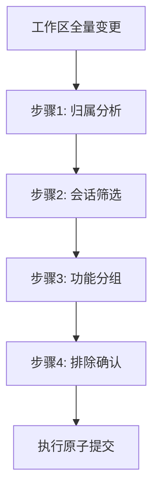

# 原子提交会话边界原则（Session-Boundary-Commit）

## 模式类型
方法论模式

## 成熟度
L1 已提炼（首次从实践中萃取，待独立验证）

## 适用场景
当工作区存在多个不相关会话/任务的变更混合在一起，需要执行原子提交时。

## 问题背景
原子提交的"单一职责原则"通常理解为**功能维度的单一**（一个提交只做一件事）。但在实际开发中，工作区经常堆积多个会话的变更（如A会话的forum-bot开发 + B会话的阶段守卫开发 + C会话的vendor配置），如果只按功能维度分组，可能将不属于当前会话的变更纳入提交，导致：
- **责任混乱**：替其他会话的变更负责，出问题时难以追溯
- **回滚困难**：一个提交混合多个会话的变更，无法选择性回滚
- **审查负担**：代码审查者需要理解不相关的上下文

## 标准实施步骤



### 步骤1：归属分析
列出所有变更文件，标注每个文件的来源会话：
```
file_a.py → 当前会话（forum-bot开发）
file_b.md → 其他会话（阶段守卫）
file_c.py → 当前会话（测试计划）
```

### 步骤2：会话筛选
只保留当前会话的文件，排除其他会话的文件：
- 排除的文件留给对应会话的原子提交处理
- 如果不确定某个文件的归属，宁可排除

### 步骤3：功能分组
对当前会话的文件按功能维度分组：
- 每组遵循"单一职责"原则
- 一组对应一个原子提交

### 步骤4：排除确认
提交前最终确认：暂存区中是否只有当前会话的文件？
- 使用 `git status` 检查暂存区
- 确认无"替别人提交"的文件

## 关键要点

1. **双重单一职责**：原子提交 = 功能单一 + 会话单一
2. **宁可排除**：不确定归属时，宁可排除也不纳入提交
3. **不替人提交**：其他会话的变更由对应会话负责
4. **归属先于功能**：先做会话筛选，再做功能分组

## 成功案例

| 场景 | 工作区文件数 | 当前会话文件数 | 排除文件数 | 原子提交数 |
|------|------------|--------------|-----------|-----------|
| forum-bot会话提交 | 50+ | 15 | 35+ | 5 |

排除的35+文件包括阶段守卫、vendor子模块等不相关变更，留给对应会话处理。

## 适用边界

- **适用于**：多会话并行开发、工作区变更堆积的场景
- **不适用于**：单会话开发（无归属歧义）；紧急修复（需快速提交）

> **关联模块**：
> - `atomic-commit.md` — 原子提交指令集（本模式的执行载体）
> - `stage-guardrails.md` — 阶段守卫（会话边界的形式化定义）
