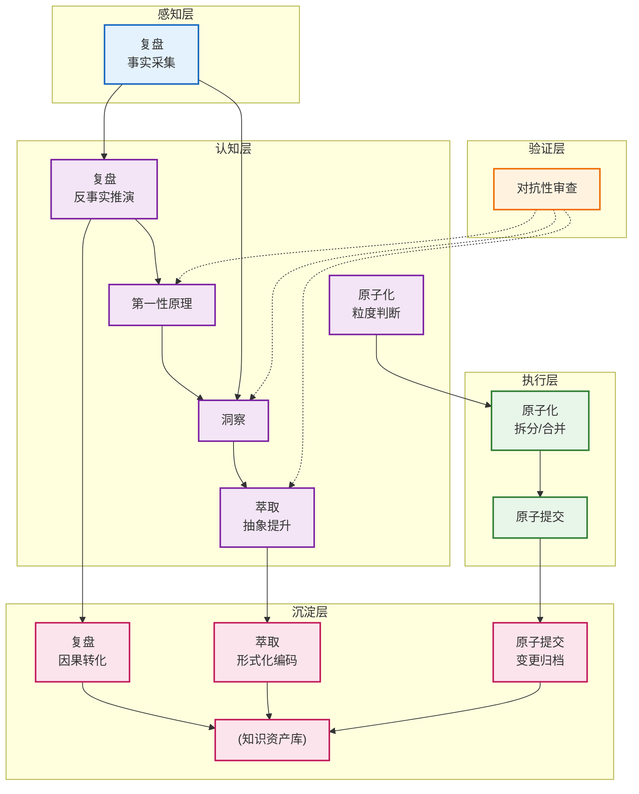

# 七概念本质定位与五层层级模型

> 基于第一性原理公理体系，建立七个核心方法论概念的本质要素分解、五层定位图谱与DAG依赖关系。

## 一、五层层级定位图谱

五层从信息流动到知识沉淀构成完整闭环：

| 层级 | 核心职能 | 认知特征 |
|------|---------|---------|
| **感知层** | 信息采集、现象观察、事实输入 | 客观数据接收，无判断 |
| **认知层** | 思维推理、本质洞察、方案生成 | 主观加工，逻辑推导 |
| **验证层** | 证伪防御、质量保障、偏差修正 | 多视角攻击，鲁棒性校验 |
| **执行层** | 操作落地、变更实施、粒度控制 | 精确行动，因果闭环 |
| **沉淀层** | 知识归档、模式复用、资产积累 | 形式化编码，可检索 |

## 二、七概念基础要素分解（公理→要素）

每个概念提炼≤4个不可再分、独立无重叠的基础要素：

### 1. 复盘（Retrospective）——4要素
**公理**：对已发生事件的结构化反事实推理，将时序经验转化为因果知识
- **事实采集**：客观可验证数据的系统性收集（无判断、无因果）
- **时序结构化**：离散事件按因果链组织为时间线
- **反事实推演**："如果X则Y"的假设路径推理
- **因果转化**：时序经验→因果知识的形态转换

**层级归属**：感知层（事实采集）→ 认知层（反事实推演）→ 沉淀层（因果转化）

### 2. 洞察（Insight）——4要素
**公理**：跨情境可迁移规律，最小形式为「触发条件→因果机制→可操作结论」三元组
- **条件识别**：规律适用的触发边界与情境标记
- **机制揭示**：现象背后的因果作用机理
- **结论生成**：可直接指导行动的具体规则
- **迁移验证**：跨情境适用性的可证伪检验

**层级归属**：认知层（核心）+ 验证层（迁移验证）

### 3. 萃取（Extraction）——4要素
**公理**：知识从隐性经验到显性模式的形式化转换，四层漏斗逐级精炼
- **显化转换**：隐性经验→显性知识的编码过程
- **抽象提升**：具体事件→通用模式的抽象层级跃迁
- **漏斗过滤**：事件→洞察→模式→原则四层渐进精炼
- **形式化编码**：结构化表示以支持复用与检索

**层级归属**：认知层（抽象提升）→ 沉淀层（形式化编码）

### 4. 原子提交（Atomic Commit）——4要素
**公理**：变更集的不可分割单一职责单元，满足同因同果、可独立回滚、review无认知跳跃
- **职责内聚**：变更集逻辑单一，不可再分
- **因果闭合**：同因同果的完整变更单元（无遗漏、无多余）
- **独立回滚**：不依赖其他变更可安全撤销
- **认知平滑**：review时无跨主题认知跳跃

**层级归属**：执行层（核心）→ 沉淀层（变更归档）

### 5. 原子化（Atomization）——4要素
**公理**：复杂系统向最优信息粒度的收敛过程，在认知负荷与导航成本间找到平衡点
- **粒度寻优**：认知负荷vs导航成本的U型曲线最低点搜索
- **单元独立**：各模块单一职责、独立可读、语义完整
- **链接完整**：单元间引用关系完整可追溯
- **双向收敛**：既支持拆分也支持合并的动态调整

**层级归属**：认知层（粒度判断）→ 执行层（拆分/合并操作）

### 6. 第一性原理（First Principles）——4要素
**公理**：从不可证伪公理出发，通过推导链自下而上重构方案的思维方式
- **假设剥离**：质疑所有未经验证的经验类比与隐含前提
- **要素拆解**：识别不可再分的基础组成单元
- **公理自洽**：提炼独立无矛盾的基础公理体系
- **重构推导**：从公理自下而上构建完整解决方案

**层级归属**：认知层（核心思维）+ 验证层（公理自洽检验）

### 7. 对抗性审查（Adversarial Review）——4要素
**公理**：主动寻找证伪证据的认知防御机制，系统性构造反例暴露确认偏误盲区
- **证伪导向**：主动构造反例而非证明正确
- **多角攻击**：多角色独立审查避免单一视角盲区
- **偏差防御**：系统性对抗确认偏误、权威崇拜等认知缺陷
- **审计可溯**：所有验证过程可复现、可追溯、可审计

**层级归属**：验证层（核心）

## 三、概念间DAG依赖关系（无环）

定义前置条件与后置输出，构成有向无环图：

| 源概念 | 目标概念 | 依赖关系 | 前置条件 | 后置输出 |
|--------|---------|---------|---------|---------|
| 第一性原理 | 洞察 | 思维框架输入 | 公理体系确立 | 结构化洞察模板 |
| 复盘 | 洞察 | 事实素材输入 | 事实采集完成 | 待分析的时序经验 |
| 复盘 | 第一性原理 | 问题触发 | 识别"知其然不知其所以然" | 本质分析需求 |
| 洞察 | 萃取 | 中间产物输入 | 三元组验证通过 | 待抽象的规律单元 |
| 对抗性审查 | 第一性原理 | 公理验证 | 假设清单列出 | 公理自洽性报告 |
| 对抗性审查 | 洞察 | 迁移性验证 | 初步洞察生成 | 证伪后的稳健洞察 |
| 对抗性审查 | 萃取 | 质量校验 | 模式初步形式化 | 偏差修正后的模式 |
| 原子化 | 原子提交 | 粒度优化前置 | 粒度寻优完成 | 最优粒度的变更单元 |
| 原子提交 | 沉淀层 | 变更归档 | 提交验证通过 | 可追溯的变更历史 |
| 萃取 | 沉淀层 | 模式入库 | 四层漏斗完成 | 可复用的L1/L2模式 |

**依赖关系验证**：无循环依赖（主链路拓扑排序顺序：第一性原理/复盘 → 洞察 → 萃取 → 原子化粒度判断 → 原子化执行 → 原子提交 → 沉淀；对抗性审查V作为横切验证层不属于固定层级，可作用于认知层/执行层所有节点的输出，在各步骤后置执行而非独立阶段）

## 四、七概念关系全景图

## 五、模型自洽性验证

1. **要素独立性**：每个概念的4个要素之间无重叠、无交叉（如"事实采集"≠"时序结构化"，前者是输入后者是组织）
2. **层级逻辑**：感知→认知→验证→执行→沉淀符合信息处理的自然流动顺序，无反向越级依赖
3. **无循环依赖**：DAG拓扑排序可行（第一层：复盘/第一性原理；第二层：洞察；第三层：萃取/原子化粒度判断；第四层：原子化执行/对抗性审查；第五层：原子提交；第六层：沉淀）
4. **与现有指令集不矛盾**：
   - 复盘四步骤（事实→分析→洞察→建议）对应感知→认知→沉淀
   - 原子提交六步骤（三查→验证→信息→提交→验证→推送）对应执行→沉淀
   - 对抗性审查作为横切验证层与"生成-验证闭环"描述一致
   - 第一性原理的假设剥离→要素→公理→重构与认知层定位吻合
