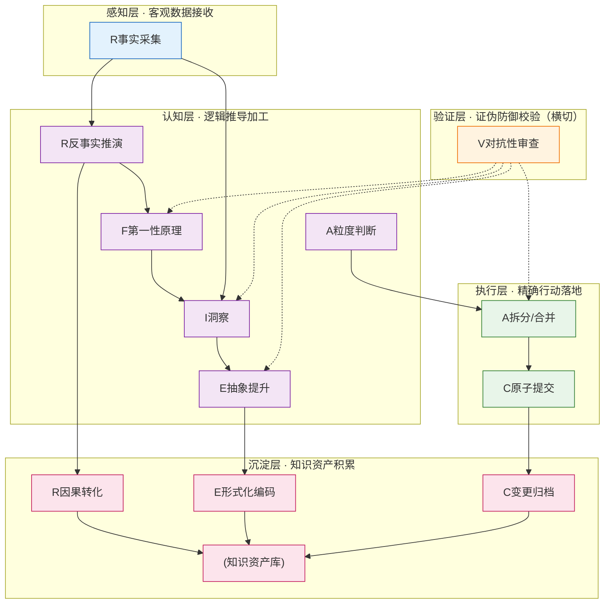

# 七概念方法论统一速查手册

> **R=复盘 | I=洞察 | E=萃取 | C=原子提交 | A=原子化 | F=第一性原理 | V=对抗性审查**
>
> 一套逻辑严密、自举验证通过的项目管理方法论体系，经SpecWeave项目18天1258次提交实战验证。
> 当前成熟度：**L2.8**（可重复级→已定义级过渡）

---

## 一、七概念公理速查卡

| 概念 | 一句话公理 | 4个基础要素 | 层级归属 |
|------|-----------|------------|---------|
| **复盘 R** | 对已发生事件的结构化反事实推理，将时序经验转化为因果知识 | 事实采集、时序结构化、反事实推演、因果转化 | 感知→认知→沉淀 |
| **洞察 I** | 跨情境可迁移规律，最小形式为「C→M→A→B」四元组 | 条件识别、机制揭示、结论生成、迁移验证 | 认知+验证 |
| **萃取 E** | 知识从隐性经验到显性模式的形式化转换，四层漏斗逐级精炼 | 显化转换、抽象提升、漏斗过滤、形式化编码 | 认知→沉淀 |
| **原子提交 C** | 变更集的不可分割单一职责单元，同因同果、可独立回滚、review无认知跳跃 | 职责内聚、因果闭合、独立回滚、认知平滑 | 执行→沉淀 |
| **原子化 A** | 复杂系统向最优信息粒度的收敛，平衡认知负荷与导航成本 | 粒度寻优、单元独立、链接完整、双向收敛 | 认知→执行 |
| **第一性原理 F** | 从不可证伪公理出发，自下而上重构方案的思维方式 | 假设剥离、要素拆解、公理自洽、重构推导 | 认知+验证 |
| **对抗性审查 V** | 主动寻找证伪证据的认知防御机制，构造反例暴露确认偏误 | 证伪导向、多角攻击、偏差防御、审计可溯 | 验证层（横切） |

**洞察四元组格式**：`[条件C]` → 因为`[机制M]` → 做`[行动A]` → 导致`[结果B]`（必须可证伪、附迁移场景）

---

## 二、五层层级模型与全景关系



**五层核心职能**：
- 感知层：信息采集、现象观察（无判断）
- 认知层：思维推理、本质洞察、方案生成
- 验证层：证伪防御、质量保障、偏差修正（V横切作用于认知/执行层后置）
- 执行层：操作落地、变更实施、粒度控制
- 沉淀层：知识归档、模式复用、资产积累

---

## 三、触发决策树（启动前先问5个问题）

```
任务启动
  │
  ├─ Q1: P0紧急止血? ──是──→ 先恢复服务，稳定后追加R+I
  │
  └─ 否 ──┬─ Q2: 成本trivial<10分钟? ──是──→ 仅C原子提交
          │                                    （中途发现超预估→重新走决策树）
          │
          └─ 否 ──┬─ Q3: 高影响重大决策?
                  │   │
                  │   ├─ 是 ──┬─ 遇未知问题需根因? ──是──→ F→V→R→I→E→C 全链路
                  │   │       │
                  │   │       └─ 否 ──┬─ 里程碑→ R→I→E→C 复盘闭环
                  │   │               ├─ 架构决策→ F→V→I→C 决策论证
                  │   │               ├─ 代码审查→ V→C 对抗审查
                  │   │               ├─ 重构整理→ A→V→C 原子化验证
                  │   │               └─ 知识入库→ E→V 萃取入库
                  │   │
                  │   └─ 否 ──┬─ 需要知识沉淀?
                  │           │   ├─ 是 ──┬─ 重复≥2次→ C+R/I/E/A 双概念
                  │           │   │       └─ 首次→ C或A 单一概念
                  │           │   └─ 否 ──┬─ 有粒度问题? ──是──→ A+C
                  │           │                       └─ 否──→ 仅C
```

### 16种场景→概念组合速查表

| 场景 | 组合 | 场景 | 组合 |
|------|------|------|------|
| 里程碑/迭代完成 | R→I→E→C | 代码审查/PR | V→C |
| P1+故障/线上问题 | F→V→R→I→E→C | 版本发布 | C→V→(R) |
| 新功能开发 | C→V→(R) | P2/P3 Bug修复 | V→C→(R) |
| 代码/文档重构 | A→V→C | 新人上手/Onboarding | R→E |
| 文档整理/原子化 | A→V→C | 工具链/CI优化 | V→C→(I) |
| 知识沉淀/模式入库 | R→I→E→V | 规范制定/更新 | F→V→E→C |
| 架构决策/技术选型 | F→V→I→C | 跨项目迁移 | A→V→C |
| P0应急止血 | 仅恢复→事后R+I | PoC/原型验证 | C松散→验证后重构 |

### ⛔ 5种"不应使用"场景

| 场景 | 原因 | 正确做法 |
|------|------|---------|
| 拼写错误/格式调整（<5行） | 方法论成本>收益 | 直接C，1分钟完成 |
| P0止血第一阶段 | 方法论延迟MTTR | 先恢复，后R+I |
| PoC/原型早期 | 强约束抑制创造力 | 松散迭代，验证后重构 |
| 个人临时草稿 | 非正式内容无需治理 | 草稿区自由记录 |
| 纯依赖升级/版本号变更 | 机械变更无洞察价值 | 仅C |

**6条判断原则**：10分钟法则（含预估错误升级）、重复触发（≥2次必沉淀）、影响半径（直接>3或间接>5模块必V）、未知边界（"知其然不知其所以然"必F）、恢复优先、中途升级（允许判断错误时升级）

---

## 四、5种核心组合流程（共15个质量门）

| 流程 | 链路 | 步骤 | 触发条件 | 核心输出 | 3个质量门 |
|------|------|------|---------|---------|----------|
| **1.里程碑复盘** | R→I→E→C | 6 | Sprint结束/版本交付 | 复盘报告+洞察+模式入库 | G1事实无因果词<br/>G2洞察四元组完整可证伪<br/>G3模式通过V审查入库 |
| **2.问题解决** | F→V→R→I→E→C | 6 | P1+故障/根因不明 | 根因报告+修复+预防pattern | G1根因可复现修复100%<br/>G2含预防措施<br/>G3同类pattern入库 |
| **3.重构优化** | A→V→C→(R) | 5 | 技术债/文件>500行 | 重构产物+无断链 | G1功能等价无回归<br/>G2链接100%完整<br/>G3单文件≤500行 |
| **4.知识沉淀** | R→I→E→V→入库 | 5 | 同类经验≥2次 | L1/L2模式+反模式 | G1≥2个独立案例<br/>G2配套≥1个反模式<br/>G3maturity标注完整 |
| **5.创新突破** | F→V→I→C | 5 | 新架构/未知领域 | PoC+ADR+假设清单 | G1所有假设显式列出<br/>G2≥3个失败场景防御<br/>G3PoC数据支撑关键假设 |

---

## 五、关键接口与冲突仲裁

### 前置/后置条件（7条核心调用路径）

| 路径 | 前置Pre | 后置Post | 回退机制 |
|------|---------|----------|---------|
| R→I | 事实无因果词，可验证事件≥3（小任务≥2） | 洞察四元组完整，可证伪，附迁移场景 | 事实混判断→回退R重采集 |
| I→E | 洞察≥1条（里程碑≥3），V验证通过 | 抽象层级正确，配套≥1反模式 | V击破洞察→回退I修边界 |
| A→C | U型粒度评分≥70，链接100%完整 | 单文件≤500行，可独立revert | 断链→回退A修链接 |
| F→I | 公理自洽，假设已列出 | 洞察从公理可推导，无跳跃 | V发现公理矛盾→回退F |
| V→任意 | 待验证对象完整 | 验证记录可追溯，反例≥1-2个 | 验证失败→标记rejected回退 |
| E→知识库 | level≥1，validation_count≥2 | frontmatter完整 | 成熟度不足→标draft不入库 |
| 任意→C | 前置质量门全通过 | 提交信息符合Conventional Commits | CI失败→revert修复重试 |

### 原子化粒度评分公式
`score = 100 - |cognitive_load - navigation_cost|×10 - max(0, cognitive_load+navigation_cost-10)×5`
- 合格≥70分；理想：两者均4-6且差值≤2

### ⚖️ 5条冲突仲裁规则

| # | 冲突场景 | 仲裁规则 |
|---|---------|---------|
| CR1 | F推导 vs R经验矛盾 | 边界优先：样本<3用F补验证；样本≥3用R重审F边界 |
| CR2 | V审查 vs F公理冲突 | **V优先级更高**：找到反例则公理边界必须收缩 |
| CR3 | A粒度 vs C原子性 | 可回滚性优先：按"希望回退到哪一步"定提交边界 |
| CR4 | 多I洞察互相矛盾 | 证伪优先：被反例击破者淘汰；都未击破则标注context-dependent |
| CR5 | 紧急止血 vs 完整流程 | 恢复优先：先止血，稳定后2小时内补完整闭环 |

---

## 六、质量必查清单（Top 10 + 8种反模式）

### ✅ 每次执行必查10项

| # | 检查项 | 判定标准 |
|---|--------|---------|
| 1 | R事实无判断 | "因为/所以/导致"出现次数=0 |
| 2 | R事实可验证 | 事件≥3（小任务≥2），含timestamp+actor+action |
| 3 | I洞察四元组完整 | 每条含「C→M→A→B」，可证伪，附迁移场景 |
| 4 | E模式有案例有反模式 | L2+模式≥2案例+≥1反模式 |
| 5 | C提交职责单一 | 无跨模块无关变更混同提交 |
| 6 | C提交可独立回滚 | revert不破坏其他功能 |
| 7 | A后链接完整 | 无断链，无file:///绝对路径 |
| 8 | F假设显式 | 隐含假设已列出标记hidden=true |
| 9 | V证伪导向 | 构造反例为主（高影响≥2个，简单场景≥1个） |
| 10 | frontmatter完整 | id/title/source/x-toml-ref四字段齐全 |

### ⚠️ 8种反模式（来自项目实战教训）

| ID | 反模式 | 表现 | 防御 |
|----|--------|------|------|
| AP1 | 超大批量提交 | >100文件/跨模块混提交（如vendor 1693文件混提） | 按单一职责拆分，粒度=revert意愿 |
| AP2 | 事实阶段下结论 | 复盘S1直接因果判断，忽略矛盾证据 | S1禁因果词，只列可验证事实 |
| AP3 | 原子化过细 | 每洞察每小模块独立文件，深层嵌套 | U型曲线寻优，平衡认知vs导航 |
| AP4 | 缺乏对抗验证 | 交付前无证伪检查，大量孤立节点 | V横切检查所有认知层输出 |
| AP5 | 隐含假设未验证 | 假设"标准库正确""API符合预期" | F显式列所有假设，V逐个证伪 |
| AP6 | 经验未萃取 | 复盘只有"学了什么"无"如何复用" | 走四层漏斗：事件→洞察→模式→原则 |
| AP7 | 冗余违反DRY | 洞察/模式重复嵌入正文 | 独立归档，复盘只保留链接引用 |
| AP8 | 洞察金句化 | 只有感悟无四元组结构、无证伪条件 | 必须形式化为「C→M→A→B」+迁移场景 |

---

## 七、成熟度自测（L1-L4）

| 级别 | 特征 | 你的团队在第几级？ |
|------|------|------------------|
| **L1 初始级** | 凭经验随机使用，要素不全，无质量检查，AP1-AP8反复出现 | 刚开始接触方法论 |
| **L2 可重复级** | 有决策树能选对组合，单概念要素齐全，C/A/R常规化，原子提交率>80% | 按手册执行，基础质量有保障 |
| **L3 已定义级** | 5种流程常规化，7×7矩阵无违规，质量门CI强制执行，V检查所有L2+入库，AP4-AP6可防御 | 多概念协同，质量可预测 |
| **L4 优化级** | 元复盘常态化，V嵌入每步默认执行，方法论自举验证自身，CI自动检测反模式，模式复用率>60% | 持续自我改进，方法论本身也在进化 |

**当前体系自评分：L2.8**（核心逻辑自洽可执行，经15个问题10项修复加固，建议试运行1个月后二次元复盘冲击L3）

---

## 八、四层知识漏斗

```
L0事件 → L1洞察 → L2模式 → L3原则
  │        │         │        │
  ▼        ▼         ▼        ▼
原始事实  四元组    通用规则  跨领域公理
无判断    可证伪   ≥2案例   FP推导
         可迁移    +反模式
```

| 层级 | 必需元数据 |
|------|-----------|
| L0事件 | `{timestamp, source, verifiable:true}` |
| L1洞察 | `{insight_id, source_retro, falsifiable:true, confidence}` |
| L2模式 | `{pattern_id, source_insights[≥2], anti_pattern_id, maturity, validation_count}` |
| L3原则 | `{principle_id, source_patterns[≥3], domain, first_principles_derived:true}` |

---

## 九、详细文档索引

如需深入阅读，按顺序查阅以下原子化模式文件：

| 顺序 | 文件 | 内容深度 |
|------|------|---------|
| 1 | [seven-concepts-retrospective-report.md](seven-concepts-retrospective-report.md) | 项目复盘报告：1258次提交统计、6大阶段、14个实际案例、公理提炼过程 |
| 2 | [seven-concepts-positioning-model.md](seven-concepts-positioning-model.md) | 五层层级模型详细定义、DAG依赖关系、Mermaid全景图、模型自洽性验证 |
| 3 | [seven-concepts-trigger-decision-tree.md](seven-concepts-trigger-decision-tree.md) | 决策树完整Mermaid图、16场景映射表、6条判断原则详解、使用边界 |
| 4 | [seven-concepts-core-workflows.md](seven-concepts-core-workflows.md) | 5种流程RACI角色分工、每步输入输出、15个质量门判定标准、流程全景图 |
| 5 | [seven-concepts-interaction-spec.md](seven-concepts-interaction-spec.md) | 7组JSON数据契约、7×7交互矩阵、四层漏斗格式、知识入库YAML标准 |
| 6 | [seven-concepts-quality-standards.md](seven-concepts-quality-standards.md) | 完整33项检查清单、8反模式详解、L1-L4成熟度每级4-6个特征 |
| 7 | [seven-concepts-adversarial-review.md](seven-concepts-adversarial-review.md) | 自举对抗审查全过程：4视角攻击、15个问题发现、10项修复记录、遗留风险 |
| 入口 | [seven-concepts-methodology-index.md](seven-concepts-methodology-index.md) | 索引入门页（含快速入门指南） |

---

> **自举验证结论**：本方法论体系经对抗性审查（4视角攻击发现15个问题并修复10个致命/重要缺陷），无阻断性矛盾残留，达到内部可用水平。建议试运行1个月后基于真实使用数据进行第二次元复盘，持续优化演进。
