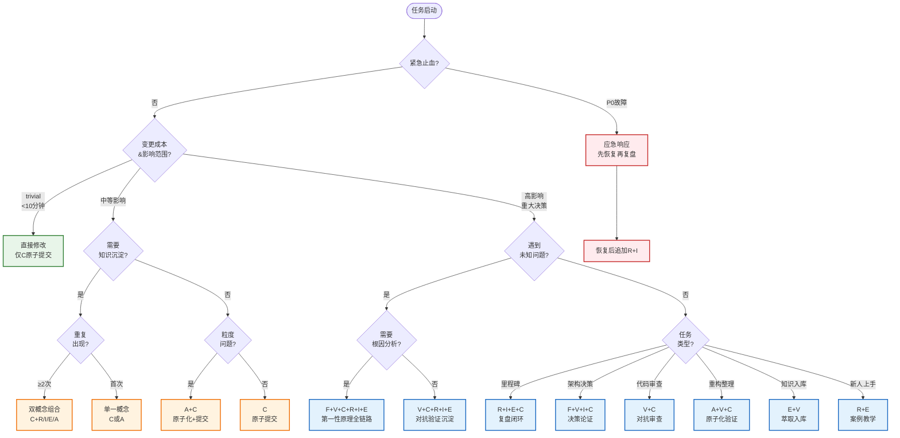

# 七概念组合触发决策树

> 概念缩写：R=复盘 | I=洞察 | E=萃取 | C=原子提交 | A=原子化 | F=第一性原理 | V=对抗性审查

## 一、触发决策树

## 二、场景→概念组合映射表（16种）

| # | 场景类型 | 触发特征 | 概念组合 | 执行顺序 |
|---|---------|---------|---------|---------|
| 1 | 里程碑/迭代完成 | 周期节点、Sprint结束、版本交付 | R→I→E→C | 事实采集→反事实推演→洞察萃取→模式归档→原子提交 |
| 2 | 故障/线上问题(P1+) | 告警触发、用户投诉、服务异常 | F→V→C→R→I→E | 第一性原理剥离假设→对抗验证根因→修复验证→复盘→洞察→萃取预防入库 |
| 3 | 新功能开发 | 需求明确、从0到1实现 | C→V→(R) | 原子提交开发→对抗性审查→(上线后复盘) |
| 4 | 代码/文档重构 | 结构优化、无功能变更、技术债偿还 | A→V→C | 粒度寻优→原子化拆分→对抗验证一致性→原子提交 |
| 5 | 文档整理/原子化 | 文件过大、导航困难、结构混乱 | A→V→C | U型曲线评估→拆分/合并→链接完整性验证→收尾提交 |
| 6 | 知识沉淀/模式入库 | 可复用经验、重复出现≥2次 | R→I→E→V | 复盘→洞察三元组→四层漏斗萃取→对抗验证迁移性→入库 |
| 7 | 架构决策/技术选型 | 影响范围广、长期约束、多方案 | F→V→I→C | 第一性原理推导→对抗性论证→决策记录洞察→原子提交 |
| 8 | 代码审查/PR Review | PR提交、合并请求、质量门禁 | V→C | 对抗性审查找证伪→问题修复→原子提交合并 |
| 9 | 版本发布 | 发布窗口、CHANGELOG、打标签 | C→V→(R) | 原子提交发布物→验证完整性→(发布后复盘) |
| 10 | Bug修复(P2/P3) | 功能异常、非紧急、有复现路径 | V→C→(R) | 对抗验证修复方案→原子提交→(同类问题复盘) |
| 11 | 新人上手/Onboarding | 新成员加入、知识传递、环境搭建 | R→E | 案例复盘→萃取核心模式→学习文档 |
| 12 | 工具链优化 | 效率提升、脚本改进、CI更新 | V→C→(I) | 对抗验证新旧差异→原子提交→(效率数据洞察) |
| 13 | 规范制定/更新 | 治理规则、流程变化、标准更新 | F→V→E→C | 第一性原理推导规则→对抗审查漏洞→萃取模式→原子提交 |
| 14 | 跨项目迁移 | 子模块移动、目录重构、资产转移 | A→V→C | 原子化规划→依赖检查→断链修复验证→原子提交 |
| 15 | 应急响应/P0止血 | 线上宕机、数据损坏、安全事件 | 仅恢复→事后R+I | 先止血恢复（不用方法论）→事后复盘根因→洞察 |
| 16 | PoC/原型验证 | 探索性实验、方案可行性验证 | C（松散） | 快速迭代提交（不强制原子性）→验证后再用方法论重构 |

## 三、使用边界定义

| 组合类型 | 适用场景边界 | 不适用场景 |
|---------|-------------|-----------|
| **单一概念** | 简单任务、明确操作、<10分钟可完成、无知识沉淀价值 | 跨模块变更、需要回滚的复杂操作、高影响决策 |
| **双概念组合** | 日常开发、单一职责变更、粒度优化、单次审查 | 系统性问题、架构决策、里程碑节点、未知领域问题 |
| **多概念协同** | 里程碑、故障根因、架构决策、知识沉淀、规范制定 | Trivial修改、紧急止血第一阶段、PoC探索期 |

## 四、"不应使用"场景（5种）

| # | 场景 | 原因 | 替代方案 |
|---|------|------|---------|
| 1 | 简单拼写错误/格式调整 | 变更<5行，成本>收益，方法论开销反而降低效率 | 直接C原子提交，1分钟完成 |
| 2 | 应急响应/线上止血第一阶段 | 先恢复服务是第一优先级，方法论延迟MTTR | 先恢复，服务稳定后再追加R+I复盘 |
| 3 | PoC/原型验证早期 | 探索期方向不确定，强方法论约束抑制创造力 | 快速松散迭代，验证通过后再用规范重构 |
| 4 | 个人临时笔记/草稿 | 未进入正式流程的非正式内容，无需治理 | 草稿区自由记录，成熟后再走正式流程 |
| 5 | 纯依赖升级/版本号变更 | 机械性变更，无逻辑变化，无洞察价值 | 仅C原子提交，无需其他概念 |

## 五、成本收益判断原则

1. **10分钟法则**：预计<10分钟完成的trivial任务，只用C；**预估错误升级机制**：执行中发现实际复杂度超过预估（如简单修复牵出深层问题），立即停止，按实际影响范围重新走决策树
2. **重复触发原则**：同一问题出现≥2次，必须追加I+E沉淀
3. **影响半径原则**：直接修改>3个模块或间接影响（被依赖数）>5个模块，必须用V对抗审查；"模块"定义为独立功能目录或独立部署单元
4. **未知边界原则**：遇到"知其然不知其所以然"的问题，必须启动F第一性原理
5. **恢复优先原则**：P0故障先止血，方法论在恢复后追加而非同步执行；故障持续反复时，复盘时间窗顺延至故障彻底解决后2小时内
6. **中途升级原则**：按决策树选择概念组合后，执行中发现判断错误（如以为trivial实为高影响），允许中途升级到更重的组合，已完成步骤若质量达标可保留，无需全部回退
