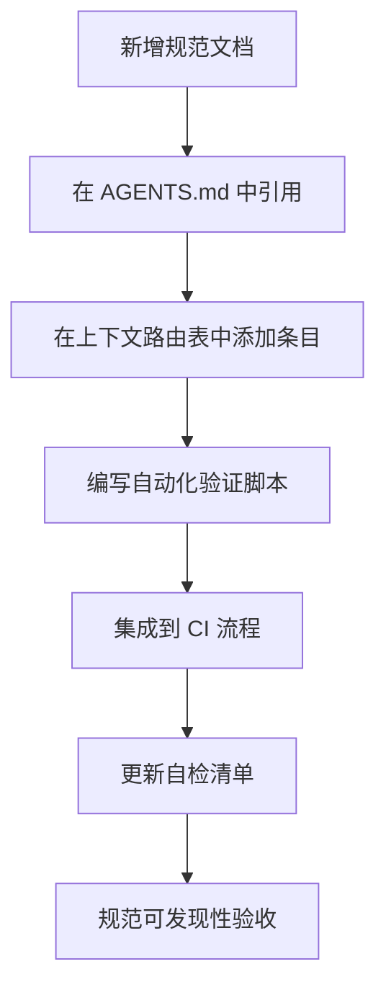

> **来源**：从 `docs/retrospective/reports/competitive-analysis/retrospective-tuyaopen-learning-report-optimization-20260630/export-suggestions.md` 模式候选 2 拆分

# 规范可发现性保障模式（Spec Discoverability Guarantee）

## 模式类型
方法论模式 → 治理策略

## 成熟度
L1 实验性（从本次任务中提炼，尚未独立验证）

## 适用场景
- 新增规范文档时的自检
- 规范文档完整性审计
- 智能体流程设计

## 问题背景

规范文档存在"存在但不可发现"的问题：
- 规范已制定但未在全局规则中引用，智能体无法感知
- 规范未在上下文路由表中列出，执行任务时无法定位
- 规范缺乏自动化验证脚本，无法强制执行

## 核心原则

确保每一项重要规范都在三个位置有映射——形成完整的可发现性保障闭环：

1. **AGENTS.md 全局规则引用**：在项目最高优先级入口中提及
2. **上下文路由表条目**：在路由表中列出，便于智能体查找
3. **自动化脚本执行**：有对应的检查脚本确保规范被执行

## 三层映射表

| 规范 | AGENTS.md 引用 | 路由表条目 | 自动化脚本 |
|------|---------------|-----------|-----------|
| 文件命名规范 | 文件创建纪律规则 | 文件命名规范条目 | check-filename-convention.py |
| Spec 目录规范 | Spec 目录规范规则 | Spec 全局看板条目 | check-spec-consistency.py |
| 代码风格规范 | 代码修改规则 | CI 综合检查条目 | ci-check.py |

## 自检清单

| 检查项 | 标准 | 达标状态 |
|--------|------|---------|
| 规范是否在 AGENTS.md 中被引用 | 全局核心规则或路由表中提及 | ✅/❌ |
| 规范是否在上下文路由表中列出 | 有对应的路由条目 | ✅/❌ |
| 规范是否有自动化验证脚本 | 有可执行的检查脚本 | ✅/❌ |
| 验证脚本是否集成到 CI | 在 PR 流程中自动执行 | ✅/❌ |

## 执行流程

## 可发现性验收标准

| 层级 | 验收要求 | 验证方式 |
|------|---------|---------|
| 入口层 | AGENTS.md 中有规范引用 | 搜索 AGENTS.md |
| 路由层 | 上下文路由表中有对应条目 | 检查路由表 |
| 执行层 | 有自动化脚本验证规范 | 运行脚本 |
| 强制层 | CI 流程中集成检查 | 查看 CI 配置 |

## 价值

- **可发现性保障**：确保规范不会"存在但不可发现"
- **完整性自检**：为规范文档的完整性提供自检框架
- **智能体友好**：三层映射模型便于智能体感知和执行规范
- **执行闭环**：从规范定义到自动化执行形成完整闭环

## 关联资源

- [智能体全局契约](../../../../../AGENTS.md)
- [Spec 一致性检查脚本](../../../../../.agents/scripts/check-spec-consistency.py)
- [CI 综合检查脚本](../../../../../.agents/scripts/ci-check.ps1)
- [文件创建前置检查模式](./file-creation-precheck-pattern.md)