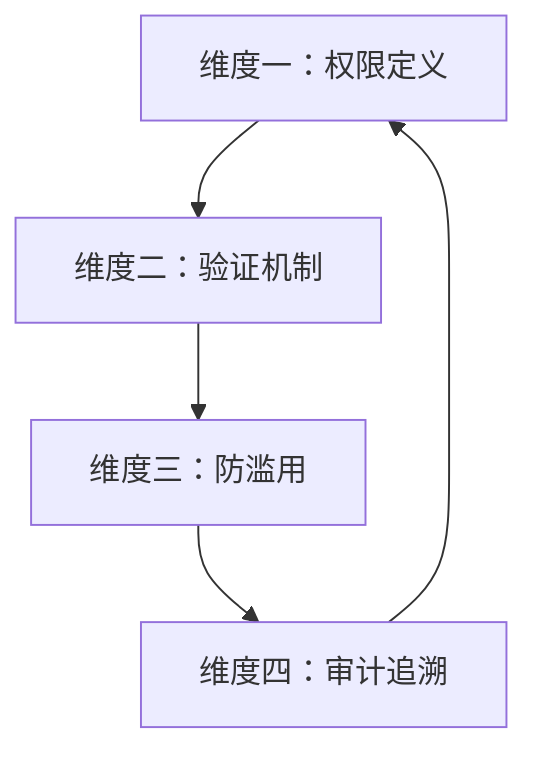
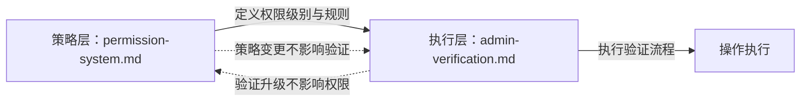

# 规范层纵深防御模型：安全设计前置

## 核心原则
纵深防御（Defense-in-Depth）不仅适用于代码实现，同样适用于规范设计。在规范层就定义多层防护，使后续实现天然具备安全基线。安全不是实现阶段的事后补丁，而是设计阶段的一等公民。

## 成熟度评估
| 维度 | 评估 | 依据 |
|---|---|---|
| 实践验证 | 高 | 团队管理模块完整实现四维防护 |
| 可复用性 | 高 | 适用于任何涉及特权操作的模块 |
| 通用性 | 高 | 安全原则跨领域通用 |

## 四维防护模型

| 维度 | 职责 | 设计内容 | 对应文件 |
|---|---|---|---|
| 权限定义 | 定义"有什么权限" | 权限分级 L1/L2/L3、权限清单、互斥规则 | permission-system.md |
| 验证机制 | 定义"如何验证权限" | 验证分级 V1/V2/V3、操作令牌、双重确认 | admin-verification.md |
| 防滥用 | 定义"如何防止滥用" | 触发条件、最小权限原则、权限转授禁止 | role-auto-creation.md |
| 审计追溯 | 定义"如何追溯操作" | 操作日志、失败处理、告警分级 | admin-verification.md |

## 权限-验证映射

权限级别与验证级别一一映射，敏感度越高校验越严格。

| 权限级别 | 验证级别 | 校验内容 | 典型操作 |
|---|---|---|---|
| L1 公开 | V1 基础验证 | 角色标识合法性 | 查看团队信息 |
| L2 内部 | V2 身份验证 | 管理员身份 + 权限校验 | 分配角色、修改配置 |
| L3 特权 | V3 双重验证 | 管理员身份 + 操作令牌 + 二次确认 | 创建角色、解散团队 |

## 策略-执行分离原则

权限定义（策略层）与验证逻辑（执行层）须分离设计，使两者可独立演化。

**分离的收益**：
- 策略变更（如新增权限级别）不影响验证逻辑
- 验证逻辑升级（如引入新令牌机制）不影响权限定义
- 两者可独立演化，降低维护耦合度

## 互斥规则设计

部分权限存在互斥关系，禁止同一角色同时拥有，防止权限滥用。

| 权限 A | 权限 B | 互斥原因 |
|---|---|---|
| assign_role | remove_member | 防止自行加入并分配角色 |
| create_role | revoke_permission | 防止创建角色后回收他人权限 |
| modify_config | dissolve_team | 防止修改配置后立即解散 |

**设计原则**：互斥规则须覆盖"发起-执行-回收"全链路，确保任何单点权限无法完成完整的滥用路径。

## 适用条件

- 模块涉及特权操作（如创建、删除、权限分配）
- 操作影响范围大（如团队解散、角色创建）
- 安全合规要求高
- 需要操作可追溯

## 实施检查清单

- [ ] 维度一：权限已按敏感度分级（至少 3 级）
- [ ] 维度一：权限互斥规则已定义并覆盖关键路径
- [ ] 维度二：验证级别与权限级别一一映射
- [ ] 维度二：特权操作须双重验证 + 操作令牌
- [ ] 维度三：特权操作须满足触发条件，禁止凭空执行
- [ ] 维度三：最小权限原则已落实
- [ ] 维度四：所有 L2/L3 操作须记录审计日志
- [ ] 维度四：失败处理与告警分级已定义

## 实践案例

| 案例 | 权限级别 | 验证级别 | 互斥规则 | 审计日志 |
|---|---|---|---|---|
| 团队管理模块 | L1/L2/L3 | V1/V2/V3 | 3 组 | V2/V3 全记录 |

> 来源：来自 retrospective-report-teams-module.md 洞察 2、方法论 2
> 关联模块：`.agents/teams/permission-system.md`、`.agents/teams/admin-verification.md`、`.agents/teams/role-auto-creation.md`
