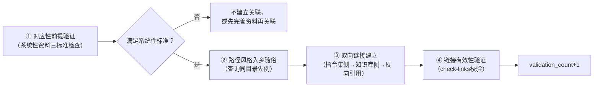

# Spec引用验证/关联对应性前提（Specification Reference Validation Pattern）

## 模式类型
治理策略模式（规范层/知识关联治理）

## 成熟度
L2 已验证（2次验证：first-principles指令集↔知识库关联、mermaid指令集↔知识库关联）

## 问题场景

在指令集/规范文档与知识库资料档案之间建立双向关联时，常见的失败模式：

1. **对零散资料建立关联**：将单篇文章、零散笔记作为"关联资源"引用，导致"关联资源"部分噪声化，使用者无法判断哪些是系统性参考
2. **物理多文件谬误**：错误认为"多个文件=系统性资料"，忽略单文件结构化操作手册也可能是高质量系统性参考
3. **路径风格不一致**：在.agents/目录下用docs/前缀路径、在docs/目录下用相对路径，导致链接失效或风格混乱
4. **无先例盲目创新**：建立关联时不查询已有案例，发明新的引用风格而非遵循项目约定
5. **关联前无验证**：先建立链接再验证资料存在性/质量，导致断链或引用低质量内容

这些失败模式的共同后果是：双向关联看似建立，实则无法为执行者提供有效的知识支撑，反而增加导航负担和信任损耗。

## 核心定义

```
关联对应性前提（Reference Correspondence Premise）= 建立指令集↔知识库双向关联前，必须验证目标知识库存在"系统性资料档案"——判断标准为逻辑系统性而非物理多文件
```

核心判断三标准：
- **覆盖完整操作流程**：包含完整的步骤序列（如6步执行法、9章节操作手册）
- **包含结构化检查清单/验证点**：有可执行的检查项而非仅理论描述
- **经过端到端项目验证**：validation_count≥1，有实际项目应用记录

## 与相关模式的区别

| 模式 | 核心关注点 | 与关联对应性前提的区别 |
|------|-----------|---------------------|
| spec-discoverability-guarantee | 确保Spec文档可被发现（索引、路径约定） | 可发现性关注**能不能找到**，对应性前提关注**找到的是不是系统性资料** |
| cross-wiki-reference-directory-first | 跨Wiki引用时目录优先原则 | 目录优先关注**路径选择策略**，对应性前提关注**引用目标的质量判定** |
| wiki-pre-creation-three-checks | 创建Wiki前的三项预检 | 创建预检关注**新文档创建前的验证**，对应性前提关注**已有知识关联时的验证** |
| reference-as-trigger | 引用作为触发器触发相应动作 | 引用触发关注**引用的行为副作用**，对应性前提关注**引用目标的质量门槛** |

## 解决方案

### 核心机制：关联建立四步验证法



### 步骤详解

**Step 1：对应性前提验证（系统性资料三标准检查）**
- **标准1：覆盖完整操作流程**
  - 检查目标资料是否包含完整的步骤/章节序列（如6步执行法、9章节操作手册）
  - 零散笔记、单篇概念文章不满足此标准
- **标准2：包含结构化检查清单/验证点**
  - 检查是否有可执行的检查项、验收标准、验证点
  - 纯理论描述、概念解释不满足此标准
- **标准3：经过端到端项目验证**
  - 检查是否有实际项目应用记录（validation_count≥1）
  - 未经验证的草稿、初稿不满足此标准
- **关键认知修正**：逻辑系统性 > 物理多文件。单文件若满足以上三标准（如best-practices/mermaid-guide.md单文件9章节操作手册），也应视为系统性资料档案

**Step 2：路径风格入乡随俗**
- 在`.agents/commands/`目录下的文档：使用相对路径（如`../../docs/knowledge/...`）
- 在`docs/`目录下的文档：使用`.agents/`前缀路径引用规范（如`.agents/commands/first-principles.md`）
- **禁止**在同一目录层级混用两种风格
- 不同子目录（如`.trae/specs/`）的路径风格需单独确认先例

**Step 3：先例查询验证**
- 建立新关联前，先用Grep查询同目录下已有链接的风格：
  ```powershell
  Select-String -Path "同目录文件.md" -Pattern "\.agents/|\.\./.*docs/" | Select-Object -First 5
  ```
- 遵循已有先例风格，**禁止发明新的引用模式**
- 如果同目录无先例，查询相邻相似目录的约定

**Step 4：双向链接建立与验证**
- **指令集侧**：在"关联资源"章节添加知识库文件链接
- **知识库侧**：在README"交叉引用"章节添加指令集反向链接
- 建立后立即运行`check-links.py`验证所有链接有效性
- 记录本次关联到commit历史，便于追溯

### 系统性资料判断矩阵

| 资料类型 | 完整流程？ | 检查清单？ | 项目验证？ | 是否系统性？ |
|---------|-----------|-----------|-----------|-------------|
| first-principles知识档案（11文件） | ✅ 6步执行法 | ✅ 28项检查清单 | ✅ validation_count≥1 | ✅ 是 |
| mermaid-guide.md（单文件） | ✅ 9章节操作手册 | ✅ 规范检查清单 | ✅ 多次项目应用 | ✅ 是 |
| 单篇概念解释文章 | ❌ | ❌ | ❓ | ❌ 否 |
| 零散笔记集合（多文件但无结构） | ❌ | ❌ | ❓ | ❌ 否 |
| 未完成草稿 | ❓ | ❌ | ❌ | ❌ 否 |

## 本案例验证

### 验证案例1：first-principles指令集↔知识库关联

| 维度 | 内容 |
|------|------|
| **关联方向** | .agents/commands/first-principles.md ↔ docs/knowledge/learning/first-principles/README.md |
| **目标资料** | first-principles知识档案（11个核心文件、87来源、4869行内容） |
| **系统性验证** | ✅ 完整6步执行流程（08-methodology-framework.md）、✅ 28项检查清单、✅ 端到端项目验证 |
| **路径风格** | 指令集侧用`../../docs/knowledge/...`相对路径（遵循.agents/目录约定） |
| **验证结果** | 6个关键知识库链接全部有效，双向关联建立成功 |
| **Commit** | `65ce05b7` |

### 验证案例2：mermaid指令集↔知识库关联

| 维度 | 内容 |
|------|------|
| **关联方向** | .agents/commands/mermaid.md ↔ docs/knowledge/best-practices/mermaid-guide.md |
| **目标资料** | mermaid-guide.md（单文件9章节操作手册） |
| **初始判断偏差** | 初版认为"单文件=非系统性资料"，准备不建立关联 |
| **修正后判断** | ✅ 9章节覆盖完整编码→检查→修复→验证流程、✅ 安全编码六规则等检查清单、✅ 多次项目验证（validation_count≥5）→满足系统性标准 |
| **路径风格** | 遵循.agents/目录相对路径约定，查询first-principles.md先例 |
| **验证结果** | 单文件操作手册的系统性被确认，关联成功建立 |
| **关键发现** | 修正了"物理多文件=系统性"的初始判断谬误 |
| **Commit** | `083bba50` |

## 核心洞察

> **建立知识关联时，最重要的不是"有没有链接"，而是"链接指向的是不是使用者真正需要的系统性参考"。** 对零散资料建立关联会污染"关联资源"的信噪比，让使用者在大量低价值链接中迷失，最终降低对整个知识体系的信任。

三个关键认知：
1. **逻辑系统性 > 物理多文件**：单文件结构化操作手册 > 多文件零散笔记
2. **路径风格是一种无言的约定**：入乡随俗比"统一风格"更重要，遵循先例比发明新模式更安全
3. **关联是一种质量承诺**：你放入"关联资源"的每个链接，都在向使用者承诺"这是经过验证的系统性参考"

## 反模式

| 反模式 | 表现 | 后果 |
|--------|------|------|
| **数量优先关联** | "关联资源"章节尽可能多地放链接，不管质量 | 信噪比极低，使用者无法辨别哪些是核心参考 |
| **物理多文件谬误** | 看到目录下有多个文件就认为是系统性资料，不检查内容结构 | 引用零散笔记集合，关联无实际价值 |
| **路径风格创新** | 不查询先例，自己发明一种"更合理"的路径风格 | 同目录链接风格不一致，增加维护成本，易导致断链 |
| **单向链接** | 只在指令集侧放知识库链接，不做反向引用 | 知识无法双向导航，闭环断裂 |
| **先建链后验证** | 先批量建立链接，再检查是否有效 | 断链堆积，使用者遇到404后对系统失去信任 |

## 实施检查清单

- [ ] 建立关联前是否验证了目标资料满足"系统性三标准"（完整流程/检查清单/项目验证）？
- [ ] 是否避免了"物理多文件=系统性"的判断谬误？
- [ ] 是否查询了同目录已有链接的路径风格先例？
- [ ] 路径风格是否遵循"入乡随俗"原则（.agents/用相对路径，docs/用.agents/前缀）？
- [ ] 是否建立了双向链接（指令集侧→知识库侧+反向引用）？
- [ ] 建立后是否运行check-links验证所有链接有效性？
- [ ] 关联后是否更新了相关索引/README文件？

## 可迁移启示

1. **Spec阶段引用已有知识资产时**：不要直接引用，先验证目标资产是否为系统性资料
2. **建立任何双向导航关系时**：对应性前提验证是质量门槛，而非可选优化
3. **路径/风格约定问题**：先例查询成本极低，风格不统一的维护成本极高
4. **单文件vs多文件判断**：始终以逻辑结构判断系统性，而非物理文件数量

## 关联模式

- [spec-discoverability-guarantee.md](spec-discoverability-guarantee.md)：确保Spec可发现是关联的前提，对应性前提确保发现的内容有价值
- [spec-level-defense-in-depth.md](spec-level-defense-in-depth.md)：深度防御包含多层验证，关联验证是Spec引用层的防御措施
- [cross-wiki-reference-directory-first.md](cross-wiki-reference-directory-first.md)：跨目录引用的路径策略，与"入乡随俗"原则互补
- [wiki-pre-creation-three-checks.md](wiki-pre-creation-three-checks.md)：创建新文档前的预检，关联前的验证是引用场景的预检
- [reference-as-trigger.md](reference-as-trigger.md)：引用可以触发动作，有效引用的前提是引用目标满足质量门槛
- [methodology-constructive-validation.md](methodology-constructive-validation.md)：构造性验证是方法论层面的验证，对应性前提是关联场景的具体验证方法
