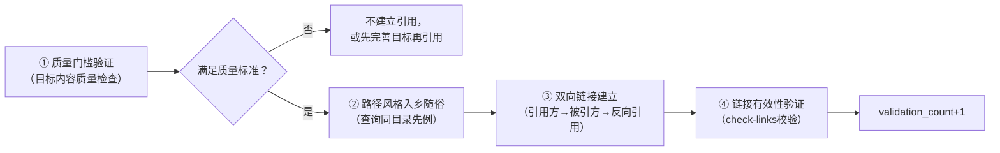

# Spec引用验证通用原则（Specification Reference Validation Pattern）

## 模式类型
治理策略模式（规范层/引用质量治理）

## 成熟度
L2 已验证（3次验证：first-principles指令集↔知识库关联、mermaid指令集↔知识库关联、analysis-report.md交付物位置修正；经第一性原理公理化分析v2.0重构，新增交付物位置规则）

## 问题场景

在任意文档（Spec、指令集、规范、Wiki）之间建立交叉引用时，常见的失败模式：

1. **对低质量目标建立引用**：将草稿、零散笔记、单篇概念文章作为"关联资源"引用，导致引用区域噪声化，使用者无法判断哪些是系统性参考
2. **物理形式谬误**：错误根据物理形式（文件数量、路径深度）判断内容质量，忽略内容本身的逻辑结构
3. **路径风格不一致**：在同一目录层级混用不同路径风格（相对路径/绝对前缀），导致链接失效或风格混乱
4. **无先例盲目创新**：建立引用时不查询同目录已有案例，发明新的引用风格而非遵循项目约定
5. **引用前无验证**：先建立链接再验证资料存在性/质量，导致断链或引用低质量内容
6. **单向链接无闭环**：只在引用方放目标链接，不做反向引用，导航闭环断裂

这些失败模式的共同后果是：交叉引用看似建立，实则无法为执行者提供有效的知识支撑，反而增加导航负担和信任损耗。

## 核心定义

```
引用验证原则（Reference Validation Principle）= 建立任何跨文档引用前，必须验证目标满足基本质量门槛——判断标准为逻辑系统性而非物理形式；引用路径必须遵循目录约定；有效引用必须形成双向闭环。
```

## 与相关模式的区别

| 模式 | 核心关注点 | 与本模式的区别 |
|------|-----------|----------------|
| spec-discoverability-guarantee | 确保Spec文档可被发现（索引、路径约定） | 可发现性关注**能不能找到**，引用验证关注**找到的是不是高质量内容** |
| cross-wiki-reference-directory-first | 跨Wiki引用时目录优先原则 | 目录优先关注**路径选择策略**，引用验证关注**引用目标的质量判定**和**双向闭环** |
| wiki-pre-creation-three-checks | 创建Wiki前的三项预检 | 创建预检关注**新文档创建前**的验证，引用验证关注**已有文档间引用**时的验证 |
| reference-as-trigger | 引用作为触发器触发相应动作 | 引用触发关注**引用的行为副作用**，引用验证关注**引用目标的质量门槛**和**路径一致性** |
| command-knowledge-link | 指令集↔知识库关联的专门规则 | command-knowledge-link是本模式在指令集(.agents/commands/)↔知识库(docs/knowledge/)特定场景的特化，包含公理化判定体系和13条演绎规则 |
| spec-workflow/spec-reference-validation-pattern | Spec阶段引用路径存在性验证 | Spec工作流版本关注**引用路径是否存在**（Glob验证），本模式关注**引用目标的质量**（系统性/路径风格/双向闭环），二者互补 |

## 解决方案

### 核心机制：引用建立四步验证法



### 步骤详解

**Step 1：质量门槛验证**
- 引用目标必须为有价值的参考，而非噪声
- 质量判定标准根据引用场景不同而有所特化（参见command-knowledge-link对指令集↔知识库场景的公理化判定）
- 通用最低门槛：
  - 目标内容非草稿/非空/非占位符
  - 目标内容与引用点逻辑相关
  - 目标内容经过基本验证（非未经测试的初稿）
- **关键认知修正**：逻辑质量 > 物理形式。不要因为"只有一个文件"就否定单文件高质量参考，也不要因为"有很多文件"就认可零散笔记集合

**Step 2：路径风格入乡随俗**
- 查询同目录下已有引用的路径风格，遵循先例
- **禁止**在同一目录层级混用多种路径风格
- 如果同目录无先例，查询相邻相似目录的约定
- 通用路径约定参考：
  - `.agents/`目录内：使用相对路径（如`../../docs/knowledge/...`）
  - `docs/`目录内：使用`.agents/`前缀路径引用规范（如`.agents/commands/xxx.md`）
  - 其他子目录（如`.trae/specs/`）：需单独确认先例

**Step 2.5：交付物位置验证**（Spec任务收尾时必做）
- **核心原则**：区分「规划空间」与「交付空间」
  - `.trae/specs/` = **规划空间**（蓝图）：仅存放spec.md（需求）、tasks.md（任务分解）、checklist.md（验收清单）
  - `docs/retrospective/reports/` = **交付空间**（成果）：存放任务完成后的实际交付物（README.md复盘、analysis-report.md分析报告、insight-extraction.md洞察萃取、export-suggestions.md导出建议）
- **验证项**：
  - [ ] 任务完成后，所有非规划类文档（分析报告、完整复盘、洞察萃取等）是否已从`.trae/specs/`迁移至`docs/retrospective/reports/`对应子目录？
  - [ ] `.trae/specs/<spec-name>/`下是否仅保留spec.md/tasks.md/checklist.md（以及README.md主题看板）？
  - [ ] 文件移动后是否Grep搜索所有引用并更新路径？
  - [ ] 是否运行check-links验证所有链接可达？
- **禁止项**：
  - ❌ 禁止将交付物（分析报告、复盘文档等）长期存放在`.trae/specs/`目录
  - ❌ 禁止在`.trae/specs/`中存放docs/目录应有的正式文档
  - ❌ 禁止移动文件后不更新引用路径直接提交

**Step 3：双向链接建立**
- 引用方添加目标的链接
- 被引方在适当位置添加反向引用（交叉引用/相关资源/关联模式章节）
- 形成可导航的闭环

**Step 4：链接有效性验证**
- 建立后立即运行`check-links.py`验证所有链接有效性
- 记录本次关联到commit历史，便于追溯

### 通用反模式

| 反模式 | 表现 | 后果 |
|--------|------|------|
| **数量优先引用** | "参考资料/关联资源"章节尽可能多地放链接，不管质量 | 信噪比极低，使用者无法辨别哪些是核心参考 |
| **物理形式谬误** | 根据文件数量/路径深度等表面特征判断内容质量 | 引用低质量内容或遗漏高质量单文件参考 |
| **路径风格创新** | 不查询先例，自己发明一种"更合理"的路径风格 | 同目录链接风格不一致，增加维护成本，易导致断链 |
| **单向链接** | 只在引用方放目标链接，不做反向引用 | 知识无法双向导航，闭环断裂 |
| **先建链后验证** | 先批量建立链接，再检查是否有效 | 断链堆积，使用者遇到404后对系统失去信任 |
| **规划/交付空间混淆** | 将分析报告、复盘文档等交付物长期存放在`.trae/specs/`规划目录中 | 目录职责边界模糊，交付物难以被发现和归档，spec目录膨胀 |

### 通用检查清单

- [ ] 建立引用前是否验证了目标内容满足基本质量门槛？
- [ ] 是否避免了物理形式谬误（仅根据文件数量/形式判断质量）？
- [ ] 是否查询了同目录已有链接的路径风格先例？
- [ ] 路径风格是否遵循"入乡随俗"原则？
- [ ] **Spec任务收尾时**：交付物是否已从`.trae/specs/`（规划空间）迁移至`docs/retrospective/reports/`（交付空间）？
- [ ] **Spec任务收尾时**：`.trae/specs/`下是否仅保留规划文档（spec.md/tasks.md/checklist.md）？
- [ ] **文件移动后**：是否Grep搜索所有引用并更新路径？
- [ ] 是否建立了双向链接（引用方→被引方+反向引用）？
- [ ] 建立后是否运行check-links验证所有链接有效性？
- [ ] 对于特定场景（如指令集↔知识库），是否遵循了该场景的专门化规则？

## 可迁移启示

1. **任何双向导航关系建立时**：质量门槛验证是底线，而非可选优化
2. **路径/风格约定问题**：先例查询成本极低，风格不统一的维护成本极高
3. **单文件vs多文件判断**：始终以逻辑结构判断系统性，而非物理文件数量
4. **引用是一种质量承诺**：放入"关联资源"的每个链接，都在向使用者承诺"这是经过验证的参考"

## 场景特化

本模式是通用引用验证原则。针对特定场景的特化版本提供更精确的判定规则：

| 场景 | 特化模式 | 特化内容 |
|------|---------|---------|
| 指令集(.agents/commands/)↔知识库(docs/knowledge/) | [command-knowledge-link.md](command-knowledge-link.md) | 5条公理+13条演绎规则+系统性三问法+5类型判定矩阵 |
| Spec阶段引用路径存在性验证 | [spec-workflow/spec-reference-validation-pattern.md](../spec-workflow/spec-reference-validation-pattern.md) | Glob验证路径存在性、引用修正流程 |
| 跨Wiki引用 | [cross-wiki-reference-directory-first.md](cross-wiki-reference-directory-first.md) | 目录优先原则、章节编号验证 |

## 关联模式

- [spec-discoverability-guarantee.md](spec-discoverability-guarantee.md)：确保Spec可发现是引用的前提，引用验证确保发现的内容有价值
- [spec-level-defense-in-depth.md](spec-level-defense-in-depth.md)：深度防御包含多层验证，引用验证是Spec引用层的防御措施
- [spec-triple-sync.md](spec-triple-sync.md)：规范三同步原则确保规范落地，引用验证是规范落地的质量保障
- [cross-wiki-reference-directory-first.md](cross-wiki-reference-directory-first.md)：跨目录引用的路径策略，与"入乡随俗"原则互补
- [wiki-pre-creation-three-checks.md](wiki-pre-creation-three-checks.md)：创建新文档前的预检，引用前的验证是引用场景的预检
- [reference-as-trigger.md](reference-as-trigger.md)：引用可以触发动作，有效引用的前提是引用目标满足质量门槛
- [command-knowledge-link.md](command-knowledge-link.md)：本模式在指令集↔知识库场景的公理化特化版本

## 模式溯源

- **来源复盘**：[retrospective-first-principles-comprehensive-research-20260709](../../../reports/insight-extraction/external-learning/retrospective-first-principles-comprehensive-research-20260709/README.md)
- **来源洞察**：[insight-extraction.md 模式7](../../../reports/insight-extraction/external-learning/retrospective-first-principles-comprehensive-research-20260709/insight-extraction.md)
- **公理化重构**：[analysis-report.md](../../../reports/task-reports/retrospective-first-principles-pattern-split-20260709/analysis-report.md)（第一性原理六步分析，5公理+13规则）
- **提取日期**：2026-07-09
- **v2.0重构日期**：2026-07-09（拆分为通用原则+场景特化两层架构）
