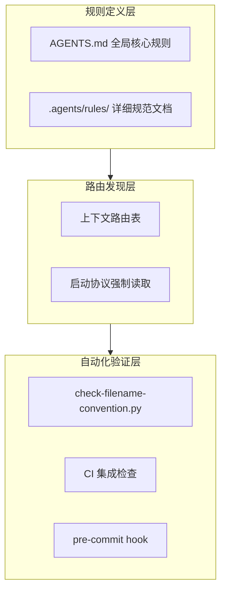

> **来源**：从 TuyaOpen 学习报告优化任务规律1拆分

# 规范约束三层次模型（Three-Layer Spec Constraint Model）

## 模式类型
方法论模式 → 治理策略

## 成熟度
L2 已验证（基于 TuyaOpen 学习报告优化任务实践验证）

## 适用场景
- 创建新文档前的规范检查
- 规范文档完整性审计
- 智能体流程设计
- CI/CD 流程中的规范验证

## 问题背景

规范文档存在但未被智能体在执行任务时自动加载，等于不存在。需要将规范检查嵌入到智能体的启动协议和任务路由中，而非依赖智能体的自觉行为。

## 核心模型

规范约束需要三个层次的保障——规则定义层、路由发现层、自动化验证层。

### 第一层：规则定义层
- **目标**：明确规范内容，确保有标准可依
- **方法**：在 AGENTS.md 全局核心规则中定义强制性规则，在 `.agents/rules/` 中存放详细规范文档
- **关键**：规则必须清晰、无歧义，包含可执行的检查标准

### 第二层：路由发现层
- **目标**：确保规范可被发现，智能体在执行任务时能自动加载
- **方法**：在上下文路由表中列出规范条目，通过启动协议强制读取
- **关键**：路由表必须覆盖所有常用任务场景，规范位置必须易于查找

### 第三层：自动化验证层
- **目标**：强制验证合规性，从技术层面保障规范执行
- **方法**：开发自动化检查脚本，集成到 CI 流程和 pre-commit hook
- **关键**：验证脚本必须可执行、可复用，违规能被及时发现和阻断

## 层次职责表

| 层次 | 职责 | 示例 |
|------|------|------|
| 规则定义层 | 定义规范内容 | AGENTS.md 新增「文件创建纪律」规则 |
| 路由发现层 | 确保规范可被发现 | 上下文路由表新增命名规范条目 |
| 自动化验证层 | 强制验证合规性 | check-filename-convention.py 验证 |

## 反模式警示

- ❌ 只有定义层没有路由层：规则写了但智能体找不到
- ❌ 只有路由层没有验证层：规范可发现但无法强制遵守
- ❌ 三层不同步：规则更新了但路由表和验证脚本没更新

## 实施检查清单

- [ ] 规则定义层：AGENTS.md 中是否定义了强制性规则？
- [ ] 规则定义层：`.agents/rules/` 中是否有详细规范文档？
- [ ] 路由发现层：上下文路由表中是否列出了规范条目？
- [ ] 路由发现层：启动协议是否强制读取规范？
- [ ] 自动化验证层：是否有可执行的检查脚本？
- [ ] 自动化验证层：验证脚本是否集成到 CI 流程？

## 价值

- **规范保障**：三层保障确保规范不会"存在但不可发现"
- **流程一致性**：提供标准化的规范约束方法论
- **可审计性**：三层结构清晰，便于追溯和验证
- **成本控制**：前置检查避免后续返工成本

## 关联资源

- [文件命名规范](../../../../../.agents/rules/file-naming-convention.md)
- [文件名检查脚本](../../../../../.agents/scripts/check-filename-convention.py)
- [智能体全局契约](../../../../../AGENTS.md)
- [规则落地三层模型](three-layer-rule-enforcement.md)