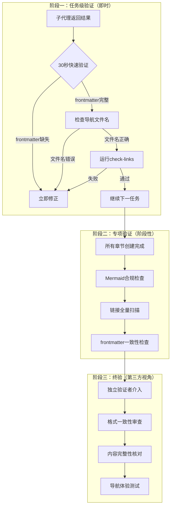

# 三段式内容验证模式：任务级→专项→终验

## 模式概述

在多文件文档项目（如技术Wiki教程）中，单一的终验往往发现问题时已积累大量返工。通过"任务级验证 + 专项验证 + 终验"三段递进式验证，将缺陷发现时机前移：任务级验证在每个子任务完成时立即捕获低级错误（路径/frontmatter/导航），专项验证在阶段性完成时系统性扫描特定质量维度（Mermaid合规/链接有效性），终验则以独立第三方视角发现作者自检盲区（格式一致性/内容遗漏）。三段验证的检测维度互补，形成"即时捕获→系统扫描→独立审查"的完整质量闭环。

## 问题现象

仅依赖终验的常见后果：

1. **错误积累**：多个子任务的错误积累到终验时才被发现，返工范围大、上下文已丢失
2. **自检盲区**：作者验证自己的产出时，天然倾向跳过自己认为"应该没问题"的部分
3. **维度遗漏**：任务级验证关注结构正确性，但容易忽略格式一致性和内容完整性
4. **修复成本非线性增长**：早期发现1个导航错误只需改1行，终验时发现可能需要排查整个目录的交叉引用

## 三段验证流程

### 阶段一：任务级验证（即时，30秒/任务）

每个子代理任务返回后立即执行，在上下文新鲜时捕获低级错误：

| 检查项 | 工具/方法 | 通过标准 |
|--------|----------|---------|
| frontmatter完整性 | 读取文件头部 | 所有必需字段存在且非空 |
| 导航文件名准确性 | 与tasks.md规划对比 | 前后章/总览/对比章文件名完全匹配 |
| 文件行数 | check-file-size.py | 在约束范围内（如<300行） |
| 链接有效性 | check-links.py（单文件） | 无断链 |

**关键原则**：不积累错误。发现问题时立即修正，不等到所有任务完成后再批量修复——因为后续任务的导航可能依赖当前任务的文件名，错误会链式传播。

### 阶段二：专项验证（阶段性，覆盖特定质量维度）

所有章节创建完成后，针对特定质量维度进行系统性扫描：

| 专项检查 | 工具 | 关注点 |
|---------|------|--------|
| Mermaid合规性 | check-mermaid.py | 空行/引号/换行符/安全违规（click/HTML/script） |
| 链接全量扫描 | check-links.py（全目录） | 跨章节引用的相对路径正确性 |
| frontmatter一致性 | 人工/脚本 | 所有章节的category/tags/status字段格式统一 |
| 导航格式统一 | 人工审查 | 返回总览链接格式、表格结构一致性 |

**关键原则**：工具优先。能用自动化脚本检测的不用人工检查，人工精力集中在格式一致性和内容质量上。

### 阶段三：终验（第三方视角，发现自检盲区）

以独立验证者身份（非作者）进行最终全面检查：

| 检查维度 | 方法 | 典型发现 |
|---------|------|---------|
| 格式一致性 | 逐章浏览对比 | 导航表格格式不统一、返回总览链接格式差异 |
| 内容完整性 | 对照spec.md需求 | 遗漏的章节内容、未覆盖的需求项 |
| 用户体验 | 模拟读者路径 | 从总览入口能否顺畅导航到每个章节 |
| 交叉引用 | 验证章节间引用 | 章节A引用章节B的内容是否准确 |

**关键原则**：独立视角。终验者不应是章节作者本人，因为作者存在"自己写的肯定没问题"的认知偏差。终验的目标不是重复任务级验证，而是发现作者自检无法发现的问题。

## 角色分工

| 角色 | 阶段一 | 阶段二 | 阶段三 |
|------|--------|--------|--------|
| 主代理（作者） | 执行并自检 | 执行专项检查 | 提供产出物 |
| 独立验证者 | — | — | 独立审查 |
| 自动化工具 | check-links（单文件） | check-mermaid + check-links（全量） | — |

## 实际案例

### Agent通信协议Wiki教程项目

该项目包含12个章节文件、30+个Mermaid图表，采用三段式验证：

**阶段一（任务级）**：每个子代理创建章节后立即检查frontmatter和导航文件名，发现1处导航文件名偏差（05-practice vs 05-comparison），10秒修正。

**阶段二（专项）**：运行check-mermaid.py发现38处 `\n` 换行问题、4处引号嵌套错误、8处边标签引号缺失，通过 `--fix` 和手动修复全部解决。运行check-links.py确认无断链。

**阶段三（终验）**：独立验证子代理以第三方视角审查，发现速查表章节的返回总览链接格式与其他章节不一致（未使用表格形式）。此问题是作者自检时跳过的——因为作者"知道"格式应该统一，但实际写的时候遗漏了。

**效果**：三段验证将缺陷发现时机分散到三个时间点，终验时仅剩格式一致性问题（低修复成本），而非积累大量结构性错误（高修复成本）。

## 与其他模式的关系

| 关系模式 | 关系类型 | 说明 |
|---------|---------|------|
| [subagent-atomic-task-template.md](../ai-collaboration/subagent-atomic-task-template.md) | 前置 | 六要素模板确保子代理产出质量，降低阶段一验证的失败率 |
| [three-tier-governance.md](three-tier-governance.md) | 相关 | 三层治理模型关注文档架构治理，本模式关注内容质量验证 |
| [root-cause-diagnosis.md](root-cause-diagnosis.md) | 相关 | 阶段二专项验证发现的问题可使用根因诊断模式分析 |

## 边界与选型

**何时使用本模式**：
- 多文件文档项目（3个以上子任务）
- 使用子代理并行创建文档
- 项目有明确的质量维度（Mermaid/链接/frontmatter）
- 作者自检存在盲区风险

**何时简化**：
- 单文件创建 → 仅做任务级验证即可
- 无Mermaid图表 → 跳过Mermaid专项检查
- 纯代码项目 → 用单元测试替代内容验证

**何时不适用**：
- 探索性任务（无明确质量标准） → 不需要三段验证
- 时间极度紧迫 → 至少保证阶段一，跳过阶段三
