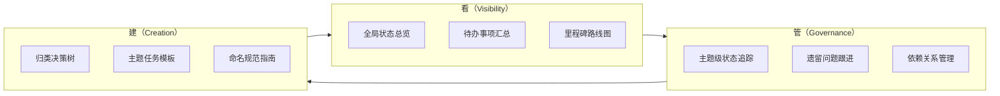

# 三层看板体系：看-管-建全生命周期覆盖

## 模式概述

为文档/任务管理体系构建三层结构化看板：全局看板（看状态）→ 主题看板（管进度）→ 创建模板（建新内容）。三层覆盖"看全局状态、管主题进度、建新内容"三个核心动作，通过模板收尾任务形成自维护闭环，确保看板随内容增长持续同步。

## 三层结构详解

| 层级 | 位置 | 回答的问题 | 服务场景 | 核心内容 |
|------|------|----------|---------|---------|
| 第一层：全局看板 | 根目录 README | "整体进度如何？下一步做什么？" | 项目管理、优先级决策 | 状态总览表、待办汇总、里程碑路线图、跨主题依赖图、归类决策树 |
| 第二层：主题看板 | 各主题目录 README | "这个主题内有哪些内容？状态如何？" | 主题级进度追踪、遗留跟进 | 主题状态表、主题路线图、遗留问题跟进、边界判定、新增指南 |
| 第三层：创建模板 | 模板目录 | "如何新建一个内容单元？" | 新内容创建、任务编写 | Task 0 前置验证、Task 1-N 核心实施、Task N+1 验证收尾、依赖说明 |

## 看-管-建三动作模型



**核心原则**：任何文档/任务管理体系的完整设计都应覆盖这三个动作。缺少"看"则不透明，缺少"管"则失控，缺少"建"则无法持续扩展。

## 自维护闭环机制

第三层模板的最后一个任务统一要求"在对应主题 README.md 中登记完成状态"，形成闭环：

```
使用模板创建新内容 → 执行任务 → 最后一步更新主题看板 → 全局看板统计同步
```

**关键设计**：将"额外维护动作"转化为"工作流内置步骤"。如果维护是额外动作（如"记得更新看板"），很容易被遗忘；如果维护是工作流的最后一步（如 Task N+1），则自然完成。

## 归类决策树设计

全局看板中包含归类决策树，将分类判断流程显式化：

```
新内容 → 条件A？ → 是 → 主题A
              → 否 → 条件B？ → 是 → 主题B
                      → 否 → ... → 均不匹配 → 重新评估或创建新主题
```

**设计原则**：
- 按优先级排列判断条件（高频主题在前）
- 每个条件用"是/否"二选一，避免模糊判断
- 均不匹配时提供兜底策略（重新评估或创建新主题）
- 用 Mermaid flowchart 可视化，比文字描述更直观

## 复用条件

| 条件 | 说明 |
|------|------|
| 内容单元数量 ≥ 10 | 少量内容无需三层结构，单层索引足够 |
| 存在明确的主题分类 | 需要至少 2 个主题才有分层管理价值 |
| 需要支持持续新增 | 一次性项目无需创建模板层 |
| 状态会随时间变化 | 静态内容无需看板追踪 |

## 质量检查清单

- [ ] 第一层包含：状态总览表、待办汇总、路线图、依赖图、决策树
- [ ] 第二层每个主题包含：状态表、路线图、遗留跟进、边界判定、新增指南
- [ ] 第三层每个模板包含：Task 0 前置验证、核心实施任务、验证收尾任务、依赖说明
- [ ] 第三层模板收尾任务包含"更新主题看板"子任务
- [ ] 全局看板链接到所有主题看板
- [ ] 主题看板链接到对应创建模板
- [ ] 归类决策树覆盖所有主题
- [ ] 状态标注统一（如 ✅完成 / 🔧进行中 / 📋待启动）

## 适用场景

- 规格文档体系（spec/任务/检查清单）的状态管理
- 多主题知识库的进度追踪与创建指导
- 项目任务管理（按主题/模块/团队分类）
- 任何需要"状态追踪 + 创建指导"的双需求场景

## 不适用场景

- 内容单元 < 10 个（单层索引足够）
- 无明确分类的扁平内容（无主题可分层）
- 一次性项目（无持续新增需求）
- 纯代码项目管理（已有 Git/Issue 系统覆盖）

> 来源：SpecWeave specs 目录 7 主题 29 spec 的任务看板体系构建实践
> 关联模式：`review-insight-export-loop`（复盘闭环驱动看板更新）、`meta-document-leverage`（元文档战略价值）、`three-tier-governance`（三层治理模型的同构应用）
