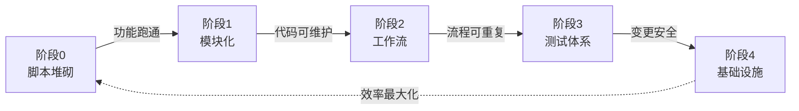

# 工具链项目五阶段演进路径

## 模式概述

工具链项目从"能用"到"好用"存在典型的五阶段演进路径，遵循**自底向上**的演进顺序：先让功能跑通，再模块化，再编排化，再测试覆盖，最后优化基础设施。过早优化（阶段0就做基础设施优化）是浪费，过晚优化则严重拖累效率。

## 五阶段模型

```
阶段0: 脚本堆砌 → 阶段1: 模块化重构 → 阶段2: 工作流标准化 → 阶段3: 测试体系 → 阶段4: 基础设施优化
```

| 阶段 | 标志 | 核心产出 | 关键判断 |
|------|------|---------|---------|
| 阶段0 | 分散的shell/python脚本直接调用工具命令 | 能跑的脚本 | 功能是否跑通？ |
| 阶段1 | 提取utils/模块，清理.gitignore | 模块化代码 | 代码是否可维护？ |
| 阶段2 | 工作流编排+CLI+错误重试 | 标准化流程 | 流程是否可重复？ |
| 阶段3 | 测试覆盖率从0%提升到70%+ | 测试体系 | 变更是否安全？ |
| 阶段4 | 层缓存优化、数据模型提取 | 基础设施 | 效率是否最大化？ |

## 问题现象

工具链项目常见的阶段错位问题：

| 错位类型 | 表现 | 后果 |
|---------|------|------|
| 过早优化 | 阶段0就做Dockerfile缓存优化 | 功能还没跑通就浪费时间优化 |
| 过晚优化 | 阶段3已成熟但Dockerfile仍每次全量重建 | 每次开发迭代浪费大量时间 |
| 跳跃式发展 | 从阶段0直接跳到阶段4 | 基础不稳，返工成本高 |
| 停滞不前 | 长期停留在阶段1-2 | 代码质量和技术债持续恶化 |

## 解决方案

### 阶段跃迁判断标准



### 各阶段核心任务

**阶段0→1 跃迁信号**：脚本超过3个，开始有重复代码
- 提取公共工具到 utils/ 模块
- 创建 .gitignore

**阶段1→2 跃迁信号**：手动执行步骤超过5步，容易出错
- 引入工作流编排（如 Metaflow）
- CLI 框架（如 Typer）
- 错误重试机制

**阶段2→3 跃迁信号**：每次修改都担心破坏现有功能
- 建立单元测试体系
- 集成测试覆盖关键路径
- 覆盖率目标 70%+（非100%）

**阶段3→4 跃迁信号**：测试完善但开发迭代速度慢
- 基础设施优化（Dockerfile缓存、CI流水线）
- 数据模型提取（models.py）
- 开发者体验优化

## 适用场景

- **新工具链项目**：判断当前所处阶段，规划下一步
- **现有项目评估**：诊断是否阶段错位
- **技术债优先级排序**：根据阶段确定优化顺序
- **团队资源分配**：按阶段决定投入重点

## 实际案例

### 案例1：llvm-dev 工具链演进（首次验证）

| 阶段 | 对应提交 | 标志 |
|------|---------|------|
| 阶段0 | `f2f596e` Initial commit | 分散脚本直接调用docker命令 |
| 阶段1 | `09e8890`、`6b29afb` | 提取utils/模块，清理.gitignore |
| 阶段2 | `bda449b` | Metaflow 8步工作流+Typer CLI+错误重试 |
| 阶段3 | `0db2f4c` | 测试覆盖率从0%提升到77% |
| 阶段4 | `0db2f4c` | Dockerfile层缓存优化、数据模型提取（models.py） |

规律验证：阶段3和阶段4在同一提交完成，说明测试体系建立后立即进入基础设施优化是合理的。

## 反模式

### 反模式1：过早优化
```
阶段0: 刚写完第一个脚本 → 立即优化Dockerfile缓存 → 功能还没跑通
```
结果：优化投入的精力无法回收，因为功能变更导致Dockerfile频繁重写。

### 反模式2：跳过测试阶段
```
阶段2: 工作流标准化 → 直接跳到阶段4: 基础设施优化 → 没有测试保护
```
结果：基础设施优化时引入回归bug，无法及时发现。

### 反模式3：停滞不前
```
阶段1: 模块化 → 长期停留 → 手动执行步骤越来越多
```
结果：技术债持续累积，最终需要大规模重构。

## 与其他模式的关系

- **以 methodology-five-level-maturity 为评估工具**：五级成熟度模型可用于评估各阶段完成度
- **与 toolchain-maturity 互补**：工具链五阶段成熟度关注工具本身，本模式关注项目演进
- **与 bottleneck-first-refactoring 配合**：瓶颈优先法确定当前阶段的优先改进点

## 边界与选型

本模式适用于**工具链/基础设施类项目**的演进规划。判断信号：
- ✅ 项目包含多个脚本/工具的编排
- ✅ 有明确的功能迭代和基础设施优化需求
- ✅ 团队需要判断"下一步该做什么"
- ❌ 纯业务应用（演进路径不同，更关注MVP→增长→优化）
- ❌ 一次性脚本（无需阶段性演进）
