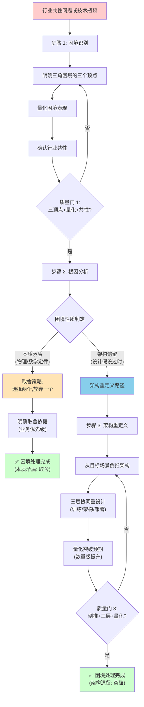

> **来源**：MaineCoon 实时音视频基础模型文章分析任务复盘（2026-07-06）——catnip.ai 的 22B 实时音视频模型通过架构级重新设计，突破"成本/速度/时长"三角困境（成本降至 Seedance 2.0 的 1/500、47.5 FPS、30 分钟+稳定生成）
> **验证次数**：1 次（MaineCoon 案例分析萃取，待在自有项目架构决策中验证后升级 L2）

# 三角困境→架构级解决框架（Trilemma Architectural Resolution）

## 模式类型

方法论模式（治理策略/架构决策/困境突破）

## 成熟度

L1 实验性（1 次成功案例分析萃取，待在自有项目架构决策中验证 1 次后升级 L2）

## 适用场景

| 场景 | 是否适用 | 说明 |
|------|---------|------|
| 产品技术突破决策 | ✅ 核心场景 | 当现有技术路线无法突破瓶颈时，评估是否需要架构级重新设计 |
| 架构重构决策 | ✅ 核心场景 | 判断当前架构瓶颈是本质矛盾还是架构遗留，决定重构方向 |
| 困境突破策略制定 | ✅ 核心场景 | 面对三角困境时，区分"不可突破的本质矛盾"和"可突破的架构遗留" |
| 竞品分析中的技术突破识别 | ✅ 核心场景 | 评估竞品的数量级提升是工程优化还是架构突破 |
| 单点性能优化 | ❌ 不适用 | 单点优化无需架构级思考，直接优化即可 |
| 已确定是本质矛盾的困境 | ❌ 不适用 | 本质矛盾（如 CAP 定理）无法通过架构突破，应转向取舍策略 |
| 业务流程优化 | ⚠️ 部分适用 | 业务流程的"三角困境"可参考本框架，但"架构级"需替换为"流程级" |

## 问题背景

行业共性问题常呈现"三角困境"形态——三个关键指标相互制约，优化其中之一必然损害其他两个。常见的三角困境：

| 困境类型 | 三个顶点 | 典型表现 |
|---------|---------|---------|
| 实时音视频模型 | 成本 / 速度 / 时长 | 低成本无法实现高 FPS + 长时长稳定生成 |
| 分布式系统（CAP） | 一致性 / 可用性 / 分区容错 | 三者不可兼得（本质矛盾，不可突破） |
| 软件项目铁三角 | 时间 / 成本 / 质量 | 加快进度或降低成本往往牺牲质量 |
| 推理服务 | 延迟 / 吞吐 / 成本 | 低延迟高吞吐必然推高成本 |
| 模型训练 | 参数量 / 数据量 / 算力 | 大参数量需大数据+大算力，成本指数级上升 |

面对三角困境时，常见的认知误区与执行偏差：

1. **局部优化陷阱**：在现有架构内反复调参、工程优化，收益递减但无法突破数量级瓶颈
2. **本质矛盾误判**：把"架构遗留导致的困境"误判为"本质矛盾"，放弃突破尝试
3. **架构遗留忽视**：不识别当前架构的历史包袱，在旧架构上叠加新优化，复杂度爆炸
4. **目标场景失焦**：架构重设计时追求"通用最优"，而非"目标场景最优"，导致新架构无法落地

本模式通过三步法，帮助决策者区分困境性质，并在架构遗留场景下找到突破路径。

## 核心规则

**三角困境的突破路径取决于困境性质：本质矛盾只能取舍，架构遗留可以突破。突破架构遗留困境必须从目标场景倒推架构重定义，而非在旧架构上局部优化。**

```
步骤 1: 困境识别 → 步骤 2: 根因分析 → 步骤 3: 架构重定义
                              ↓
                    判断：本质矛盾 or 架构遗留？
                              ↓
              本质矛盾 → 取舍策略（选择两个，放弃一个）
              架构遗留 → 架构级重新设计（从目标场景倒推）
```

**关键约束**：
- 步骤 1 必须明确三角困境的三个顶点，不能模糊表述为"性能/成本/质量"
- 步骤 2 必须区分"本质矛盾"（如 CAP 定理）和"架构遗留"（如通用模型改造为实时模型）
- 步骤 3 的架构重设计必须"从目标场景倒推"，而非"从现有架构改进"
- 突破的标志是数量级提升（如成本降至 1/N、速度提升 N 倍），而非渐进式改进

## 三步法详解

### 步骤 1：困境识别

**输入**：行业共性问题或现有技术瓶颈
**输出**：三角困境的三个顶点 + 困境的量化表现

**执行要点**：
1. **明确三个顶点**：用具体的、可量化的指标表述三个顶点，而非模糊的"性能/成本/质量"
2. **量化困境表现**：用数据说明当前技术路线在三个顶点上的表现，以及相互制约关系
3. **识别行业共性**：确认这是行业共性问题（多个团队/产品都遇到），而非单一项目的特殊问题

**质量门**：
- [ ] 三个顶点已用可量化指标表述
- [ ] 困境的量化表现已有数据支撑
- [ ] 已确认是行业共性问题

**MaineCoon 案例示例**：
- 三个顶点：成本（美元/小时）、速度（FPS）、时长（分钟级稳定生成）
- 困境量化表现：Seedance 2.0 等前代模型无法同时实现"低成本 + 高 FPS + 长时长"，三者相互制约
- 行业共性：实时音视频基础模型领域的共性问题，多个团队遇到相同瓶颈

### 步骤 2：根因分析

**输入**：三角困境的三个顶点 + 量化表现
**输出**：困境性质判定（本质矛盾 vs 架构遗留）+ 根因说明

**执行要点**：
1. **判断困境性质**：
   - **本质矛盾**：困境源于物理/数学/逻辑定律的不可调和（如 CAP 定理、测不准原理）
   - **架构遗留**：困境源于当前架构的历史包袱或设计假设过时，可通过重新设计突破
2. **架构遗留的识别信号**：
   - 当前架构是"通用架构改造"而非"为目标场景原生设计"
   - 当前架构的设计假设与目标场景不匹配（如通用模型假设离线推理，目标场景需要实时流式）
   - 突破需要"从第一天就奔着目标场景设计"，而非"在现有架构上叠加优化"
3. **根因说明**：如果是架构遗留，明确说明当前架构的哪个设计假设导致了困境

**质量门**：
- [ ] 困境性质已判定（本质矛盾 or 架构遗留）
- [ ] 如果是架构遗留，已明确当前架构的设计假设问题
- [ ] 判定依据已记录（用于后续验证）

**MaineCoon 案例示例**：
- **困境性质**：架构遗留（非本质矛盾）
- **根因**：前代模型（如 Seedance 2.0）是"通用视频生成模型改造为实时音视频"，架构假设是离线生成，与实时流式场景不匹配
- **突破路径**：从"通用模型改造"转向"为实时音视频场景原生设计"

**本质矛盾的判定示例**：
- CAP 定理：一致性/可用性/分区容错是本质矛盾，分布式系统只能选择两个，无法通过架构突破
- 测不准原理：位置/动量不可同时精确测量，是物理定律，无法突破
- 突破策略：本质矛盾只能取舍（如 CAP 中选择 CP 或 AP），不能强行突破

### 步骤 3：架构重定义

**输入**：困境性质判定（架构遗留）+ 目标场景需求
**输出**：架构级重新设计方案 + 突破的量化预期

**执行要点**：
1. **从目标场景倒推**：不要从现有架构改进，而是从目标场景的需求倒推架构应如何设计
2. **三层协同重设计**（以模型架构为例，可类比为其他架构层）：
   - **训练框架层**：为目标场景原生设计训练流程（而非通用训练后微调）
   - **模型架构层**：为目标场景原生设计模型结构（而非通用模型改造）
   - **推理部署层**：为目标场景原生设计推理引擎（而非通用推理优化）
3. **量化突破预期**：明确架构重设计后，三个顶点预期达到什么水平，是否实现数量级提升
4. **"第一天就奔着目标场景设计"原则**：架构从头构建，而非在旧架构上叠加新模块

**质量门**：
- [ ] 架构重设计方案已从目标场景倒推完成
- [ ] 三层（或对应架构层）协同重设计已完成
- [ ] 量化突破预期已明确（数量级提升）
- [ ] "第一天就奔着目标场景设计"原则已验证

**MaineCoon 案例示例**：
- **目标场景**：实时音视频交互（直播/语音通话/实时交互），需要低延迟 + 高 FPS + 长时长稳定
- **三层协同重设计**：
  - 训练框架层：为实时音视频场景原生设计训练流程
  - 模型架构层：22B 参数模型，架构为流式生成优化
  - 推理部署层：针对流式场景优化推理引擎
- **量化突破**：
  - 成本：降至 Seedance 2.0 的 1/500（数量级提升）
  - 速度：47.5 FPS（满足实时交互）
  - 时长：30 分钟+稳定生成（满足长时长场景）
- **设计原则**：第一天就奔着实时音视频场景设计，而非通用模型改造

## 完整决策流程图



## 验证案例：MaineCoon 模型架构突破（2026-07-06 分析）

### 案例背景
- **分析对象**：catnip.ai 的 MaineCoon 22B 实时音视频基础模型
- **困境类型**：实时音视频基础模型的"成本/速度/时长"三角困境
- **前代模型表现**：Seedance 2.0 等通用视频生成模型无法同时实现低成本 + 高 FPS + 长时长

### 三步法实际执行

| 步骤 | 执行内容 | 产出 |
|------|---------|------|
| 步骤 1：困境识别 | 识别三个顶点（成本/FPS/时长）+ 量化前代模型表现 + 确认行业共性 | 三角困境明确：成本/速度/时长相互制约 |
| 步骤 2：根因分析 | 判定困境性质：架构遗留（前代模型是通用模型改造，设计假设是离线生成） | 根因：通用模型架构假设与实时流式场景不匹配 |
| 步骤 3：架构重定义 | 从实时音视频场景倒推三层协同重设计 | 训练框架/模型架构/推理部署三层原生设计 |

### 突破结果
- **成本**：降至 Seedance 2.0 的 1/500（数量级突破）
- **速度**：47.5 FPS（满足实时交互）
- **时长**：30 分钟+稳定生成（满足长时长场景）
- **突破性质**：架构级突破（非工程优化），通过"第一天就奔着目标场景设计"实现

### 案例分析来源
本案例来自外部文章分析任务，分析报告见 `.trae/specs/retrospectives-insights/analyze-mainecoon-social-world-model-article/analysis-report.md`，通过 [external-article-deep-analysis-methodology.md](../research-knowledge/external-article-deep-analysis-methodology.md) 六步法的步骤 6（批判性思考）萃取为本模式。

## 反模式与注意事项

### 绝对禁止的反模式

| 反模式 | 为什么错误 | 正确做法 |
|--------|----------|---------|
| **在旧架构上无限优化** | 架构遗留困境下，局部优化收益递减，无法突破数量级瓶颈 | 步骤 2 判定为架构遗留后，直接进入步骤 3 架构重定义 |
| **把架构遗留误判为本质矛盾** | 放弃突破尝试，在困境中停滞 | 步骤 2 严格区分：本质矛盾有物理/数学定律支撑，架构遗留有设计假设问题 |
| **把本质矛盾误判为架构遗留** | 浪费资源强行突破不可突破的矛盾，必然失败 | 本质矛盾（如 CAP）只能取舍，不能突破 |
| **从现有架构改进而非目标场景倒推** | 改进型思路受限于旧架构假设，无法实现突破 | 步骤 3 必须从目标场景需求倒推架构设计 |
| **追求通用最优而非场景最优** | 通用最优是幻觉，所有架构突破都是为特定场景优化 | "第一天就奔着目标场景设计" |
| **渐进式改进当作架构突破** | 渐进式改进（如提升 20%）不是突破，突破是数量级提升（如 1/N、N 倍） | 突破的标志是数量级提升 |

### 注意事项

1. **困境性质的判定需要证据**：不能凭直觉判定是本质矛盾还是架构遗留，需要有明确依据（物理定律/数学证明 vs 设计假设问题）
2. **架构重设计的成本**：架构级重新设计的成本远高于局部优化，需在步骤 2 确认困境确实是架构遗留后再进入步骤 3
3. **数量级提升的验证**：突破后需用数据验证是否实现数量级提升，而非渐进式改进
4. **与现有架构的兼容性**：架构重设计可能需要与现有系统共存一段时间，需考虑过渡策略（本模式不展开，可参考相关迁移模式）

## 与其他模式的关系

| 关联模式 | 关系类型 | 关系说明 |
|---------|---------|---------|
| [process-vs-experience-intuition.md](process-vs-experience-intuition.md) | **互补** | 该模式关注"流程合规 vs 经验直觉"的区分，本模式关注"架构级突破路径"；两者共同构成决策方法论：流程保证下限，架构突破上限 |
| [three-level-problem-solving.md](three-level-problem-solving.md) | **方法论对齐** | 该模式定义"L1症状治疗→L2病因根治→L3系统免疫"三层跃迁，本模式的"局部优化→架构重定义"对应 L2→L3 跃迁 |
| [root-cause-diagnosis.md](root-cause-diagnosis.md) | **步骤 2 实现支撑** | 根因诊断模式的 5-Whys 法可用于步骤 2 的困境性质判定，追溯困境的根本原因 |
| [scenario-driven-parameter-tradeoff.md](../product-growth/scenario-driven-parameter-tradeoff.md) | **步骤 3 实现支撑** | 场景驱动参数取舍模式为架构重设计中的参数选择提供方法论支撑 |
| [external-article-deep-analysis-methodology.md](../research-knowledge/external-article-deep-analysis-methodology.md) | **萃取来源** | 本模式从该模式（六步法）的步骤 6（批判性思考）中萃取，是 MaineCoon 文章分析的副产品 |
| [parameter-difference-quantification.md](../product-growth/parameter-difference-quantification.md) | **突破验证支撑** | 参数差异量化方法可用于验证架构突破是否实现数量级提升（≥10 倍差异暗示架构根本不同） |

## 模式演进方向

当前版本为 L1 实验性（1 次外部案例分析萃取），后续可在以下方向迭代：

1. **自有项目验证（L1→L2 路径）**：在 SpecWeave 自身的架构决策中验证本模式（如工具链架构突破、文档治理架构突破），积累至少 1 次自有项目复用案例以满足 L2 标准
2. **更多困境类型验证**：在除"成本/速度/时长"外的其他三角困境中验证三步法的适用性（如"延迟/吞吐/成本"、"参数量/数据量/算力"）
3. **本质矛盾判定清单**：建立常见本质矛盾清单（CAP、测不准、香农定理等），帮助决策者快速识别不可突破的困境
4. **架构重设计成本模型**：量化架构级重新设计 vs 局部优化的成本对比，为步骤 2 的决策提供数据支撑
5. **与 [process-vs-experience-intuition.md](process-vs-experience-intuition.md) 的深度融合**：探索"流程保证下限 + 架构突破上限"的完整决策框架

## Changelog

<!-- changelog -->
- 2026-07-06 | create | 初始 L1 版本，基于 MaineCoon 模型架构突破案例分析萃取三步法（困境识别→根因分析→架构重定义），与 [process-vs-experience-intuition.md](process-vs-experience-intuition.md) 互补
