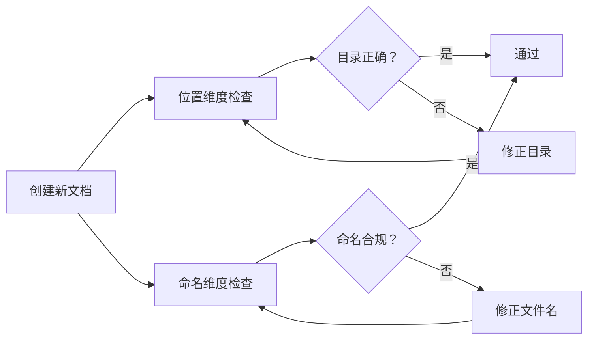

> **来源**：从 TuyaOpen 学习报告优化任务规律2拆分

# 文档治理双维度检查模型（Two-Dimension Document Governance Model）

## 模式类型
方法论模式 → 治理策略

## 成熟度
L2 已验证（基于 TuyaOpen 学习报告优化任务实践验证）

## 适用场景
- 创建新文档时的合规检查
- 文档重构和迁移
- CI/CD 流程中的文档检查
- 文档归档和整理

## 问题背景

单一违规可能是偶然疏忽，双重违规必然是流程漏洞。创建新文档时缺乏系统性的检查流程，容易同时违反文件放置规范和文件名命名规范。

## 核心模型

创建新文档时必须同时检查两个维度——位置维度和命名维度。

### 维度一：位置维度
- **检查项**：文件放置目录
- **合规标准**：文件必须放在 `docs/knowledge/` 下的正确分类目录（如 `learning/`、`operations/`、`troubleshooting/`）
- **验证工具**：查阅 `docs/knowledge/README.md` 确定归属目录

### 维度二：命名维度
- **检查项**：文件名称格式
- **合规标准**：kebab-case、纯英文、无中文、无空格
- **验证工具**：运行 `check-filename-convention.py`

## 检查维度表

| 检查维度 | 检查项 | 合规标准 | 验证工具 |
|---------|--------|---------|---------|
| 位置维度 | 文件放置目录 | 是否在 docs/knowledge/ 下的正确分类目录 | 查阅 docs/knowledge/README.md |
| 命名维度 | 文件名称格式 | kebab-case、纯英文、无中文、无空格 | check-filename-convention.py |

## 双重违规判断标准

| 情况 | 位置维度 | 命名维度 | 判定 |
|------|---------|---------|------|
| 正常 | ✅ | ✅ | 通过 |
| 单一违规 | ❌ | ✅ | 可能是偶然疏忽 |
| 单一违规 | ✅ | ❌ | 可能是偶然疏忽 |
| 双重违规 | ❌ | ❌ | **流程漏洞**，需要检查创建流程 |

## 实施检查清单

- [ ] 位置维度：文件是否放在知识分类体系定义的对应目录下？
- [ ] 位置维度：目录是否符合项目约定的分类结构？
- [ ] 命名维度：文件名是否使用 kebab-case？
- [ ] 命名维度：文件名是否为纯英文？
- [ ] 命名维度：文件名是否通过 check-filename-convention.py 检查？
- [ ] 双重违规：是否同时违反两个维度？如果是，需要检查创建流程

## 价值

- **全面检查**：确保文档在位置和命名两个维度都符合规范
- **问题定位**：双重违规可以快速定位流程漏洞
- **流程改进**：基于检查结果优化文件创建流程
- **一致性保障**：确保所有文档符合统一的分类和命名规范

## 关联资源

- [文件命名规范](../../../../../.agents/rules/file-naming-convention.md)
- [文件名检查脚本](../../../../../.agents/scripts/check-filename-convention.py)
- [知识库入口](../../../../knowledge/)
- [文件创建前置检查模式](file-creation-precheck-pattern.md)