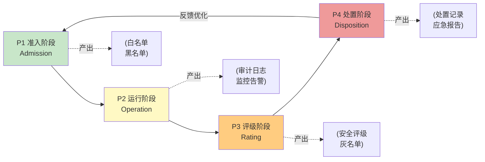

# 第三方供应商全生命周期治理模型

## 模型概述
接入第三方API/服务时，往往只做准入审查而缺乏持续治理，导致供应商安全态势变化后无法及时发现和处置。本模型提供四阶段全生命周期闭环治理，实现供应商从准入到清退的全程管控。

## 核心问题
- **准入即终点**：只做接入前审查，接入后无人问津
- **无动态调整**：供应商安全评级一成不变，无法应对态势变化
- **无分级处置**：发生问题后要么不管要么一刀切，缺乏梯度响应
- **无闭环反馈**：处置结果不反向影响准入标准，同样问题重复发生

## 四阶段闭环模型

| 阶段 | 名称 | 目标 | 关键活动 |
|---|---|---|---|
| P1 | 准入阶段（Admission） | 确保供应商符合接入安全基线 | 资质审查、安全评估、合规承诺、接入测试、黑白名单 |
| P2 | 运行阶段（Operation） | 持续监控供应商运行期安全态势 | 分级审计计划、日志审计、行为监控、异常检测 |
| P3 | 评级阶段（Rating） | 定期评估供应商安全等级并动态调整 | 五维安全评级（A/B/C/D级）、黑白灰名单动态调整 |
| P4 | 处置阶段（Disposition） | 对违规/风险供应商进行梯度处置 | 违规分级处置、事件应急响应、经验反馈 |

## 流程图

## 各阶段详细说明

### P1：准入阶段（Admission）
建立供应商接入前的安全基线，不合格供应商不得接入。

| 检查项 | 说明 |
|---|---|
| **资质审查** | 营业执照、相关行业资质、安全认证（ISO27001、等保等） |
| **安全评估** | 数据安全能力、隐私保护能力、接口安全设计、历史安全事件 |
| **合规承诺** | 签署数据安全协议、隐私保护承诺、合规责任书 |
| **接入测试** | 安全渗透测试、接口健壮性测试、数据传输加密验证 |
| **黑白名单** | 通过者加入白名单，有严重不良记录者加入黑名单 |

**准入检查清单（19项）**：
- [ ] 企业资质合法有效
- [ ] 具备对应行业的必要许可
- [ ] 通过ISO27001/等保等安全认证
- [ ] 提供数据安全白皮书
- [ ] 提供隐私政策并符合要求
- [ ] 接口支持HTTPS/TLS1.2+
- [ ] 支持身份认证与鉴权
- [ ] 有数据加密存储方案
- [ ] 明确数据保留与删除策略
- [ ] 支持日志审计
- [ ] 有漏洞披露与响应机制
- [ ] 过去12个月无重大安全事件
- [ ] 签署数据安全协议
- [ ] 签署隐私保护承诺
- [ ] 完成安全渗透测试无高危漏洞
- [ ] 完成接口功能测试
- [ ] 明确SLA服务等级
- [ ] 明确应急响应联系人
- [ ] 通过安全评审加入白名单

### P2：运行阶段（Operation）
供应商接入后持续监控，及时发现异常行为。

| 活动 | 说明 |
|---|---|
| **分级审计计划** | A级供应商季度审计、B级月度审计、C级每周审计、D级实时监控 |
| **日志审计** | 定期审计API调用日志，检查异常调用模式 |
| **行为监控** | 监控数据传输量、调用频率、访问时段、数据类型 |
| **异常检测** | 基于规则和基线检测异常行为并触发告警 |

**审计异常规则（12项）**：
1. 单分钟调用量超过基线300%
2. 非工作时段异常高频调用
3. 单次请求数据量超过阈值
4. 请求包含未授权的数据字段
5. 来自异常IP段的调用
6. 连续认证失败超过5次
7. 尝试访问未授权接口
8. 数据传输目的地异常变更
9. 响应时间异常变长（可能在拖库）
10. 新增之前未出现的数据类型请求
11. 供应商侧证书/密钥异常变更
12. 公开情报显示供应商发生安全事件

### P3：评级阶段（Rating）
定期对供应商进行安全评级，动态调整信任等级。

**五维安全评级体系**：
| 维度 | 权重 | 评估内容 |
|---|---|---|
| 安全资质 | 20% | 认证保持情况、资质更新 |
| 历史行为 | 25% | 审计结果、异常记录、违规次数 |
| 技术能力 | 20% | 加密强度、接口安全、漏洞修复速度 |
| 合规表现 | 20% | 数据使用合规性、隐私保护执行情况 |
| 响应能力 | 15% | 事件响应速度、问题配合度 |

**安全等级定义**：
| 等级 | 分数区间 | 管控措施 | 名单状态 |
|---|---|---|---|
| A级 | 90-100分 | 信任级，季度审计 | 白名单 |
| B级 | 75-89分 | 标准级，月度审计 | 白名单 |
| C级 | 60-74分 | 关注级，每周审计，限制敏感数据 | 灰名单 |
| D级 | <60分 | 高风险，实时监控，启动退出评估 | 黑名单（观察） |

评级周期：每季度一次评级，发生重大安全事件时即时评级。

### P4：处置阶段（Disposition）
根据违规严重程度进行梯度处置，形成闭环。

**违规分级处置矩阵**：
| 违规等级 | 典型场景 | 处置措施 | 响应时效 |
|---|---|---|---|
| 轻微 | 偶发异常调用、日志不完整 | 警告、限期整改 | 7个工作日 |
| 一般 | 超出授权范围访问、未按约定加密 | 限流、暂停新功能接入 | 3个工作日 |
| 严重 | 数据泄露风险、违规留存数据 | 暂停服务、启动调查 | 24小时内 |
| 重大 |  confirmed数据泄露、售卖用户数据 | 立即清退、法律追责、上报监管 | 立即执行 |

**事件应急响应流程**：
1. 告警触发 → 2. 事件定级 → 3. 紧急处置（限流/暂停）→ 4. 根因调查 → 5. 处置执行 → 6. 影响评估 → 7. 报告复盘 → 8. 反馈准入标准

## 实施步骤

| 步骤 | 动作 | 产出 |
|---|---|---|
| 1. 建立准入标准 | 制定19项准入检查清单，评审流程 | vendor-admission规则文档 |
| 2. 部署运行监控 | 接入日志采集，配置12项异常检测规则 | vendor-audit规则文档、监控看板 |
| 3. 建立评级体系 | 定义五维评级模型，确定评级周期 | 安全评级模板、黑白灰名单机制 |
| 4. 制定处置预案 | 制定四级处置矩阵，明确应急响应流程 | incident-response预案 |
| 5. 闭环机制建设 | 建立评级→处置→反馈准入的闭环流程 | 供应商治理定期复盘机制 |

## 适用场景
- 第三方API接入管理
- 外包供应商安全管理
- SaaS服务采购治理
- 云服务供应商管理
- 任何涉及外部数据交互的第三方管理

## 不适用场景
- 内部服务间调用（已有统一认证鉴权）
- 公开的无认证公开数据接口
- 一次性临时数据对接（可使用简化流程）

## 关键检查清单汇总
| 阶段 | 检查项数量 | 核心产出 |
|---|---|---|
| 准入阶段 | 19项 | vendor-admission.md、白名单/黑名单 |
| 运行阶段 | 12项异常规则 | vendor-audit.md、监控告警 |
| 评级阶段 | 5维度 | 安全评级标准、灰名单动态调整 |
| 处置阶段 | 4级处置 | incident-response.md、应急响应流程 |

## 验证案例
AI智能体互联第三方API供应商管理：
- P1准入：vendor-admission.md定义19项准入检查，建立白名单机制
- P2运行：vendor-audit.md定义12项异常检测规则，分级审计计划
- P3评级：五维安全评级体系，A/B/C/D四级，季度评级动态调整
- P4处置：与incident-response.md联动，四级处置矩阵

## 关键原则
1. **全生命周期**：准入不是终点，而是治理的起点
2. **动态调整**：供应商信任等级不是一成不变的，必须定期重新评估
3. **梯度处置**：根据违规严重程度采取不同措施，避免一刀切
4. **闭环反馈**：每次事件的教训必须反向优化准入标准，防止重复踩坑
5. **分级管控**：不是所有供应商都需要同样强度的审计，基于风险分级投入资源

> 来源：AI智能体互联数据安全治理实践萃取
> 关联模块：`docs/retrospective/patterns/methodology-patterns/governance-strategy/five-layer-governance-architecture.md`、`docs/retrospective/patterns/methodology-patterns/governance-strategy/compliance-driven-rule-building.md`、`docs/retrospective/reports/project-governance/process-and-compliance/retrospective-ai-agent-data-security-governance-20260629/`
