# Wiki创作三查流程模式（Wiki Pre-Creation Three Checks Pattern）

## 模式概述

创建新的Wiki/知识库文档前，必须强制执行三项前置检查（查同类、查规范、查索引），从源头杜绝格式错误、目录错误、索引遗漏三类高频问题。该模式将"凭经验写作"的不确定性转化为"三步验证"的确定性流程，经过4次实践验证（3正1反），格式错误率从100%降至0%。

该模式是 [format-evidence-over-memory-pattern.md](format-evidence-over-memory-pattern.md)（格式证据优先于记忆）在Wiki/知识库文档场景下的特化与可操作化，也是 [file-creation-precheck-pattern.md](file-creation-precheck-pattern.md)（文件创建前置检查）在Wiki文档子类下的补充。相比通用的文件创建检查，三查流程更聚焦于Wiki文档最容易出错的三个环节：格式一致性、目录归属、索引更新。

## 问题背景

在创建Wiki/知识库学习文档时，反复出现三类高频低级错误：

1. **frontmatter格式错误**：依赖记忆中的"TOML frontmatter"描述使用+++分隔符，但项目实际统一使用YAML格式（---分隔），导致返工修复（非线性返工成本：约8分钟/次）
2. **目录位置错误**：文件放错目录，或文件名不符合kebab-case纯英文规范
3. **索引遗漏**：写完文档忘记更新知识库索引（docs/knowledge/README.md），导致文档无法被发现

这些问题的共同根因是：**没有在创建文件前设置强制检查卡点，依赖执行者"记得要检查"**。人的记忆不可靠，尤其在：
- 跨会话上下文恢复后
- 任务类型频繁切换时
- 项目规范发生过演进变更时
- 子代理执行任务缺乏上下文时

> **教训来源**：2026-07-04 MopMonk安全Agent Wiki任务中，因跳过同类文档检查，子代理机械遵循project_memory中的旧描述使用TOML格式frontmatter，导致格式错误返工。同日text-to-cad任务首次执行三查流程后零错误，sunlogin-smart-socket任务再次验证零错误，sunlogin-p4-p1pro任务第三次验证零错误，形成"执行→零错误、跳过→出错误"的强因果关系。

## 成熟度

**L3 可复用**（基于4次实践验证：1次反面验证 + 3次正面验证，复用次数≥3，可作为标准流程推广）

## 适用场景

- ✅ 创建新的知识库Wiki文档（docs/knowledge/learning/等目录）
- ✅ 创建新的复盘报告（docs/retrospective/reports/）
- ✅ 创建新的Spec规划文档（.trae/specs/）
- ✅ 委派子代理创建任何类型的Markdown文档
- ✅ 上下文恢复后继续之前的文档创建任务
- ❌ 编辑已有文档（不需要三查，但需确认格式保持一致）
- ❌ 创建临时文件（使用file-creation-precheck-pattern的第零步判断，输出到.temp/）

## 标准操作流程

在动笔写任何新的Wiki/知识库文档前，强制执行以下三项检查（按顺序，不可跳过、不可调换）：

```mermaid
flowchart LR
    A["收到创建新Wiki/知识库文档任务"] --> B["🔍 第一查：查同类<br/>Read 1-2个同目录现有Wiki"]
    B --> C{"找到同类文档？"}
    C -->|"是"| D["观察并确认：<br/>• frontmatter风格（---/+++）<br/>• 标题层级结构<br/>• 链接格式<br/>• 表格/列表写法<br/>• 特殊约定"]
    C -->|"否（目录下无同类）"| C1["查找最近父目录或同类主题的文档<br/>参考其格式风格"]
    C1 --> D
    D --> E["📋 第二查：查规范<br/>确认三项规范"]
    E --> F["确认：<br/>• 目标目录是否正确（查docs/knowledge/README.md分类）<br/>• 文件名是否kebab-case纯英文<br/>• frontmatter必填字段（title/source/date/tags）"]
    F --> G["📑 第三查：查索引<br/>确认索引文件位置和格式"]
    G --> H["确认：<br/>• 索引文件路径（如docs/knowledge/README.md）<br/>• 索引表格的列结构<br/>• 新条目应插入的位置"]
    H --> I["✅ 三查完成<br/>开始按确认的格式创建文档"]
    I --> J["文档写完后：<br/>• 运行文件名检查脚本<br/>• 更新对应索引文件<br/>• 对照checklist自检"]
    J --> K["✅ 完成"]

    style B fill:#f96,stroke:#333,stroke-width:2px
    style E fill:#f96,stroke:#333,stroke-width:2px
    style G fill:#f96,stroke:#333,stroke-width:2px
```



### 第一查：查同类（最关键，约1分钟）

**动作**：使用Read工具读取目标目录下1-2个最近创建/修改的同类Wiki文档。如果目标目录下暂无文档，往上一级目录或同类主题目录查找参考。

**必须确认的格式要素**：

| 格式要素 | 检查内容 | 反面案例 |
|---------|---------|---------|
| frontmatter风格 | YAML（---包裹）还是TOML（+++包裹）？必填字段有哪些（title/source/date/tags/x-toml-ref）？ | MopMonk任务：凭记忆用了+++，实际项目标准是--- |
| 标题层级 | #用于文档标题，##用于章，###用于节？编号格式是中文数字（一、二、三）还是阿拉伯数字？ | 不同目录可能有不同约定 |
| 链接格式 | 使用相对路径还是file:///绝对路径？外部链接是否带https://？ | 链接格式不一致影响可导航性 |
| 表格写法 | 表头是否对齐？是否使用中文标点？ | 表格渲染异常 |
| 特殊标记 | 是否使用⚠️/✅/❌等emoji？是否有TOML引用x-toml-ref？ | 风格不一致 |

**关键原则**：**同目录现有文档的实际做法是格式问题的唯一权威**，project_memory和抽象规范中的描述仅供参考，可能已过时。

### 第二查：查规范（约30秒）

在第一查基础上，进一步确认三项规范：

1. **目录归属**：查阅知识库索引（docs/knowledge/README.md），根据文档内容类型确认应放在哪个分类子目录（learning/operations/troubleshooting等）
2. **文件名规范**：
   - 必须是kebab-case（小写字母 + 连字符分隔）
   - 纯英文命名，禁止中文、下划线、空格
   - 建议格式：`{topic}-{type}.md`（如`sunlogin-p4-p1pro-comparison-wiki.md`）
3. **frontmatter必填字段**：参照同类文档确认必填字段，通常包括：title、source、date、tags

### 第三查：查索引（约30秒）

1. **确认索引文件路径**：新文档写完后需要更新哪个索引文件？（知识库文档通常是docs/knowledge/README.md）
2. **确认索引表格格式**：索引表格有哪些列？（通常是：标题、简介、日期、标签）
3. **确认插入位置**：新条目应插入分类表格的哪个位置？（通常是按时间倒序或类别顺序）

**为什么查索引要在写文档之前？**因为提前确认索引位置和格式，写完文档后不会忘记更新，也不会因为不了解表格列结构而更新错误。

## 反模式（禁止做法）

- ❌ **不查同类直接写**："我记得格式应该是XXX"——MopMonk任务因这个错误导致8分钟返工
- ❌ **只查规范不查实例**：project_memory说"TOML frontmatter"但实际用YAML，规范描述可能过时
- ❌ **写完才想起来索引**：文档写完后忘记更新索引，导致文档成为"孤儿"无法被发现
- ❌ **跨目录假设格式统一**：不同子目录可能有不同的格式约定，必须查目标目录的同类
- ❌ **依赖子代理"自己会查"**：委派任务时必须明确指示"先查同类文档格式"，不能假设子代理会主动做
- ❌ **上下文恢复后不重新验证**：会话恢复后必须重新读取关键文件确认状态，不能只依赖摘要

## 检查清单（创建Wiki文档时用）

创建文档前：
- [ ] 已读取目标目录下1-2个同类现有文档（第一查）
- [ ] 已确认frontmatter风格、标题层级、链接格式（第一查）
- [ ] 已确认目标目录正确（第二查）
- [ ] 已确认文件名符合kebab-case纯英文（第二查）
- [ ] 已确认索引文件路径和表格格式（第三查）
- [ ] （委派子代理时）任务描述中已明确要求"先查同类文档格式"

文档写完后：
- [ ] 已运行 `python .agents/scripts/check-filename-convention.py <文件名>` 验证文件名
- [ ] 已更新对应的索引文件（如docs/knowledge/README.md）
- [ ] 对照同类文档确认格式风格一致
- [ ] frontmatter字段完整且格式正确

## 价值

- **零格式错误**：经过3次连续正面验证，执行三查流程的任务格式错误率为0%（vs 跳过流程的MopMonk任务100%出错）
- **降低返工成本**：2分钟前置检查避免8-30分钟的格式修复和重构（非线性返工成本）
- **子代理友好**：可作为明确的检查点指令嵌入委派任务描述，子代理执行时无需猜测格式
- **流程兜底**：将"人的疏忽/记忆偏差"转化为"流程的强制卡点"，不依赖执行者的记忆和经验
- **索引完整性**：提前确认索引位置，从根源解决"写完文档忘更新索引"的问题

## 验证案例

### 案例0：MopMonk Wiki任务（反面验证，未执行三查）

- **任务背景**：2026-07-04 创建MopMonk安全Agent Wiki教程
- **执行情况**：跳过"查同类"步骤，凭记忆写格式
- **问题现象**：frontmatter使用TOML格式（+++分隔），不符合项目YAML标准
- **返工成本**：约8分钟修复格式，额外创建外部TOML元数据文件
- **教训**：不执行三查流程时，格式错误概率极高

### 案例1：text-to-cad Wiki任务（正面验证1，首次执行三查）

- **任务背景**：2026-07-04 创建text-to-cad学习Wiki
- **执行情况**：创作前主动参考the-agency-project-wiki.md的格式
- **结果**：零格式错误，frontmatter正确使用YAML格式，索引正确更新
- **效果验证**：首次应用即避免了MopMonk任务中出现的格式问题

### 案例2：sunlogin-smart-socket Wiki任务（正面验证2，明确提出三查模式）

- **任务背景**：2026-07-04 创建向日葵智能插座C1Pro/C2/C4三款产品Wiki
- **执行情况**：在复盘中明确提炼"三查"流程，主动参考text-to-cad-wiki.md和sunlogin-pdu-hardware-learning的格式
- **结果**：零格式错误、零目录错误、零索引错误，958行文档一次通过
- **效果验证**：三查流程被明确命名并写入复盘报告

### 案例3：sunlogin-p4-p1pro Wiki任务（正面验证3，成熟度升级L2→L3）

- **任务背景**：2026-07-04 创建向日葵P4/P1Pro智能插线板对比学习Wiki
- **执行情况**：自然执行三查流程，参考sunlogin-pdu和sunlogin-smart-socket的格式
- **结果**：零格式错误、零需求变更、零回退，1192行文档一次通过
- **效果验证**：三查流程已形成"肌肉记忆"，连续3次正面验证，成熟度从L2升级为L3

### 验证数据汇总

| 任务 | 执行三查？ | 格式错误 | 目录错误 | 索引遗漏 | 返工时间 |
|------|----------|---------|---------|---------|---------|
| MopMonk wiki | ❌ 未执行 | 1（frontmatter） | 0 | 0 | ~8分钟 |
| text-to-cad wiki | ✅ 执行 | 0 | 0 | 0 | 0 |
| sunlogin-smart-socket wiki | ✅ 执行 | 0 | 0 | 0 | 0 |
| sunlogin-p4-p1pro wiki | ✅ 执行 | 0 | 0 | 0 | 0 |

**结论**：三查流程与零格式错误之间存在强因果关系，执行→零错误、跳过→出错误。

## 委派子代理时的任务描述模板

委派子代理创建Wiki文档时，在任务描述中加入以下前置要求：

```
【重要前置要求】创建文件前必须执行"三查"：
1. 先用Read工具查看docs/knowledge/learning/目录下最近1-2个wiki文档（如sunlogin-p4-p1pro-comparison-wiki.md），确认frontmatter格式、标题风格、链接格式
2. 确认目标目录正确，文件名使用kebab-case纯英文
3. 确认写完后需要更新docs/knowledge/README.md索引

不按此要求做导致格式错误，需要返工。
```

## 与其他模式的关系

| 关系模式 | 关系类型 | 区别与互补 |
|---------|---------|-----------|
| [format-evidence-over-memory-pattern.md](format-evidence-over-memory-pattern.md) | 父模式/泛化 | 格式证据优先是通用原则，本模式是其在Wiki/知识库文档场景下的可操作化三步骤 |
| [file-creation-precheck-pattern.md](file-creation-precheck-pattern.md) | 父模式/泛化 | 文件创建前置检查是通用文件创建规范，本模式聚焦Wiki文档最易出错的三个点，作为补充 |
| [multi-product-comparison-structure.md](../document-architecture/multi-product-comparison-structure.md) | 协同 | 多产品对比结构指导"内容写什么"，三查流程指导"格式怎么对"，创建多产品对比Wiki时两者配合使用 |
| [convention-driven-creation.md](convention-driven-creation.md) | 相关 | 约定驱动创建是更宏观的治理原则，三查流程是其具体落地手段之一 |

## 关联资源

- [wiki-spec-template.md](../../../../../.agents/templates/wiki-spec-template.md)（已整合三查流程作为强制检查点）
- [文件命名规范](../../../../../.agents/rules/file-naming-convention.md)
- [知识库入口](../../../../knowledge/README.md)
- [文件名检查脚本](../../../../../.agents/scripts/check-filename-convention.py)
- [向日葵智能插座复盘（模式提炼来源）](../../../reports/competitive-analysis/retrospective-sunlogin-smart-socket-wiki-20260704/insight-extraction.md#模式1wiki创作三查流程)
- [向日葵P4/P1Pro复盘（模式验证L3）](../../../reports/competitive-analysis/retrospective-sunlogin-p4-p1pro-comparison-20260704/insight-extraction.md#模式2wiki创作三查流程再次验证成熟度升级)
