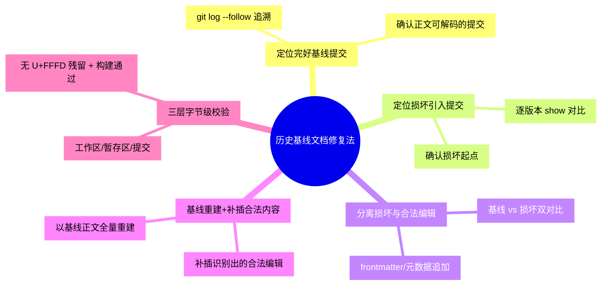

# 历史基线文档修复法

## 模式概述

当 Markdown/YAML/配置文件出现**编码损坏**（UTF-8 截断、U+FFFD 替换字符、非法字节），且损坏提交之前存在**完好历史版本**时，修复的正确途径不是「逐字猜中文重写」，而是把 git 历史当作**权威信源仓库**：用 `git show` 提取损坏前的完好正文基线，再与损坏提交对比，分离「仅编码损坏」与「合法编辑」，以基线全量重建后补插合法内容。

核心思想：**git 历史不仅是错误引入记录，更是修复所需完好内容的备份来源**。只要有版本控制，损坏就是「可撤销」的——先定位损坏侵入点与完好基线提交，再做「正文可取信源 + 元数据保留」双通道重建。

该模式由 awesome-okf-xs 文档库 CI 里程碑案例萃取：12 个 jupyter-book 文档在提交 `f78d5c4` 被写入非法 UTF-8 字节（正文行数从 176 缩减至 138），而历史提交 `6fe904e` 中同一批文件为有效 UTF-8 可解码。采用「基线 `6fe904e` 正文 + 保留 `f78d5c4` 合法 frontmatter 元数据」策略无损重建，工作区/暂存区/提交三层字节级校验全部一致。

## 触发场景

**适用于**：
- 文本型数据（Markdown/YAML/JSON/README/配置文件）出现编码损坏（UTF-8 截断、U+FFFD、非法字节）
- 损坏提交之前存在完好历史版本，且损坏与合法编辑混在同一提交内
- 损坏的文件有 git 版本历史可追溯
- 正文内容较长/含多语言，无法凭人眼猜测正确内容（逐字重写成本高且易错）

**不适用于**：
- 文件从未被正确版本提交过（无完好基线，无法取信源）
- 损坏发生在上游生成流程（源头即坏，git 历史也无完好版本）
- 文件很短且内容可百分百确定，直接重写比历史追溯更快

## 核心做法（5 步）

1. **定位完好基线提交**：用 `git log --follow --oneline <path>` 追溯文件历史，定位正文可解码的完好提交基线（`baserev`）。

2. **定位损坏引入提交**：在同一追溯链中定位首次写入非法字节的提交（`corruptrev`）；用 `git show <rev>:<path>` 逐版本对比，确认损坏从哪个提交开始。

3. **分离「损坏」与「合法编辑」**：用 `git show <baserev>:<path>` 与 `git show <corruptrev>:<path>` 双对比，识别损坏提交中除码损坏外的合法变更（如 frontmatter 元数据追加、结构化字段更新），这些不得丢失。

4. **基线重建 + 补插合法内容**：以基线正文全量重建，仅补插第 3 步识别出的合法编辑内容（而非保留损坏提交的损坏正文）。逐行比对确保正文与基线一致。

5. **三层字节级校验**：分别校验工作区、暂存区、提交三层的字节内容与基线正文一致，并断言无 U+FFFD 替换字符残留；必要时本地跑一次构建（如 Sphinx dummy）验证无解码错误。

### 核心做法思维导图

## 反模式（3 个）

### 反模式1：逐字符猜中文重写正文

- **来源**：本案例若不采用基线法，138-176 行多语言长文的正确内容无法凭猜恢复
- **表现**：损坏后靠语义/记忆猜测原文字，易引入与原稿不一致的错误内容
- **正确做法**：用 `git show <baserev>:<path>` 取权威原文，杜绝猜测

### 反模式2：直接全量回退到基线，丢失后续合法编辑

- **来源**：本案例损坏提交 `f78d5c4` 除损坏外还含合法 frontmatter 追加（tags/generated/verified/status/stale_after/sources），全量回退会丢失
- **表现**：`git checkout`/重置回基线，一并丢弃损坏提交期间的合法变更
- **正确做法**：先双对比分离合法编辑，基线重建后再补插，保留有效演进

### 反模式3：凭终端或工具显示判断编码是否修复

- **来源**：Windows 终端以 GBK 误显示 UTF-8，`git log` 中文乱码但字节级校验为 True；本地浏览工具对 U+FFFD 有容错
- **表现**：肉眼看到"乱码"误判未修复，或看到"正常"误判已修复
- **正确做法**：一律用字节级比对（`git show` 输出与基线逐字节比对、`row.encode('utf-8')` 解码断言）判断，不凭终端/工具显示

## 检验标准

- [ ] 完好基线提交已定位（正文可 `decode('utf-8')`）
- [ ] 损坏引入提交已定位，且确认损坏起点唯一
- [ ] 损坏提交中所有合法编辑（元数据/字段更新）被识别并保留
- [ ] 重建后文件正文与基线逐字节一致（工作区/暂存区/提交三层）
- [ ] 重建后文件无 U+FFFD 替换字符残留
- [ ] 本地构建（如 Sphinx dummy）exit 0，无解码错误

## 跨场景迁移示例

### 迁移示例1：JSON 配置文件编码损坏

- 场景：一份含中文字段值的 config.json 在某个提交被写坏，导致 CI 解析失败；更早提交为正确 UTF-8
- 迁移应用：`git log --follow config.json` 定位完好基线 → 提取原文 → 保留损坏期间新增的合法 key → 重建后 `json.load` 校验
- 迁移可行性：与案例完全同构（半结构化文本 + git 历史可追溯）

### 迁移示例2：README 被误改加乱码字符

- 场景：README.md 被人为粘贴进非法字节，渲染为 U+FFFD；历次提交含完整历史
- 迁移应用：定位损坏提交 → 基线重建正文 → 保留期间新增的章节/徽章（合法编辑）→ 更新后本地预览无替换字符
- 迁移可行性：正文长、含多语言的典型复现场景

### 迁移示例3：数据库/导出文件内容恢复

- 场景：上游某次导出把字段截断为半个字符（类比 UTF-8 截断），前一版本导出完整
- 迁移应用：用上一版本导出做基线 → 仅恢复损坏字段 → 保留后续合法记录追加 → 比对行数一致（176 vs 138 的类比）
- 迁移可行性：跨领域验证——「版本化数据源是故障内容的恢复备份」是通用抽象

## 案例来源

| 案例 | 来源 | 损坏点 | 处置结果 |
|------|------|--------|---------|
| awesome-okf-xs 12 个 UTF-8 损坏文档 | 七概念知识沉淀（sc-20260824-milestone-retro，模式E-1） | 提交 `f78d5c4`，正文 176→138 行 | 基线 `6fe904e` 正文 + 保留合法 frontmatter 重建，三层字节校验一致，CI 恢复 |

## 配套资产

- 参考实现：scripts/repair-bundles.py（逐文件基线比对重建脚本，当时为一次性修复脚本、未提交入库）
- 溯源复盘报告：[awesome-okf-xs-ci-integration-retrospective-20260824.md](../../reports/project-governance/awesome-okf-xs-ci-integration-retrospective-20260824.md)（模式E-1 + 洞察2 + 事实 F-7~F-12）
- 关联门禁：[check-utf8.py](../../../../projects/awesome-okf-xs/scripts/check-utf8.py)（修复后前置 gate 防复发，见前置完整性门禁 bp-preflight-integrity-gate）

## 对抗审查记录

本模式经过 7 概念知识沉淀链路 V 阶段 4 视角对抗审查，采纳 5 条修正：
1. **魔鬼代言人**：只重建不防复发 → 关联 bp-preflight-integrity-gate（前置完整性门禁）+ 配套 check-utf8.py 前置扫描，根治内容完整性
2. **新人视角**：读者不知如何验证"修复正确" → 检验标准改列字节级三层校验 + 无 U+FFFD + 构建通过的客观标准，替代主观"看着正常"
3. **老板视角**：逐字符重写看似直接但成本高易错 → 反模式1 明确"历史追溯成本远低于人工重写且零差错"，量化支撑采用基线法
4. **未来视角**：合法编辑（元数据）若含日期等强约束字段，回退会破坏一致性 → 反模式2 强调"保留而非丢弃后续合法演进"，覆盖依赖元数据的下游
5. **通用性校验**：抽象是否只停留"编码损坏" → 迁移示例3 数据文件恢复证明「版本化数据源作恢复备份」跨领域成立