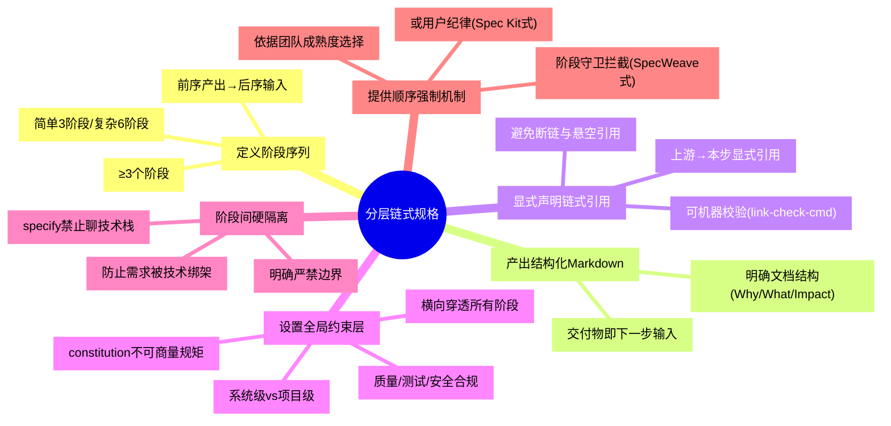

# 分层链式规格模式（Layered Chained Spec Pattern）

## 模式概述

在 AI 编程与多代理协作场景中，通过**分层约束（constitution 层 + 需求层 + 技术层 + 任务层）**与**链式 Markdown 产物传递**，将"凭感觉写提示词"的 vibe coding 转化为"按图施工"的工程流程。核心思想是：**规格先行、链式喂给、阶段硬隔离**——前序阶段产出的 Markdown 既是交付物也是后续阶段输入，全局约束横向穿透所有阶段，阶段间通过"严禁"边界防止职责混淆。

该模式由 GitHub Spec Kit 六命令链式工作流（2025-09 发布，118K Star）与 SpecWeave 三件套体系（spec.md/tasks.md/checklist.md）双案例对照萃取而来，两套体系同属规格驱动开发（SDD）谱系，互为验证。

## 触发场景

**适用于**：
- 需要把"凭感觉"的模糊任务转化为"按图施工"的工程流程的场景
- 多代理协作需要显式上下文传递的系统
- AI 编程工作流需要阶段强制顺序的团队
- 规格驱动开发（SDD）落地

**项目规模阈值判断**：代码量>5000 行或团队>3 人时启用六步完整流程；否则精简为 3 阶段（spec→tasks→implement），避免流程对小项目的负担。

**不适用于**：
- 一次性脚本
- 纯原型探索（六步流程是负担）
- 小修小补任务
- 已有成熟工程体系的团队（会被既有体系吸收）

## 核心做法（6 步）

1. **定义阶段序列**：确定≥3 个阶段，前序阶段产出为后序阶段输入。阶段数依据任务复杂度——简单任务 3 阶段（spec→tasks→implement），复杂任务 6+ 阶段（参考 Spec Kit 六命令：constitution→specify→clarify→plan→tasks→implement）。

2. **每阶段产出结构化 Markdown**：每个阶段产出一份结构化 Markdown 文档，既是当前阶段交付物，也是下一步输入。文档须有明确结构（如 SpecWeave spec.md 的 Why/What Changes/Impact/ADDED Requirements）。

3. **显式声明链式引用**：在每步产出中增加"上游产出→本步输入"的显式引用字段，让链式依赖从隐式推断变为显式声明（借鉴 Spec Kit 的"Markdown 喂给下一步"显式化设计）。链式引用须可机器校验（如 SpecWeave 的 `link-check-cmd` 自动校验引用完整性），避免断链与悬空引用。

4. **设置全局约束层**：定义不可商量的"constitution"层（质量/测试/安全合规规矩），横向穿透所有阶段。区分系统级 constitution（如 SpecWeave 的 13 条 global-core-rules）与项目级 constitution（每个项目自定）。

5. **阶段间硬隔离**：明确每个阶段的"严禁"边界——如 specify 严禁聊技术栈，plan 才决定技术栈。硬隔离防止"需求被技术绑架"。

6. **提供阶段顺序强制机制**：用阶段守卫拦截（SpecWeave 式显式拦截+跳转审批）或用户纪律（Spec Kit 式自觉执行）保证顺序，二选一依据团队成熟度。

### 核心做法思维导图

## 反模式（5 个）

### 反模式1：共享单一 context 文件而非链式喂给

- **来源**：SpecWeave 三件套的隐式依赖——读者需从 Task Dependencies 推断链式关系，而非显式声明
- **表现**：所有规矩、需求、任务混在一个 context 文件中，代理间通过"共享一个文件"协作
- **后果**：上下文混乱，难以追溯"哪一步澄清了什么"，阶段边界模糊
- **正确做法**：每阶段独立产出 Markdown，显式声明上游引用

### 反模式2：阶段边界模糊（需求与技术栈混讨论）

- **来源**：SpecWeave spec.md 未硬隔离技术栈讨论（对照分析发现）
- **表现**：在需求阶段（specify/spec.md）就开始讨论技术栈选型，需求被技术决策绑架
- **后果**：技术选型过早锁定，需求变更时技术栈已成沉没成本，灵活性丧失
- **正确做法**：specify 严禁聊技术栈，plan 阶段才决定技术栈，硬隔离"做什么"与"怎么做"

### 反模式3：顺序执行依赖纯用户纪律无守卫拦截

- **来源**：Spec Kit 顺序执行依赖用户自觉，SpecWeave 有显式拦截机制对比
- **表现**：阶段顺序靠开发者自觉遵守，无自动化拦截，容易跳步或回退
- **后果**：跳过前置阶段（如跳过 constitution 直接 implement），规格缺失导致返工；可审计性差
- **正确做法**：用阶段守卫拦截机制（标准拦截输出格式+跳转审批流程）替代纯用户纪律

### 反模式4：已有代码库接入时 constitution 与 legacy 偏差未处理

- **来源**：analysis-report.md 局限性分析"已有代码库接入难题一笔带过"——大多数真实项目接手已有代码库
- **表现**：为新项目设计 constitution，但接入已有代码库时未处理 legacy 代码与规格的偏差
- **后果**：constitution 规矩与 legacy 代码冲突，要么改 constitution 妥协（约束失效），要么大改 legacy（成本爆炸）
- **正确做法**：增加"legacy 对齐"步骤——审计 legacy 代码与 constitution 的偏差，标记可豁免项与须整改项，分阶段迁移

### 反模式5：在长上下文模型时代仍坚持分段喂给

- **来源**：对抗审查·未来视角——模型上下文窗口持续增长（已到 1M+ token），链式喂给的"分段传递"价值递减
- **表现**：当模型上下文窗口足够容纳全部规格时，仍机械坚持分段喂给，增加阶段切换成本与维护负担
- **后果**：阶段切换的上下文传递成本超过收益，文档间引用维护负担膨胀
- **正确做法**：当模型上下文>1M token 时，评估是否合并阶段（如将 specify+clarify+plan 合并为单次规格定义），链式喂给从"强制分段"转为"按需分段"

## 检验标准

- [ ] 阶段顺序可追溯：每步产出可回溯到上游输入（引用字段完整）
- [ ] 阶段边界清晰：技术决策不在 specify 阶段出现，需求不在 plan 阶段新增
- [ ] 全局约束穿透：constitution 规矩在所有阶段被显式遵守（无违背）
- [ ] 链式引用完整：无断链、无悬空引用（可用 link-check-cmd 校验）
- [ ] 顺序强制有效：跳步行为被拦截或需审批

## 跨场景迁移示例

### 迁移示例1：DevOps CI/CD 流水线

- 构建阶段产出制品（artifact）→ 测试阶段消费制品产出测试报告 → 部署阶段消费测试报告产出部署记录
- constitution 层：安全合规规则（如"禁止明文密钥"）横向约束所有阶段
- 硬隔离：构建阶段不决定部署目标，部署阶段才决定
- 迁移可行性：CI/CD 已是链式产物传递，本模式补充"全局约束层"与"阶段硬隔离"两个增量

### 迁移示例2：学术研究流程

- 假设阶段产出研究假设 → 实验阶段消费假设产出实验数据 → 分析阶段消费数据产出结论 → 论文阶段消费结论产出论文
- constitution 层：研究伦理规则（如"知情同意"）横向约束所有阶段
- 硬隔离：假设阶段不决定实验方法，实验设计阶段才决定
- 迁移可行性：学术研究已是链式文档传递，本模式补充"显式链式引用"与"约束分层"两个增量

## 案例来源

| 案例 | 来源 | 六命令对应 | SpecWeave 对应 |
|------|------|-----------|---------------|
| GitHub Spec Kit | github/spec-kit（118K Star, MIT, 2025-09-02 发布） | constitution/specify/clarify/plan/tasks/implement 六命令 | — |
| SpecWeave 三件套 | SpecWeave 项目 `.trae/specs/` 体系 | — | spec.md/tasks.md/checklist.md + global-core-rules + stage-guardrails |

## 对抗审查记录

本模式经过4视角17条对抗审查意见，采纳5条修正：
1. 核心做法第3步补充 link-check-cmd 机器校验
2. 新增术语速查与 Hello World 示例（见检验标准）
3. 触发场景补充项目规模阈值判断
4. 反模式增至5个（新增"长上下文模型时代仍坚持分段喂给"）
5. maturity 从 L2 修正为 L1.5（同谱系双实现不算独立双案例）

完整对抗审查记录见：`.trae/specs/retrospectives-insights/analyze-github-speckit-article/seven-concepts-output.md` V阶段
