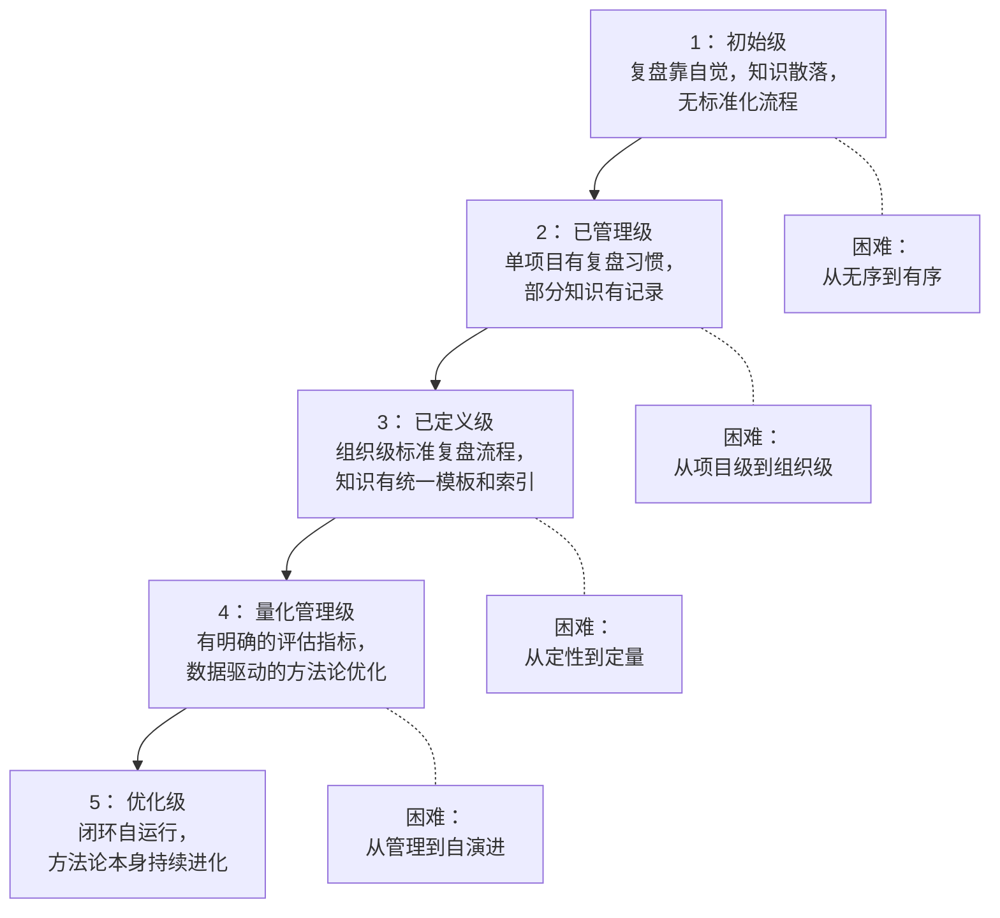
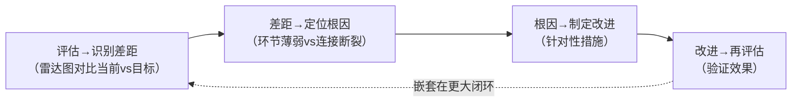

+++
id = "methodology-five-level-maturity"
domain = "methodology"
layer = "methodology"
maturity = "L1"
validation_count = 1
reuse_count = 0
documentation_level = "standard"
source = "docs/methodology-analysis-report.md#8.2"

[bindings]
rules = []
references = ["closed-loop-pdca-mapping.md", "review-insight-export-loop.md", "tool-automation-decision-model.md"]
skills = []
+++

> **来源**：从 `docs/methodology-analysis-report.md` 第 8.2 节「成熟度模型构建」拆分

# 方法论五级成熟度模型（Methodology Five-Level Maturity Model）

## 模式类型
方法论模式

## 成熟度
L1 实验性（1 次成功案例：methodology-analysis-report.md 综合方法论分析）

## 适用场景
评估一个组织或团队在「复盘-洞察-萃取-导出」闭环与「原子化-模块化」设计方法论上的实施成熟度。

## 问题背景

单一 KPI 评估方法论实施效果容易陷入"分数通胀"——每个团队都声称自己"做得不错"，但缺乏客观的、可比较的成熟度标尺。

借鉴 CMMI（能力成熟度模型集成）的五级框架，将方法论实施分为五个递进级别，每个级别都有明确的"行为特征"和"产出标准"，便于：
- 自评：组织识别当前成熟度级别
- 对标：与行业最佳实践对比差距
- 规划：从当前级别到目标级别的跃迁路径

## 五级框架

## 各级别行为特征与产出标准

| 级别 | 复盘 | 洞察 | 萃取 | 导出 | 原子化与模块化 |
|------|------|------|------|------|----------------|
| **1. 初始级** | 偶尔做，无固定格式，依赖个人自觉 | 停留在现象描述 | 无系统化萃取 | 结论停留在报告中 | 系统为单体，无拆分意识 |
| **2. 已管理级** | 单项目有复盘习惯，使用简单模板 | 开始跨案例比较，识别重复模式 | 建立知识条目记录，使用基础模板 | 知识以文档形式输出 | 开始初步拆分，但边界模糊 |
| **3. 已定义级** | 组织级标准复盘流程和模板 | 有跨项目元分析的制度化安排 | 知识有统一分类体系和自动索引 | 推进模板化和部分工具化 | 原子单元满足单一职责标准，有模块分类体系 |
| **4. 量化管理级** | 有复盘覆盖率和深度量化指标 | 洞察有采纳率追踪 | 知识复用率可量化，腐烂度可追踪 | 导出效果有行为改变率数据 | 内聚度、耦合度可量化评估 |
| **5. 优化级** | 复盘已是肌肉记忆，流程根据数据自我调整 | 双环学习常态化 | 萃取→导出全流程自动化 | 制度化与工具化深度融合 | 系统持续重构优化，粒度根据反馈自动调整 |

## 级别跃迁的关键节点

### L1 → L2：从无序到有序

**核心挑战**：从"靠人"转向"靠流程"，从"无序"建立"秩序"
**关键切入点**：找到一个高价值、低门槛的入口
- 典型做法：每周一次 15 分钟的站立复盘
- 成功要素：快速见效的正反馈建立团队信心

### L2 → L3：从项目级到组织级

**核心挑战**：不同项目之间需要共享同一套复盘模板、知识分类体系和工具体系
**关键动作**：
- 建立跨项目协调机制
- 强制执行统一规范
- 关键阻力：项目间的差异化和自主权诉求

### L3 → L4：从定性到定量

**核心挑战**：不仅要"做"，还要"度量做得好不好"
**配套工具需求**：
- 自动采集知识库访问日志
- 自动计算复盘覆盖率与深度评分
- 自动追踪行动项完成率

### L4 → L5：从管理到自演进

**核心标志**：方法论不再依赖外部推动，而是通过内置的正反馈机制自我驱动
**判断标准**：
- 系统的成熟度已经内化为组织文化的一部分
- 流程的优化方向由数据自动识别而非人工发起
- 团队成员主动提出改进建议并形成自下而上的演进

## 评估方法

### 评估维度（六个）

| 维度 | 关键指标 | 数据来源 | 评估频率 | L3 目标值 | 警戒值 |
|------|---------|---------|---------|---------|--------|
| 复盘质量 | 覆盖率、深度评分 | 项目管理系统 | 月度 | 覆盖率 ≥ 80% | 覆盖率 < 50% |
| 洞察产出 | 数量、采纳率、跨项目分析频率 | 复盘报告 | 季度 | 采纳率 ≥ 60% | 连续两季度无跨项目分析 |
| 萃取效率 | 产出数、复用率、平均延迟 | 知识库系统 | 季度 | 复用率 ≥ 30% | 复用率 < 10% |
| 导出效果 | 传播率、行为改变率 | 知识库访问日志 | 半年 | 传播率 ≥ 50% | 行为改变率 < 40% |
| 原子化纯度 | 内聚度、粒度匀称度 | 代码/文档审查 | 按需 | 内聚度 ≥ 90% | 内聚度 < 70% |
| 模块化质量 | 耦合度、接口稳定性 | 依赖分析工具 | 按需 | 耦合度保持或下降 | 耦合度连续上升 |

### 评估→改进子循环

该子循环本身也嵌套在更大的"复盘→洞察→萃取→导出"闭环中——它运行在双环学习的层面，对"改进的方法"本身进行改进。

## 建议评估节奏

| 频次 | 关注层面 | 关键问题 |
|------|---------|---------|
| 月度 | 操作层 | 这个月哪些做得好、哪些需要调整？ |
| 季度 | 战术层 | 各维度的指标变化趋势如何？ |
| 年度 | 战略层 | 我们的成熟度是否达到了升级的标准？ |

## 与现有模式的关系

- `closed-loop-pdca-mapping.md`：本模式的评估对象就是该 PDCA 闭环的成熟度
- `review-insight-export-loop.md`：本模式按"复盘-洞察-萃取-导出"四列展开评估
- `tool-automation-decision-model.md`：L3→L4 跃迁的关键是工具自动化，本模式提供跃迁的判定标准

> **关联模块**：
> - `closed-loop-pdca-mapping.md` — 闭环PDCA映射模型
> - `tool-automation-decision-model.md` — 工具自动化决策模型
