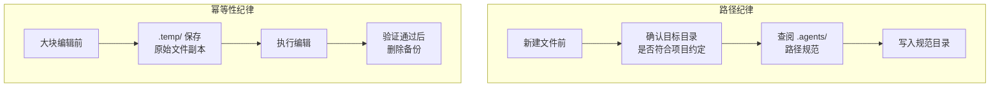

+++
id = "path-discipline"
domain = "methodology"
layer = "methodology"
maturity = "L1"
validation_count = 2
reuse_count = 0
documentation_level = "basic"
source = "docs/retrospective/reports/competitive-analysis/retrospective-specweave-contest-advantage-analysis-20260624/retrospective-v11-iteration/insight-extraction.md#洞察-4"

[bindings]
rules = ["file-operations.md#约束11", "file-operations.md#约束12"]
references = ["search-replace-fragility.md"]
skills = []
+++

# 高强度编辑中的路径与幂等性纪律

## 核心原则

在高强度多轮编辑会话中，路径纪律（文件写入位置是否符合项目约定）和幂等性纪律（编辑操作是否可安全重试）是最容易被忽视的两个维度——它们不与"思考质量"直接相关，但失败成本最高：文件写入错误位置导致目录污染，SearchReplace 断裂导致文件内容不可恢复。

## 成熟度评估

| 维度 | 评估 | 依据 |
|------|------|------|
| 实践验证 | 中 | 2 次独立触发（报名帖写入根目录 + 多轮 SearchReplace 未做回滚备份） |
| 可复用性 | 高 | 适用于所有高强度文件编辑会话 |
| 通用性 | 高 | 不限于特定领域——任何需要在多文件中创建/编辑的 AI 协作场景 |

## 两个核心维度



## 路径纪律三步走

| 步骤 | 操作 | 检查点 |
|------|------|--------|
| 1. 确认根域 | 确定当前任务所属的顶级目录（如 `d:\AI\`） | 产物不应写入根域之外或根域根目录 |
| 2. 查阅规范 | 参考 `.agents/` 中的路径规范，或同目录下已有文件的存放位置 | 新文件路径应与同类型已有文件一致 |
| 3. 分级写入 | 临时文件 → `.temp/` 或系统临时目录；最终产物 → 项目规范目录 | 最终产物不在根目录、不在临时目录 |

### 触发信号

| 信号 | 说明 | 风险 |
|------|------|------|
| 会话中首次创建文件 | 没有可参考的同类文件位置 | 默认写入当前工作目录（常为根目录） |
| 快速迭代产出 | 连续创建多个文件，路径确认被省略 | 第一个文件位置错误 → 后续文件追随错误位置 |
| 跨会话延续 | 前序会话的上下文丢失，路径约定需要重新确认 | 忘记项目特定的目录结构 |

### 常见错误模式

```
错误：初稿写入 d:\AI\specweave-registration-post.md（根目录）
原因：没有先确认项目约定——该文件属于竞品分析报告目录
修正：移至 d:\AI\docs\retrospective\reports\competitive-analysis\...\specweave-registration-post.md
```

## 幂等性纪律

### 回滚备份规则

| 编辑规模 | 备份要求 | 备份位置 | 清理时机 |
|---------|---------|---------|---------|
| < 20 行局部修改 | 不要求 | — | — |
| 20-50 行多轮修改 | 建议备份 | `.temp/` | 编辑验证通过后 |
| > 50 行大块替换 | **必须备份** | `.temp/` | 编辑验证通过后 |

### 备份失败的影响链

```
未备份 → SearchReplace 断裂 → 文件处于新旧混合状态
    ↓
手动修复需要：确认断裂边界 + 截取头部 + 重写尾部 + 拼接
    ↓
修复耗时 = 编辑耗时的 3-5 倍
    ↓
有备份：1 次 cp 恢复 → 重新编辑
```

## 适用条件

- 会话中涉及 ≥ 3 个文件的创建或编辑
- 编辑涉及大块内容替换（>50 行）
- 跨会话延续任务，前序上下文已丢失
- 项目有明确的目录约定（`.agents/` 中已定义）

## 不适用场景

- 仅读取不写入的会话
- 单文件微调（<20 行）
- 项目尚未建立路径规范

## 与其他方法论的关系

| 方法论 | 关系 |
|--------|------|
| `search-replace-fragility.md` | 本模式的幂等性纪律维度为 SearchReplace 脆弱性提供了安全网——回滚备份是大块替换失败后的兜底方案 |
| `file-operations.md` 约束 11/12 | 本模式是约束 11（路径确认三步走）和约束 12（回滚备份）的理论基础 |

> 来源：来自 SpecWeave v11 迭代中两次违反项目约定的复盘——报名帖误写根目录 + 多轮 SearchReplace 未做安全副本
> 关联模块：`search-replace-fragility.md`、`.agents/tools/file-operations.md`
