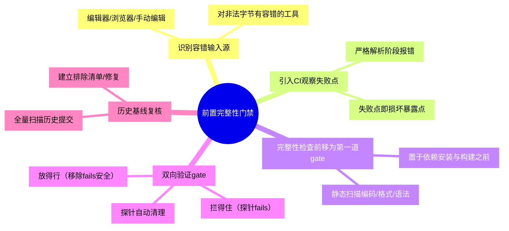

# 前置完整性门禁

## 模式概述

当**本地编辑/浏览工具对数据损坏有容错**、而**严格解析的 CI 构建会报错暴露**时，潜伏的数据损坏（编码截断、非法字节、格式错误）只有在引入 CI 构建 gate 之后才「首次被看见」。此时 CI 扮演的是损坏的**放大器**而非**源头**——它把长期存在、一直被容错掩盖的问题升级为阻塞性故障。

核心思想：**不要等构建报错再排查，把「构建前的数据/格式/编码完整性」作为 CI 的第一道检查（shift-left）**。损坏在本地被容错掩盖是常态，必须用程序化扫描在依赖安装与真正的构建动作之前主动曝光，避免"每次 CI 都在一个明知有问题的输入上构建失败"。

该模式由 awesome-okf-xs 文档库 CI 集成案例萃取：12 个 UTF-8 损坏文档长期潜伏于 git 历史，本地编辑工具对损坏字符有容错；引入 GitHub Pages/Sphinx CI 后，Sphinx 严格解码才触发 `UnicodeDecodeError`。修复后新增 `check-utf8.py` 将 UTF-8 有效性扫描置于依赖安装与 Sphinx 构建之前，从根本上让损坏在构建前被 gate 拦截。

## 触发场景

**适用于**：
- 文档库/AI生成长文本/多语言内容存在编码损坏风险（UTF-8 截断、U+FFFD 替换字符、非法字节）
- 本地工具（编辑器、浏览器）对非标准字符有容错、不报错的场景
- 引入 CI 后首次构建在严格解析阶段（解码/编译/校验）失败
- 任何格式/语法可被静态程序化校验且存在长期沉淀内容的仓库

**不适用于**：
- 内容由严格工具链持续生成、本地即报错（无容错掩盖，损坏不会潜伏）
- 纯运行时问题（无法前置静态校验，如只在特定数据量下触发的缺陷）
- 一次性且已彻底修复、无复发可能的内容（前置 gate 是过度工程，需权衡维护成本）

## 核心做法（5 步）

1. **识别"容错输入源"**：判断输入数据是否由容错型工具长期编辑/生成（编辑器/浏览器/手动复制粘贴），这类工具不会暴露非法字节。

2. **引入首个 CI 构建并观察失败点**：把文档/代码接入严格构建（Sphinx/编译器/解析器），记录第一次构建失败的阶段与错误类型（如 `UnicodeDecodeError`）。失败点即损坏暴露点。

3. **把完整性检查前置为首道 gate**：编写纯静态扫描脚本（扫描编码/格式/语法完整性），在 CI 中置于**依赖安装与真正构建动作之前**。前置顺序是关键——保证每次构建都不在明知有问题的输入上浪费资源。

4. **双向验证 gate**：gate 脚本既要"拦得住"（构造含损坏的探针输入对象，断言退出码非零），也要"放得行"（移除探针后退出码为零）。探针文件自动清理，不落库。（对齐反模式：仅测放行不测拦截的 gate 等于不存在。）

5. **历史基线复核**：用同一扫描脚本对历史提交做全量扫描，确认是否还有同类潜伏损坏，建立排除清单或修复后再放开 CI。

### 核心做法思维导图

## 反模式（3 个）

### 反模式1：等构建报错再排查，不做前置 gate

- **来源**：本案例首版 CI 首次就在 Sphinx 构建阶段报 `UnicodeDecodeError`，若止步于"修这次失败"而未加 gate，下次新损坏会再次阻塞构建
- **表现**：每次 CI 失败→人工定位→修复建失败，重复消耗，损坏仍可悄悄再度沉淀
- **正确做法**：把完整性扫描作为固定首道 gate，让新损坏在构建前被自动拦截

### 反模式2：把完整性检查放在被保护步骤之后

- **来源**：gate 放置顺序的对抗审查——若扫描放在依赖安装/构建之后，损坏已消耗了构建资源才报警，且可能被构建错误掩盖
- **表现**：gate 存在但顺序错误，无法阻止后续步骤在坏输入上执行
- **正确做法**：首道 gate 必须置于依赖安装与真正构建动作之前，保证最短路程拦截

### 反模式3：gate 只测"正常通过"，未验证"拦截分支"

- **来源**：本案例对 gate 做了探针拦截验证（临时坏文件 → exit 1）与移除放行验证（exit 0），确认双向分支
- **表现**：脚本逻辑缺陷导致永远放行，损坏照常通过，gate 形同虚设
- **正确做法**：用构造的坏输入探针断言非零退出，探针自动清理；只测放行不测拦截的 gate 与不存在等价

## 检验标准

- [ ] CI 中完整性扫描位于依赖安装与真正构建动作之前
- [ ] 构造含损坏的探针输入时 gate 退出码非零（拦得住）
- [ ] 移除探针后 gate 退出码为零（放得行）
- [ ] 全量历史提交扫描无剩余同类损坏，或已建排除清单
- [ ] 无探针文件残留仓库（`git status` 干净）

## 跨场景迁移示例

### 迁移示例1：代码仓库引入 lint/格式检查为 CI 首道 gate

- 场景：团队编辑器 auto-format 容错，非标准缩进/尾随空格长期存在，接入 CI 静态检查后首次全量报错
- 迁移应用：把 lint/format 检查置于依赖安装与测试/构建之前作为首道 gate，双向验证（坏代码失败、好代码通过）
- 迁移可行性：与编码损坏案例同构（容错工具掩盖 → 严格 lint 暴露 → 前置拦截）

### 迁移示例2：配置文件接入 schema 校验

- 场景：手写 YAML/JSON 配置，本地读取器对类型不匹配容错，CI 中 schema 校验首次暴露
- 迁移应用：schema 校验作为首道 gate（置于服务构建/启动之前），探针用畸形配置验证拦截
- 迁移可行性：半结构化数据同样可被静态程序化校验，容量比对结构损坏更直接

### 迁移示例3：数据管道接入列完整性检查

- 场景：上游 CSV/数据库导出的脏数据在 ETL 解析阶段失败，本地可视化工具对空值/坏编码容错
- 迁移应用：数据完整性/抽样扫描作为管道首步（置于下游任务与建模之前），用坏行探针验证拦截
- 迁移可行性：跨领域验证（数据工程），证明模式抽象层成立——凡"容错消费端掩盖 + 严格解析端暴露"皆适用

## 案例来源

| 案例 | 来源 | 暴露方式 | 处置结果 |
|------|------|---------|---------|
| awesome-okf-xs 12 个 UTF-8 损坏文档 | 七概念知识沉淀（sc-20260824-milestone-retro，报告洞察1） | 首版 CI 在 Sphinx 构建阶段报 `UnicodeDecodeError` | 重建 12 文件 + 新增 `check-utf8.py` 前置 gate（扫描 5,163 文件全通过） |

## 配套资产

- 参考实现：[check-utf8.py](../../../../projects/awesome-okf-xs/scripts/check-utf8.py)（纯标准库 UTF-8 完整性扫描，77 行）
- 工作流配置：`projects/awesome-okf-xs/.github/workflows/pages.yml`（UTF-8 检查步骤置于 Install dependencies 与 Sphinx 构建之前）
- 溯源复盘报告：[awesome-okf-xs-ci-integration-retrospective-20260824.md](../../../../.agents/docs/retrospective/reports/project-governance/awesome-okf-xs-ci-integration-retrospective-20260824.md)（洞察1 + 事实 F-3/F-4/F-5 + 决策2）

## 对抗审查记录

本模式经过 7 概念知识沉淀链路 V 阶段 4 视角对抗审查，采纳 5 条修正：
1. **魔鬼代言人**：只加 gate 不测拦截分支等于没有 → 反模式3"只测放行不测拦截"，核心做法第 4 步要求双向验证
2. **魔鬼代言人**：gate 放构建之后浪费资源且被掩盖 → 反模式2 + 核心做法第 3 步强调"首道 gate 前置顺序"
3. **新人视角**：读者不知先做什么 → 核心做法 5 步给出可直接照做的执行顺序
4. **老板视角**：维护成本 vs 收益 → 触发场景补"不适用于"边界（无容错掩盖/纯运行时/一次性场景），避免过度工程
5. **未来视角**：新损坏会不会再次沉淀 → 核心做法第 5 步"历史基线复核 + 持续 gate 拦截"，保证长期防复发